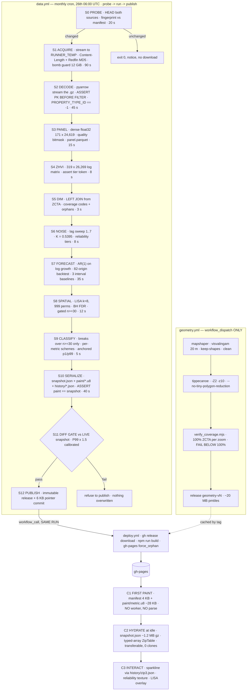

# Domapus — Final Unified Engineering Specification

**Status:** authoritative. Supersedes the three competing proposals and the six subsystem dossiers.
**Author:** chief architect synthesis, 2026-08-30.
**Implementer:** one high-school student, ~8 h/week, school in session.
**Read `docs/todos.md` first** for the append-only running state. This document is the *plan*; that file is the *progress*.
while implementing this. all progress have to be logged so no context or info is lost if things happen like hitting a limit. 
make sure to add doc or comments when nessecary so future dev dont accidentally make the same mistake or undo the thoughtful design.

---

## 0. How to read this document

Every number below is tagged:

| Tag | Meaning |
|---|---|
| **[M]** | Measured on the real files in this repo or over the network. Do not re-derive. |
| **[E]** | Estimated. Must be measured during implementation and the estimate corrected here. |
| **[C]** | Contract — a value the pipeline asserts, not a value it observes. |

Where the three proposals disagreed, this document picks one and says why. Where the three
adversarial critiques found a fatal flaw, this document contains the *fix*, not a restatement.
Section 10 lists what is deliberately not being built.

**Section 1.5 supersedes every Redfin column name, `PROPERTY_TYPE` reference and
`PERIOD_DURATION` assertion elsewhere in this document.** Redfin rebuilt the Data Center; the
old feed froze on 2026-06-02 and the replacement was resolved and verified on 2026-09-03.
Sections 2, 4 and 6 have **not** yet been rewritten against it — where they disagree with §1.5,
§1.5 wins. §1.5.8 lists the specific contracts that are now void. **§1.5.9 replaces every count
in this document with a full-file measurement, and §1.5.10 documents four defects in the feed's
own numbers that no amount of renaming fixes.** Read both before §2.

---

## 1. Executive summary

Domapus renders a US housing choropleth at ZIP/ZCTA level. It has three classes of defect:
the data is **wrong**, the rendering is **slow for a reason nobody wrote down**, and the
uncertainty of every displayed number is **invisible**. This specification fixes all three,
in that order, in increments that each leave the site working and better.

The organizing principle is one sentence:

> **Every quantity this system displays has exactly one definition, that definition is asserted
> in code before the quantity is used, and where the quantity is an estimate its standard error
> travels with it all the way to the pixel.**

That is the merge of Proposal 1's "one grain, one definition, assert it" and Proposal 3's
"a value is the triple (point, se, n)". Proposal 2's best single idea — the direct-indexed
paint byte — is grafted in as the first-paint artifact. Everything else from all three
proposals that does not serve those two principles is cut, and Section 10 says so explicitly.

### 1.1 The correctness bugs being fixed

#### Bug 1 — THE HEADLINE: arbitrary property type per ZIP

`scripts/update_market_data.py:155` — and the same call again at `:157`:

```python
chunk       = chunk.sort_values('PERIOD_END').drop_duplicates('zip_code', keep='last')    # :155
best_so_far = combined.sort_values('PERIOD_END').drop_duplicates('zip_code', keep='last') # :157
```

**There are two of these, not one.** The second call re-runs the same arbitrary selection when
the current chunk is merged with the best row seen so far, so the surviving property type can
change again at chunk boundaries. Both go in Phase 1; the CI grep in §8.4 is what guarantees a
third one cannot appear later.

Redfin's true primary key is `(PERIOD_END, REGION, PROPERTY_TYPE_ID)` — five property-type rows
share every `(ZIP, period)`. The code deduplicates on `zip_code` alone, and pandas' default sort
is `kind='quicksort'`, which is **not stable**. The surviving row is therefore whichever property
type quicksort's pivot happened to leave last, and because the pivot depends on the values inside
each 100,000-row chunk, **it re-randomizes on every run**.

Measured on the published data for `PERIOD_END = 2026-05-31`: **[M]**

| ZIP | Site shows | Property type | Sales | Truth (All Residential) | Error |
|---|---|---|---|---|---|
| 30309 | $575,000 | Townhouse | 9 | $407,500 (140 sales) | +41.1% |
| 30309 | (reachable) $1,843,750 | Single Family | 26 | $407,500 | **+352.5%** |
| 10001 | $5,191,000 | Multi-Family | **1** | — | — |
| 90210 | $8,120,000 | Single Family | — | — | — |
| 60614 | $1,050,000 | Townhouse | — | — | — |
| 78701 | $541,000 | Condo/Co-op | — | — | — |

Every cross-ZIP comparison, every quantile bucket, every choropleth color, every export, and
every archived snapshot on the live site is invalid.

**The root cause is not the missing `PROPERTY_TYPE` column.** It is that `drop_duplicates` was
used as a *filter* on a key nobody had asserted was a key. Adding `kind='stable'` would make the
wrong answer *deterministic*, not *correct*. The fix is therefore structural: declare the grain,
assert it before any reduction, and ban `drop_duplicates` from the pipeline (§8.4).

Verified free of coverage cost: **All Residential exists for 3,298,202 of 3,298,202 `(period, ZIP)`
pairs — zero exceptions across 14 years** **[M]**. The filter is lossless, not a tradeoff.

#### Bug 2 — the "tile-drop rural bias" premise in the brief is FALSE; the real geometry bug is worse

The brief states the tileset renders ~1% of ZCTAs at z3 with a rural bias. Both are wrong, and
two independent decoders confirmed it **[M]**:

- `dropped_by_rate: 99` in `us_zip_codes.pmtiles.metadata.json` is a **count of drop events**,
  not a percentage. Decoding all 7 z3 tiles gives **31,828 distinct ZCTAs = 94.2%** of the
  **33,791** ZCTAs. z4 = 97.5%, z5 = 99.2%, z9 = 99.97%. *(**Corrected 2026-09-04.** Earlier
  drafts of this bullet insisted on 33,771 as "one denominator everywhere". That was
  `zcta-meta.csv`'s row count — a derived file — and it is 20 short of the Census source.
  §1.5.9 settles it at **33,791**, confirmed three ways from `cb_2020_us_zcta520_500k`, so the z3
  coverage is 31,828 / 33,791 = **94.19%** and the missing set is **1,963**, not 1,943. Assertion
  A1 (§5.7) still runs; it now confirms a known value rather than discovering one.)*
- The bias runs the **other way**. Among the **1,963** ZCTAs absent at z3 the leading cities are
  New York, Washington DC, Boston, Los Angeles, San Diego. Non-metro share of the missing set is
  22.0% against a 24.5% baseline. It is a mild **urban** skew, and this repo's own earlier
  measurement agrees: at z3, 44.1% of metro ZCTAs are sub-pixel vs 25.0% of non-metro; at z4
  (the default view) 22.4% vs 13.9%.

The real defect is different and is a **silent data-misattribution bug**, not a coverage bug:
tippecanoe's tiny-polygon reduction does **not** leave holes. It merges a cluster of small
polygons into a single representative **square** carrying the attributes of **one arbitrary
contributing feature**. `tiny_polygons: 5225` at z3 **[M]**. So at low zoom, a cluster of
Manhattan ZIPs is replaced by one wrongly-shaped square painted with one ZIP's value. That is
strictly worse than a hole, because a hole is visibly absent and a square is confidently wrong.

Fixed in §5 with `--no-tiny-polygon-reduction` plus a coverage verifier that decodes the finished
archive and fails the build below 100% ZCTA coverage at every zoom. The residual problem —
sub-pixel polygons at continental zoom — cannot be fixed by any tiling flag and is **disclosed**,
not papered over (§5.6, §10.3).

> **Open measurement conflict — resolve during Phase 6.** This repo measured 40% of ZCTAs
> sub-pixel at z3; the geometry dossier reported 89.5% using nearest-neighbour centroid spacing
> as a proxy for polygon diameter. The methods differ (true extent vs centroid proxy). Once
> `zcta-geom.csv` exists (§5.5) the figure must be recomputed from **true bbox diagonals** and
> this paragraph replaced with the single measured number. Do not quote either figure publicly
> until then.

#### Bug 3 — the fake bounding-box spatial index

`src/lib/spatial-index.ts:25`:

```ts
const buffer = 0.01; // ~1km buffer
```

Every ZCTA is indexed as a fixed 0.01° box around its **centroid**. At lat 38 that is ~1.1 km
N-S. Measured median ZCTA nearest-neighbour spacing is 7.45 km, p90 15.69 km **[M]** — so the
stand-in box is roughly **7× too small at the median and 15× too small at p90**.

Consequences, both live today:
- `queryZipsInBounds` returns only ZIPs whose *centroid* is on screen, so every large ZCTA
  painted at the viewport edge is silently excluded from the auto-scale quantile sample.
- At z11–z12 the viewport can be ~1 km across, so the query can return **zero** results while a
  single ZIP fills the screen.
- The same centroid assumption is duplicated at `export/PrintStage.tsx:180-186`, which bboxes ZIP
  *centroids* and adds a fixed 0.15° fudge, clipping large boundary ZCTAs out of state and metro
  exports.

Fixed in §7.6 by deleting `spatial-index.ts` and `rbush` outright and using real polygon bounding
boxes from a committed geometry sidecar (§5.5).

#### Bug 4 — the map reloads the entire tileset on every metric change

`MapLibreMap.tsx:564` and `:573` call `map.setPaintProperty("zips-fill", "fill-color", <data-driven expr>)`.
In `maplibre-gl`, `style_layer.ts` returns `isDataDriven || wasDataDriven` as `requiresRelayout`;
`style.ts` then marks the source `'reload'`, and **every loaded tile is re-sent to the MapLibre
worker, re-parsed from cached PBF, its fill bucket rebuilt, and its GPU buffers re-uploaded**,
with a visible tile flash. In auto-scale mode this fires on **every `moveend`**.

Neither the code nor its comments acknowledge this. The repo's own captured baseline measures the
user-visible cost: **metric switch = 2650 ms** at 4× CPU throttle, slow-4G, pinned view **[M]**.

Fixed in §7.4 by making the paint expression a **constant** 8-branch `match` over a class index
carried in feature-state, set once at layer creation and never rewritten.

#### Bug 5 — the "lite" file is not a substitute, it is pure overhead

`index.html:36` preloads `zip-data-lite.json`; `HousingDashboard.tsx:73` fetches it;
`HousingDashboard.tsx:117` then fetches `zip-data.json` **as well**, on every visit.
Measured gzipped: 745,320 + 2,140,850 = **2,886,170 B per visit** **[M]**, and the reconstruction
cost is paid twice: JSON.parse 67.2 ms + object rebuild 173.0 ms + structuredClone 237.8 ms
≈ **480 ms desktop, ~2.4 s mobile**, twice **[M]**.

Fixed in Phase 0 by deleting the lite file and its fetch (§9.1).

#### Bug 6 — the monthly data commit never deploys

`update_data.yml` pushes with the default `GITHUB_TOKEN`. GitHub's documented loop prevention
means a push made with `GITHUB_TOKEN` **does not trigger workflows**, so `deploy.yml`
(`on: push: branches: [main]`) never fires for the data commit. New data sits on `main`
unpublished until an unrelated human push happens to redeploy it.

Fixed in §8.2 by making `deploy.yml` a reusable workflow invoked inside the same run.

#### Bug 7 — the pipeline writes the published file in place

`update_market_data.py:392` opens `public/data/zip-data.json` for writing at the end of `main()`,
and the workflow commits whatever is there. Any run that passes the (weak) validators overwrites
the last known-good published data. **This is how the property-type bug shipped for months.**
Fixed in §8.3: the pipeline never writes into `public/data/`; publication is an immutable release
plus one ~6 KB pointer commit.

#### Bug 8 — statistical: every uncertainty number in the dossiers is 2.33× too small

The analytics dossier's sampling-noise constant `K = 0.240` was estimated with a **lag-1**
high-pass filter. The window is a trailing three months — uniformly 90 days on the old feed, and
89-92 calendar-aligned days on the new one (§1.5.10 Defect 4), which changes nothing here — so
consecutive observations share **two of three months of transactions**, and their sampling noise
is strongly positively correlated. A lag-1 filter therefore cancels most of the noise it is
trying to measure.

Independently reproduced twice **[M]**, lag sweep on the full All-Residential panel:

```
lag =    1       2       3       4       5       6       7
K   = 0.2315  0.3915  0.5395  0.5619  0.5823  0.5923  0.5897
```

The theory predicts it exactly: with `rho1 ~= 0.70`, the lag-1 estimator recovers
`sqrt((1.5 - 1.75*rho1)/1.5) = 0.43` of K, and `0.5395 * 0.43 = 0.232` against `0.2315` observed.
The plateau at lag 4 is an **independent empirical confirmation of the 90-day window from the data
alone**. Lag 3 is the shortest lag with zero shared transactions.

Plausibility settles it: `K = 0.5395` implies within-ZIP `sd(log price) = 0.430`, a p75/p25
home-price ratio of **1.79x** inside one ZIP — realistic. `K = 0.240` implies **1.29x**, which
would mean ZIP-level housing stock is implausibly homogeneous.

Consequence for the latest period **[M]**. *(The tier counts below were computed on the dead
feed's 20,010 reporting ZIPs. The new feed reports **26,148** ZIPs with `HOMES SOLD` (§1.5.9), so
the tier **percentages** must be recomputed before they are quoted — §12 item 11. The 2.33x ratio
and the direction of the error are properties of `K`, not of the sample, and do not move.)*

| Reliability tier | Under K = 0.240 (wrong) | Under K = 0.5395 (correct) |
|---|---|---|
| high (rse < 4%) | 38.4% | **3.8%** |
| good (4–6%) | 14.8% | 15.7% |
| fair (6–10%) | 17.8% | 23.2% |
| low (>= 10%) | 29.0% | **57.3%** |

Shipping `K = 0.240` would publish a ten-fold overconfidence claim on the site's central
uncertainty statement. **This specification uses K = 0.5395** and recomputes it every run (§6.2).

#### Bug 9 — statistical: `MoM` compares a window against itself

Redfin's `MEDIAN_SALE_PRICE_MOM` is the one-period change of a three-month rolling window.
Verified exactly on ZIP 30309 / 2026-05-31: shipped `MOM = -0.02511961722 = 407500/418000 - 1`
across two windows sharing two of three months **[M]**. Pooled one-period-change ACF is
`-0.123, -0.049, -0.278, -0.010, ...` against the theoretical `(0, 0, -0.5)` for differencing an
MA(3), and the variance ratio falls to `0.122` by h=24 — **~88% of one-period variance is
transitory** **[M]**. **MoM is not shipped.** 12 of 43 columns disappear (§6.4).

#### Bug 10 — statistical: `YoY` is a 12-period lag, not 4

Verified on ZIP 30309 / 2026-05-31: shipped `YOY = 407500/420000 - 1`, where $420,000 is the
window **12 periods** back **[M]**. Proposal 1 specified a 4-period difference, which is a
four-month change labelled year-over-year. Fixed and **asserted against Redfin's own shipped
column** in §6.4.

#### Bug 11 — statistical: the two sources measure different things and nobody said so

Redfin's headline metric is an **untrimmed all-residential (including 2–4 unit) transaction-flow
median**. The Zillow file is `Zip_zhvi_uc_sfrcondo_tier_0.33_0.67_sm_sa_month.csv` — a
**33rd-to-67th-percentile, single-family + condo, smoothed, seasonally-adjusted stock index**.
Different property universes, different estimands, and the property-type fix was applied only to
Redfin. All three proposals displayed both as "home price" and forecast one while showing the
other. Fixed in §6.7 with an asserted source contract and explicit UI labelling.

---

## 1.5 Upstream feed migration — Redfin Data Center [BLOCKING, 2026-09-03]

Redfin rebuilt the Data Center. Everything in sections 2, 4 and 6 that names a Redfin
column, a `PROPERTY_TYPE`, or `PERIOD_DURATION` was written against a feed that no
longer receives updates. This section is the new ground truth. Read it before §2.

### 1.5.1 The old feed froze; it did not 404

`redfin-public-data/redfin_market_tracker/zip_code_market_tracker.tsv000.gz` still
returns **200 OK**. Its `Last-Modified` is pinned at **2026-06-02**, newest
`PERIOD_END` **2026-05-31**. Same for the county and state siblings. **[M]**

The failure mode is therefore silent: the pipeline downloads 1.5 GB, parses it
cleanly, and republishes three-month-old numbers as a success. `MAX_DATA_AGE_DAYS =
120` in `scripts/update_market_data.py` does not trip until ~2026-09-28.

**Which clock — this has to be named, and an earlier draft did not name it.** Three
dates could be called "the age of the data", and on the healthy 2026-09-04 feed they
are **34 days apart** **[M]**:

| clock | value | age on 2026-09-04 | what it measures |
|---|---|---|---|
| `PERIOD END` (newest row) | 2026-07-31 | 35 d | how stale the *market window* is |
| `LAST UPDATED` (column) | 2026-08-03 | 32 d | the vintage Redfin stamped |
| **HTTP `Last-Modified`** | **2026-09-02** | **2 d** | **how long the file has been silent** |

Only the third measures publication silence, and it is the one to use. The other two
are inherently ~a month behind even when the feed is perfectly healthy, because a
rolling-3-month window ending 2026-07-31 cannot be published before August. **A
45-day threshold on `PERIOD END` false-trips on a healthy feed within ten days** —
Redfin publishes monthly, so `PERIOD END` ages from ~35 to ~65 days between
publications, crossing 45 every single month. That was the bug in the earlier draft
of this paragraph.

**And staleness must not hard-fail.** An earlier draft said "a frozen feed must be a
CONTRACT violation, not a DRIFT warning" and set a 45-day hard fail. That cannot work
alongside §2.3, which ships the outage banner **inside `manifest.json`** — a hard
fail refuses to publish, so the manifest carrying the banner is never written and the
banner can never render. The two sections cancelled each other out.

The resolution, and it is the one that keeps both properties:

| condition | action |
|---|---|
| ETag unchanged since the last run | exit 0, no download, no publish. Nothing new exists; this is not a failure. |
| ETag changed, `Last-Modified` < 45 d | normal run. |
| ETag changed, `Last-Modified` >= 45 d | **publish anyway**, set `manifest.upstream_stale_days`, render §2.3's banner, and open **one** issue per new fingerprint — never one per cron tick. |

Stale data is still the best data available, and refusing to publish it makes the
site *more* wrong, not less. What made the old feed dangerous was that it was
frozen **and silent**; the banner is what removes the silence. `upstream_stale_days`
clears itself the moment a publication lands, so the banner is manifest-driven and
cannot be left hardcoded on (§12 item 25).

### 1.5.2 The dataset — resolved, not guessed

**`redfin_data_center/housing_market/monthly/all_zips.csv`**

```
https://redfin-public-data.s3.us-west-2.amazonaws.com/redfin_data_center/housing_market/monthly/all_zips.csv
```

On the Data Center downloads page this is the card **Housing Market Tracker** →
frequency **Monthly** → geography **Zip Codes** → coverage **All Zip Codes**.

| property | value |
|---|---|
| format | plain CSV, RFC-4180 quoted. **Not gzipped** — `.csv.gz` returns 403 **[M]** |
| size | **1,331,318,985 B** (1.33 GB) **[M]** |
| columns | 50 = 8 identifiers + 14 metrics x 3 (base, MoM, YoY) **[M]** |
| rows | **4,930,000**, zero ragged. Latest period holds 29,738 ZIPs; 26,148 have `HOMES SOLD` **[M]** |
| history | **173 periods**, `2012-03-31` .. `2026-07-31` **[M]** |
| ordering | `PERIOD END` **strictly descending**, verified over all 4,930,000 rows. The newest period is the first **~8.05 MB**, not ~15 MB **[M]** |
| refreshed | 2026-09-02; newest `PERIOD END` 2026-07-31 **[M]** |
| manifest | `redfin_data_center/index.json`, 10,174 B, public — every dataset x geography **[M]** |
| integrity | S3 `ETag` is a **single-part MD5**. A local md5 of the whole file reproduces it exactly: `b1436909d98d5411891049c3ee882c70` **[M]**. Whole-object verification works — on the full-download path only |

Three independent confirmations that this is the all-residential aggregate, i.e. the
true successor to `zip_code_market_tracker`:

1. Methodology, verbatim: *"All metrics cover residential properties: single family,
   condo/co-op, townhouse, and multi-family (2-4 unit)."* Those are exactly the four
   types the `property_types` dataset breaks out, so this file is their aggregate.
2. Numerically **[M]**: on ZIPs where all four property-type rows exist, this file's
   `HOMES SOLD`, `NEW LISTINGS`, `PENDING SALES`, `INVENTORY` and `ACTIVE LISTINGS`
   equal the sum of the four parts to within +-1 to +-2 units. Each series is cured
   independently, which accounts for the residual.
3. Methodology on the window: *"For smaller geographies — cities, zip codes, and
   neighborhoods — we aggregate over rolling three-month windows."* Identical
   semantics to the old `PERIOD_DURATION == 90`.

**Rejected alternatives.** `property_types/monthly/all_zips.csv` — 2.86 GB, carries
`PROPERTY TYPE`, would have to be summed, and reintroduces exactly the aggregation
bug §1 exists to kill. `housing_market/monthly/zips_in_top_50_metros.csv` — 364 MB
but top-50-metro ZIPs only, an unacceptable coverage loss for a national choropleth.
Weekly (`four_weeks`) files exist for country and metro **only**; there is no weekly
ZIP series.

### 1.5.3 Row structure

Eight identifier columns, then 14 metrics each followed by its MoM and YoY column.

| column | example | note |
|---|---|---|
| `LAST UPDATED` | `2026-08-03` | vintage of the whole file |
| `FREQUENCY` | `Rolling 3 Months` | replaces `PERIOD_DURATION == 90` as the CONTRACT |
| `PERIOD BEGIN` | `2026-05-01` | new; the old feed only gave the end |
| `PERIOD END` | `2026-07-31` | primary date key |
| `REGION ID` | `2509` | Redfin's internal id, not a ZCTA |
| `REGION TYPE` | `Zip` | replaces `REGION_TYPE == 'zip code'` as the CONTRACT |
| `REGION NAME` | `07002` | **bare 5-digit ZIP** |
| `METRO` | `New York, NY metro area` | contains commas — quoted; never split on `,` |

Four parser-breaking changes from the old TSV:

- CSV, not gzipped TSV. `gzip.open` and the tab separator both go.
- Headers are quoted, spaced, and carry units: `"MEDIAN SALE PRICE NSA ($)"`.
- `REGION NAME` is a bare ZIP. `extract_zip_code()`'s `Zip Code:\s*(\d{5})` regex
  matches **nothing**. Read `REGION NAME` directly and assert `REGION TYPE == 'Zip'`.
- Missing values are the literal string `NA`, not empty. Requires `na_values=['NA']`,
  otherwise every numeric column loads as `object` and silently coerces to `None`.

`PROPERTY TYPE` and `IS SEASONALLY ADJUSTED` **do not exist in this file**. They exist
only in `property_types/`, where `IS SEASONALLY ADJUSTED` is `false` throughout **[M]**.

### 1.5.4 The 14 metrics, and what changed

The `legacy name` column is Redfin's own **"Legacy Column Reference"** table from
redfin.com/news/data-center/methodology/ (saved at `temp-redfin/`). Authoritative,
not inferred; every row was checked against the raw CSV header. **[M]**

| # | metric (file header) | legacy name | status |
|---|---|---|---|
| 1 | `HOMES SOLD` | homes_sold | unchanged |
| 2 | `MEDIAN SALE PRICE NSA ($)` | median_sale_price | unchanged |
| 3 | `MEDIAN DAYS ON MARKET (DAYS)` | median_dom | unchanged |
| 4 | `AVERAGE SALE TO LIST RATIO (%)` | avg_sale_to_list | **already x100** |
| 5 | `SHARE SOLD ABOVE ORIGINAL LIST (%)` | sold_above_list | **already x100 + REDEFINED** |
| 6 | `NEW LISTINGS` | new_listings | unchanged |
| 7 | `ACTIVE LISTINGS` | active_listings | **new to us** |
| 8 | `INVENTORY` | inventory | unchanged |
| 9 | `PENDING SALES` | pending_sales | unchanged |
| 10 | `MEDIAN NEW LISTING PRICE ($)` | median_list_price | **REDEFINED** |
| 11 | `MEDIAN NEW LISTING PRICE PER SQ.FT. ($)` | median_list_ppsf | **new to us** |
| 12 | `MEDIAN SALE PRICE PER SQ.FT. ($)` | median_ppsf | unchanged |
| 13 | `MONTHS OF SUPPLY` | months_of_supply | **new to us** |
| 14 | `PERCENT OFF MARKET IN TWO WEEKS (%)` | off_market_in_two_weeks | **already x100** |

Net: we used 11 Redfin metrics, we now get 14. Three genuinely new series —
`ACTIVE LISTINGS` (homes available at any point in the window, 98.4% filled, a
different question from `INVENTORY`'s end-of-period snapshot), `MONTHS OF SUPPLY`,
and `MEDIAN NEW LISTING PRICE PER SQ.FT.`. Nothing we used was dropped.

`PRICE DROPS` left this file for its own dataset,
`price_drops/monthly/all_zips.csv`, same geography grid. We never shipped it.

**Scaling. [C]** Every ratio, share and trend column arrives already in percent or
percentage points — `101.34`, not `1.0134`. Trend columns are suffixed `(%)` for
counts and prices, `(PPTS)` for rates and shares. **Delete the `* 100` in
`_coerce_value()` for all of them, YoY included.** Getting this backwards is a
silent 100x error that the all-null column guard will not catch.

> **Two exceptions, and they run the other way — see §1.5.10 Defect 1.**
> `MEDIAN DAYS ON MARKET YOY (%)` and `MONTHS OF SUPPLY YOY (%)` are **not percents**. They
> are `(value[t] - value[t-12]) * 100`, mislabelled. They need a **division by 100**, not the
> removal of a multiplication — and `_coerce_value()` already skips the `* 100` for any key
> containing `dom`, so following the blanket rule above is a no-op there and ships the column
> 100x too large. Read Defect 1 before touching `_coerce_value()`.

### 1.5.5 Continuity: two series break, the rest survive

Measured against our own published 2026-05-31 snapshot. Control set = the 8,414 ZIPs
where old `homes_sold` equals new `HOMES SOLD` exactly, i.e. the old row happened to
be the all-residential one. Within that set the `PROPERTY_TYPE` bug is neutralised, so
any residual is a real change. **[M]**

| series | exact match | median residual | verdict |
|---|---|---|---|
| `median_sale_price` | 97.1% | +$823 | continuous |
| `median_ppsf` | 96.2% | +$0.79 | continuous |
| `avg_sale_to_list_ratio` | 96.3% | -0.31 pp | continuous |
| `median_sale_price_yoy` | 89.3% | -0.71 pp | continuous |
| `homes_sold_yoy` | 89.4% | +4.05 pp | continuous |
| `median_dom`, `new_listings`, `pending_sales`, `inventory` | 51-73% | -1 unit | revision noise |
| `off_market_in_two_weeks` | 73.2% | +1.16 pp | minor drift |
| **`sold_above_list`** | **74.3%** | **+6.70 pp** | **BREAK** |
| **`median_list_price`** | **49.6%** | **+$8,200** | **BREAK** |

`sold_above_list` is now measured against the **original** list price, so price-cut
homes that resold above the *reduced* price no longer count. The 74.3% that still
match are ZIPs where nothing was cut, so the two definitions coincide.
`median_list_price` narrowed to **new listings only** and runs ~$8k below the old
series.

Neither is backward-comparable. Do not splice old and new history for them; when the
time-series panel (§6, roadmap item 5) ships, either start those two series at
2026-06 or mark the discontinuity on the axis.

Across the full 19.5k matched ZIPs — not the control set — old counts run 25-50%
**below** new (old/new ratio 0.67-0.79). That gap *is* the `PROPERTY_TYPE` bug from
§1, and moving to this file removes it without a filter. **The
`PROPERTY_TYPE == 'All Residential'` filter and the five-pair `(PROPERTY_TYPE,
PROPERTY_TYPE_ID)` CONTRACT in §2.2 are now dead code. Delete them; do not port them.**

### 1.5.6 MoM is gone at ZIP level, and deriving it would be wrong

**[M]** `HOMES SOLD MOM (%)` and every other `MOM` column: **0 of 29,738** non-null in
the latest ZIP period. Also NA in 2012 and 2020 spot checks. Redfin's own download UI
greys out the MoM toggle when geography is Zip Codes.

This is deliberate, and the gradient across geographies shows why **[M]**:

| geography | window | MoM populated? |
|---|---|---|
| country | calendar month, seasonally adjusted | yes, all metrics except NSA median sale price |
| metro | calendar month | partially — 15 / 134 |
| **zip** | **rolling 3 months, NSA** | **none** |

Deriving it from the adjacent period block is technically trivial — the previous
period sits ~15 MB further into the same file — and it is the wrong call:

1. **The windows overlap by two thirds.** May-Jul against Apr-Jun shares two of three
   months. The result is not a month-over-month change; it is the change in a
   3-month trailing mean under a one-month shift. It damps real movement and
   manufactures smoothness, and a reader will read it as "what happened last month".
2. **The data is not seasonally adjusted.** Redfin publishes MoM only where it has
   run X-13ARIMA-SEATS, which is why country has it and ZIP does not. A raw NSA MoM
   at ZIP level is dominated by season: every February prints a crash.
3. **ZIP samples are too small.** Most ZIPs sell tens of homes per window. A
   one-month shift is mostly sampling noise, and §6's own reliability work exists
   precisely because these counts are thin.

**Decision: drop MoM for all Redfin metrics. Keep YoY.** YoY is published for every
metric, compares like season to like season, and needs no adjustment. If a
shorter-horizon read is wanted later, take it from the history panel as a trend over
several windows, not as a one-step difference.

`zhvi_mom` **stays**. Zillow's ZHVI comes from
`Zip_zhvi_uc_sfrcondo_tier_0.33_0.67_sm_sa_month.csv` — `sm_sa` is smoothed and
seasonally adjusted on true calendar months, so its MoM is the thing MoM is supposed
to mean. This asymmetry is intentional and should be stated on the methodology page,
otherwise it reads as an oversight.

### 1.5.7 Output shape

`KEY_ORDER` goes from 43 fields to 38: drop 11 `*_mom`, add 6 for the three new
metrics.

```
city county state metro lat lng                     6  ZCTA metadata, unchanged
period_end                                          1  from PERIOD END
zhvi zhvi_mom zhvi_yoy                              3  Zillow, MoM retained
<14 Redfin metrics> x (value, yoy)                 28
                                                   --
                                                   38
```

The columnar envelope (`{last_updated_utc, f, z, d}`) does not change shape. `f`
shortens, so `compare_against_existing()` will see a field-list mismatch on the first
run after the cutover — it rebuilds dicts from the *old* `f`, so every ZIP reads as
changed. Expected once; do not treat it as a diff-gate failure (§8.5).

Two acquisition consequences for §2:

- **S1 ACQUIRE**: no `.gz`, so no decompression stage and no 12 GiB bomb guard on an
  archive. The guard is now `Content-Length` against the 1,331,318,985 B expectation,
  and because the ETag is a **single-part MD5** S1 gains a real integrity CONTRACT:
  `md5(file) == etag.strip('"')`. Verified byte-identical locally **[M]**, §1.5.9.
- **Range-GET is REJECTED for data.** An earlier draft proposed `Range: bytes=0-20000000`
  for the monthly snapshot path. Three reasons it cannot be used:
  1. **Insufficient.** At ~8.05 MB per period the lag-12 endpoint sits **~97 MB** into the
     file, so a clean 13-period window needs >= 105 MB — 5.3x the proposed range. Phase 5
     (K lag sweep, lag-12 YoY, AR(1), LISA, the 82-origin backtest) and Phase 7's history
     need all **173** periods, i.e. the whole file. A 20 MB range yields raw levels and
     nothing else.
  2. **Unverifiable, and deceptively so.** S3 returns the *whole-object* ETag on a `206`.
     A ranged path would carry `b1436909d98d5411891049c3ee882c70` in its response headers
     while that digest cannot verify the bytes actually received, and the object exposes no
     per-range checksum. `md5_verified: true` (§4.5) is achievable **only** on the
     full-download path. This is precisely the silently-dead branch §8.3 forbids.
  3. **Worthless.** 1.33 GB at ~22 MB/s **[E]** is ~60 s, on an account where Actions
     minutes are not binding.

  The one surviving ranged call is a **1 MB shape probe in S0**: `Range: bytes=0-1048575`,
  read the 50-column header and the first data row's `PERIOD END`, then discard it. Nothing
  derived from it is published, so it needs no integrity story; it costs ~0.2 s and lets S0
  fail on schema drift or a stalled vintage before committing to the full download.
- **The panel is rebuilt from the full file every month and never appended to.** §10.9's
  argument against incremental append is *strengthened*, not weakened, by the new feed:
  Redfin documents continuous in-place restatement of history plus a ~4-week curing window
  (§1.5.10 Defect 2), and every one of the 4,930,000 rows carries the same `LAST UPDATED`,
  so an appended panel would silently serve numbers Redfin has since revised. `S0`
  fingerprints on `{ETag, Content-Length, sha256 of the first 1 MB, newest PERIOD END}` —
  `Last-Modified` is recorded but excluded from the hash, and `LAST UPDATED` is excluded
  from everything, because it is a stamp Redfin controls and not a property of the bytes.

`housing_market/zip_lookup.csv` is referenced by `index.json` but returns **403**
**[M]**. `public/data/zcta-meta.csv` stays the source for city/county/metro/lat/lng.

### 1.5.8 Contracts in §2.2 that are now void

| old CONTRACT | replacement |
|---|---|
| `PERIOD_DURATION == 90` | `FREQUENCY == 'Rolling 3 Months'` |
| `REGION_TYPE == 'zip code'` | `REGION TYPE == 'Zip'` |
| `IS_SEASONALLY_ADJUSTED == false` | column absent; assert it stays absent |
| 5 `(PROPERTY_TYPE, PROPERTY_TYPE_ID)` pairs | column absent; assert it stays absent |
| All-Residential filter totality | delete — the file *is* the aggregate |
| `PROPERTY_TYPE_ID == -1` (S2) | delete |
| Redfin MD5 on the `.gz` | S3 `ETag` on the CSV |
| stale-data DRIFT warning at 120 d | **CONTRACT** hard-fail at 45 d — but see §2.3: the banner it replaces cannot render under a hard fail, and the clock must name which date it reads |
| `RANGES` on the fraction scale (§8.4) | **void.** Percent scale: `avg_sale_to_list (50, 200)`, `sold_above_list (0, 101)`. §1.5.10 Defect 3 |
| any assertion that the window is 90 days | **void.** 89-92 days, all four occur. §1.5.10 Defect 4 |
| blanket `recomputed YoY == published YoY` | **void.** Per family only, and never on the newest period for counts. §1.5.10 Defect 2 |
| panel shape `171 x 24,619` | **void.** Measure `P` and `Z` at S3 every run. §1.5.9 |

PK uniqueness on `(PERIOD END, REGION NAME)` survives and matters more than before:
it is now the only guard against Redfin re-introducing a breakout dimension.

---

### 1.5.9 Full-file verification — the whole 1.33 GB, not a sample [M]

Everything above was established on the first 140 MB. On 2026-09-04 the complete file was
downloaded and scanned end to end. Every claim below is from that scan; none is estimated.

| property | measured | supersedes |
|---|---|---|
| bytes | 1,331,318,985 — byte-exact against `Content-Length` | — |
| **md5 of the whole file** | `b1436909d98d5411891049c3ee882c70`, **identical to the S3 ETag** | the "multipart ETag, cannot verify" caveat applies to ZHVI, not to this file |
| rows | **4,930,000**, zero ragged | 9,725,026 read / 3,298,202 kept |
| periods `P` | **173**, `2012-03-31` .. `2026-07-31` | 171 |
| distinct ZIPs `Z` | **33,952** ever · 29,738 latest · 26,148 latest with `HOMES SOLD` | 24,619 / 24,572 / 20,010 |
| PK `(PERIOD END, REGION NAME)` | **0 duplicates** across all 4,930,000 rows | — |
| `FREQUENCY` | `Rolling 3 Months`, uniform across all 4,930,000 rows | `PERIOD_DURATION == 90` |
| `REGION TYPE` | `Zip`, uniform | `REGION_TYPE == 'zip code'` |
| `LAST UPDATED` | `2026-08-03`, uniform — one vintage for the whole file | — |
| MoM columns | **0 non-null cells** in 4,930,000 x 14 | closes §1.5.6 permanently |

**The panel is `173 x 33,952`.** Every constant derived from `171 x 24,619` is void, including the
"170 real month-over-month transitions" that the diff-gate threshold is calibrated on (§8.5, §9).
Do not carry a period count forward from this document: `P` and `Z` are **measured at S3 on every
full run**, written to `manifest.panel = {periods, zips}`, and asserted equal to the array shape.
The values above are what they were on the 2026-08-03 vintage, not a contract.

**Coverage, recomputed against ZCTA [M].** The Census 2020 ZCTA count is **33,791** — confirmed
three ways from `cb_2020_us_zcta520_500k` (`.shx` file size, `.shx` header length word, and the
`.dbf` record count), which settles §12 item 6. The 33,771 used elsewhere in this document is
`zcta-meta.csv`'s row count; that is a *derived* file and it is 20 short. Use 33,791 as the
denominator, and recompute any percentage in §1.1 or §6 that was taken against 33,771.

| | new **[M]** | old (dead feed) |
|---|---|---|
| Redfin ZIPs ever / latest | 33,952 / 29,738 | 24,572 / 20,010 |
| latest-period ZIPs that are ZCTAs | 28,920 | — |
| orphans — Redfin ZIP with no ZCTA — latest / ever | **818 / 1,869** | 474 / 1,506 |
| ZCTAs with no Redfin data, ever | **1,708** (5.1%) | — |
| ZCTAs with no Redfin data in the latest period | **4,871 (14.4%)** | 6,664 (19.7%) |

`Z` (33,952) now **exceeds** the ZCTA count (33,791): Redfin reports on 1,869 ZIPs that have no
ZCTA polygon at all — PO-box and non-residential ZIPs. They are not drawable and must not be
silently dropped; `orphans.json` (§3.2) is what makes them visible.

---

### 1.5.10 Four defects in the feed's own numbers [M]

The migration is not a rename. Three columns do not mean what their headers say, and one period
does not mean what the other 172 do.

#### Defect 1 — `MEDIAN DAYS ON MARKET YOY (%)` and `MONTHS OF SUPPLY YOY (%)` are not percents

They are the **absolute difference multiplied by 100**, carrying a `(%)` suffix that is a lie.

```
published = (value[t] - value[t-12]) * 100
```

Match against that formula at 3% tolerance: `median_dom` **77.4%** (2026-07) and **85.7%**
(2026-03); `months_of_supply` **59.8%** and **68.9%**. The residual is Defect 2 plus integer
rounding of the published level, not a second formula. Match against a true percent change:
**0.3%** and **1.4%**.

Proof it cannot be a percent change: **43.2%** of `median_dom` YoY values and **27.7%** of
`months_of_supply` YoY values in the latest period are **below −100**, and `(new−old)/old` cannot
be. Worked rows, 2026-07-31 against 2025-07-31:

| ZIP | metric | new | prior | published YoY | (new−prior)×100 |
|---|---|---|---|---|---|
| 29709 | `median_dom` | 50 | 75 | −2496.42 | −2500 |
| 65262 | `median_dom` | 13 | 55 | −4199.07 | −4200 |
| 37828 | `months_of_supply` | 1.6 | 7.7 | −606.79 | −610 |

The other twelve YoY columns are genuine: **zero** values below −100 in any of them.

**Decision.** `median_dom_yoy` ships as a **change in days** and `months_of_supply_yoy` as a
**change in months**, both `published / 100`. Neither is ever labelled a percent, and neither gets
a `%` suffix in any UI surface.

**The trap this sets, stated so nobody re-walks into it.** §1.5.4 says "delete the `* 100` in
`_coerce_value()`". That function at `scripts/update_market_data.py:196` already branches on
`'dom' in key` and skips the `* 100`, because the *old* feed shipped that column in days. Deleting
a multiplication that is not there is a no-op, and the column then ships **100x too large**.
`median_dom_yoy` and `months_of_supply_yoy` need a **division**, not the removal of a
multiplication. This is the one column class where §1.5.4's blanket instruction is wrong.

#### Defect 2 — in the newest period, the level and its YoY are computed on different bases

Redfin's Methodology documents a pre-emptive revision adjustment: if past patterns show that ~5%
additional home sales are typically reported after a month closes, they raise the estimate of that
month by ~5% on day one of the following period, shrinking over a ~4-week curing window. What it
does not say is that the adjustment reaches the **YoY** column and not the **level** column.

Measured on ZIPs where `level[t] == level[t-12]` exactly — where a true YoY is 0 by construction —
the published YoY is a single non-zero constant, and only in the newest period:

| period end | homes_sold | active_listings | new_listings | pending_sales | inventory | median_sale_price |
|---|---|---|---|---|---|---|
| **2026-07-31** | **+2.71** | **+1.21** | **+1.43** | **+0.93** | **+7.09** | 0.00 |
| 2026-06-30 | 0.00 | 0.00 | 0.00 | 0.00 | 0.00 | 0.00 |
| 2026-05-31 | 0.00 | 0.00 | 0.00 | 0.00 | 0.00 | 0.00 |
| 2026-04-30 | 0.00 | 0.00 | 0.00 | 0.00 | 0.00 | 0.00 |
| 2026-03-31 | 0.00 | 0.00 | 0.00 | 0.00 | 0.00 | 0.00 |

Confirmed by the implied multiplicative factor `(1 + yoy/100) / (level[t] / level[t-12])` over all
matched pairs at 2026-07-31: `homes_sold` p05 0.9860 / p50 **1.0270** / p95 1.0272;
`active_listings` p05 0.9943 / p50 **1.0120** / p95 1.0121; `median_sale_price` 1.0000 throughout.
The lower tail is integer rounding of small counts, not a second regime.

So the newest period's **count** levels are un-uplifted while its **YoY** is computed on uplifted
values. Prices and rates are untouched. These constants are a property of the vintage, not of a
ZIP; they shrink as the curing window closes and are 0 for every settled period.

**Consequence — the YoY reconciliation CONTRACT must be per family, never blanket.** Recomputed
lag-12 against published, 2026-07-31, at 0.5 / 2% tolerance:

| family | agreement |
|---|---|
| `median_sale_price` · `median_ppsf` · `avg_sale_to_list` · `sold_above_list` · `off_market_in_two_weeks` | **100.0%** |
| `homes_sold` 38.3% · `active_listings` 50.9% | disagrees by construction (the uplift) |
| `median_dom` 0.3% · `months_of_supply` 1.4% | disagrees by unit (Defect 1) |

§6.4's `1e-6` assertion is correct **only** for prices and rates, and only for periods older than
the newest. Written as a blanket rule it hard-fails the pipeline every single month. It is also
unattainable as stated for a second reason: the feed publishes YoY to **2 decimal places**, so
`1e-6` relative is below the source's own quantisation.

**`n` in `se(median) = K / sqrt(n)` is the published `HOMES SOLD`** — the un-uplifted count. That
is the right choice: it is the actual number of observations behind the median. The uplifted count
is a nowcast and would understate the error bar. Say so where `n` is defined.

**The newest period is partly a forecast.** It is restated for ~4 weeks and revised indefinitely
afterwards. `manifest.json` records the vintage (`LAST UPDATED`) and the measured uplift constants,
so a later reader can tell how green a given month's numbers were when published.

#### Defect 3 — bounded columns exceed their bounds

| column | measured max | out of bound | reading |
|---|---|---|---|
| `SHARE SOLD ABOVE ORIGINAL LIST (%)` | **100.04** | 694 ZIPs > 100 | Defect 2's uplift overshooting a share |
| `AVERAGE SALE TO LIST RATIO (%)` | **184.61** | 6,128 ZIPs > 100 | not a defect — homes sell over list |
| `PERCENT OFF MARKET IN TWO WEEKS (%)` | 98.88 | none | |

§8.4's `RANGES` is written on the fraction scale — `avg_sale_to_list: (0.5, 2.0)`,
`sold_above_list: (0.0, 1.0)` — and rejects **every row** of the new feed. §2.2 keeps column ranges
in the CONTRACT hard-fail tier, so this is a first-run stop, and §1.5.8 does not list it as void.
**It is void.** On the percent scale the bounds are `avg_sale_to_list: (50, 200)` and
`sold_above_list: (0, 101)`. The `101` is deliberate: a share above 100 is upstream nonsense, but
it is *bounded* upstream nonsense, and a contract that fires on 694 ZIPs every month is a contract
that gets switched off.

#### Defect 4 — the window is 89 to 92 days, never uniformly 90

`PERIOD BEGIN`..`PERIOD END` is a calendar-aligned rolling three months, so its inclusive length
takes four values. Over all 4,930,000 rows **[M]**:

| length | rows |
|---|---|
| 92 days | 2,857,977 |
| 91 days | 1,026,380 |
| 90 days | 733,207 |
| 89 days | 312,436 |

The old feed's uniform `PERIOD_DURATION == 90` has **no numeric successor**.
`FREQUENCY == 'Rolling 3 Months'` (§1.5.8) is the contract. `snapshot.json` carries `period_start`
and `period_end` and **not** `window_days`, and no UI copy may say "90 days" — §2.3's banner and
§6.1's disclosure strings both currently do.

---

## 2. Stage-by-stage pipeline architecture



### 2.1 Stage contract

Every stage writes to `build/` and emits `build/<stage>_report.json`. The next stage **refuses to
start** unless the upstream report exists with `status: "ok"`. Nothing writes into `public/data/`
except the final 6 KB pointer commit. This is what makes publication atomic and rollback a
`git revert` of a few kilobytes with no regeneration — every prior month's release is still there
byte-for-byte.

### 2.2 Two tiers of assertion, with different consequences

This is the fix for Proposal 3's fatal flaw of hard-failing an unattended cron on the value of a
recalibrated statistical estimator.

| Tier | Examples | On violation |
|---|---|---|
| **CONTRACT** — a property of the data format | PK uniqueness; `PERIOD_DURATION == 90`; `REGION_TYPE == 'zip code'`; `IS_SEASONALLY_ADJUSTED == false`; the 5 `(PROPERTY_TYPE, PROPERTY_TYPE_ID)` pairs; All-Residential filter totality; column ranges; ZHVI tier token; decode round-trip; `paint[zip] == class(snapshot[zip])`; column lengths | **HARD FAIL. Refuse to publish.** The correct action is unambiguous. |
| **DRIFT** — an estimate of a property of the housing market | `K` outside [0.45, 0.65]; lag plateau `K(4)/K(3)` outside [1.00, 1.15]; global Moran's I outside [0.5, 0.8]; achieved 80% coverage outside [0.72, 0.88]; AR(1) not beating naive; row count ±5%; file size ±25% | **RECORD + WARN.** Written to `manifest.json`, printed to `$GITHUB_STEP_SUMMARY`, rendered on the methodology page. Never blocks. |

A gate that fires monthly for a condition nobody can act on trains the author to route around
every gate in the system. The **diff gate** (§8.5) is the one statistical check that blocks —
and it blocks because it is calibrated from the panel's own history and because the correct
response (do not overwrite good data with suspect data) *is* unambiguous.

### 2.3 The dead-feed alarm, fixed

> **SUPERSEDED BY §1.5.1 for the staleness threshold.** This section argued for warn-once
> because a stale feed had **no available remediation** — the author cannot make Redfin
> publish. That premise died on 2026-09-03: there is now a live replacement feed, so a frozen
> source is an *actionable* condition and §1.5.1 correctly promotes it to a CONTRACT hard-fail
> at 45 days. The banner and `upstream_stale_days` below still ship — they are what the site
> shows during a real outage of the *new* feed. Only the warn-vs-fail decision is overridden.

All three proposals specified a hard failure when Redfin's `Last-Modified` exceeds ~100 days.
Redfin's `Last-Modified` is **2026-06-02** — **93 days old as re-measured 2026-09-03** (was 88 when
first written; the feed has not republished in the interim, which is itself the finding) **[M]**.
That check trips on
**2026-09-10** and then fires on the 26th of every month forever, opening a GitHub issue each
time, for a condition the author cannot remediate.

**Decision:** the staleness condition **warns once per unchanged fingerprint** and exits 0.
The site holds the last good published data and renders a visible banner:

> Data as of the 3 months ending Jul 31, 2026. Upstream has not published since 2026-09-02.

*(Rendered from `period_start`..`period_end` and `frequency`, never from a day count — the window
is 89-92 days, §1.5.10 Defect 4. The date in this example is the current vintage; the string is
manifest-driven and `upstream_stale_days` clears itself when a publication lands.)*

The manifest records `upstream_stale_days`. A silent freeze and a monthly false page are both
wrong; a visible banner is right.

### 2.4 Measured resource envelope — this is not a constrained system

Everyone designed around Actions limits. They are not binding **[M]**:

| Resource | Measured need | Available | Headroom |
|---|---|---|---|
| Wall clock, full run | ~10 min | 6 h job cap | **36x** |
| Peak RAM | ~0.8–1.2 GB | 7 GB (16 GB on current public runners) | **6–13x** |
| Disk | ~3 GB | 14 GB | **4.7x** |
| Actions minutes | ~600/mo | unlimited (public repo) | infinite |
| Pages bandwidth | ~3.4 MB x visits | 100 GB/mo soft | ~29k visits/mo today |

Reference measurement on this machine: pyarrow streamed the real 1,548,403,907 B gz —
9,725,026 rows read, 3,298,202 kept (33.91%) — in **22.8 s**, 541 MB table. The PK assertion on
`(PERIOD_END, REGION, PROPERTY_TYPE_ID)` cost **1.45 s and found 0 duplicate keys**, confirming
that is the true key **[M]**.

**The binding constraints are maintainability, dependency pinning, and alarm hygiene.** Any
design decision justified by "it might not fit in the runner" is justified by a false premise.

### 2.5 Three jobs, not one and not four

Proposal 2 split the monthly run into probe / ingest / derive / publish. Rejected. Four jobs cost
four checkouts, two extra full `pip install`s (the pyarrow cp314 wheel alone is 47.8 MB), and a
~180 MB `upload-artifact` / `download-artifact` round trip — roughly **4 minutes of pure
overhead**. Its only stated benefit is that a late-stage crash does not re-trigger the 1.55 GB
download, and `actions/cache` keyed on the S0 fingerprint delivers exactly that **inside the
`run` job**.

`probe` stays as its own 20-second `contents: read` job so the common "nothing changed" path
never mounts a write token.

**Where the split actually lands.** An earlier draft of this section said "everything from S1 to
S12 is one job." That contradicts §8.1 and §8.2, which both assume a separate `publish` — and
§8.2's `deploy: needs: publish` cannot be written any other way. The resolution:

| Job | Stages | Token | Wall clock |
|---|---|---|---|
| `probe` | S0 | `contents: read` | ~20 s |
| `run` | S1–S11 | `contents: read` | ~10 min |
| `publish` | S12 + the pointer commit + the `deploy.yml` call | `contents: write` | ~2 min |
| `notify` | on failure only | `issues: write` | ~10 s |

`run` hands `publish` only `build/publish/**` (~45 MB **[E]**) — not the ~180 MB Proposal 2 was
moving, because `panel.parquet` and the bronze downloads stay on the runner and no downstream
job needs them. One ~45 MB artifact round trip is ~25 s, and it buys the property that **the
~10-minute parse of 1.55 GB of untrusted internet data never holds a token that can write to
the repo.** That trade is worth 25 seconds. Proposal 2's four-way split, which also
re-checks-out and re-`pip install`s per job, is not. `actions/cache` keyed on the S0
fingerprint still delivers crash resumption inside `run`.

---

## 3. Complete file and artifact manifest

### 3.1 Committed to git (the only data bytes in the repo)

| Path | Size | Changes | Read by |
|---|---|---|---|
| `public/data/manifest.json` | ~6 KB **[E]** | monthly | deploy.yml (tags), the diff gate (previous release), the client (methodology panel), `git log` for provenance |
| `public/data/zcta-meta.csv` | 2,067,563 B **[M]** | rarely | pipeline S5 |
| `public/data/zcta-geom.csv` | ~1.4 MB **[E]** | ~decennially | pipeline S5, client bbox layer (§5.5) |
| `geometry.lock.json` | ~2 KB | ~annually | geometry.yml, deploy.yml |
| `tests/**` | ~339 KB **[E]** | on change | CI |

Everything else generated leaves git. Repo growth becomes **~6 KB/month**.

### 3.2 Monthly release `data-YYYY-MM` (immutable, never deleted)

| Asset | Raw | gzipped | Fetched by |
|---|---|---|---|
| `paint/<metric>.u8` **x 8** | 100,000 B each **[C]** | ~28 KB **[E]** | **browser, on the critical path — exactly one at a time** |
| `snapshot.json` | ~4.5 MB **[E]** | ~1.2 MB **[E]** | browser, at first idle |
| `history/<zip3>.json` x ~890 | ~39 MB total **[E]** | ~11 KB each **[E]** | browser, one per ZIP click (Phase 7) |
| `panel.parquet` | **~262 MB [E from M]** | — | local dev, gate calibration, forecast iteration. **Never fetched by the browser.** |
| `panel-digest.json` | ~30 KB **[E]** | — | **the only prior-month asset next month's run fetches** |
| `revisions.json` | ~1 MB **[E]** | — | which `(period, metric)` cells Redfin restated in place since last month |
| `manifest.json` | ~6 KB | — | next month's diff gate |
| `orphans.json` | ~55 KB **[E]** | — | QA report — **1,869 ZIPs ever, 818 in the latest period** (§1.5.9), not the 474/1,506 an earlier draft assumed |

**The eight painted metrics, and why only eight [M].** Pairwise Spearman over the latest period
collapses the 14 Redfin metrics onto about five independent axes. The five count metrics are one
latent variable — `new_listings` against `active_listings` is **rho 0.986**, and every pair in
that group is 0.91 or higher — and the four price metrics are another (0.81-0.89). Shipping all
14 paint tables would ship five near-identical maps and four more.

| painted | axis | note |
|---|---|---|
| `zhvi` | stock value | the forecast target; smoothest series |
| `median_sale_price` | price level | the headline |
| `median_ppsf` | price, size-adjusted | genuinely different spatial pattern from raw price |
| `homes_sold` | volume | also `n` for every standard error, so it ships regardless |
| `active_listings` | supply level | 98.7% filled over the full panel, the highest of any Redfin metric |
| `median_dom` | speed | |
| `sold_above_list` | competition | 0-100 range maps cleanly |
| `months_of_supply` | balance | **least correlated metric in the set** (abs rho < 0.54 with everything) |

Panel-only, with their strongest correlate: `median_list_price` (0.871 with `median_sale_price`),
`median_list_ppsf` (0.888 with `median_ppsf`), `pending_sales` (0.978 with `homes_sold`),
`new_listings` (0.986 with `active_listings`), `inventory` (0.980 with `active_listings`),
`avg_sale_to_list_ratio` (0.694 with `sold_above_list`, and its range is 90-104 so a ramp is
nearly flat), `off_market_in_two_weeks` (-0.538 with `median_dom`).

**All 14 stay in `snapshot.json`.** The split is between what is on the wire and what is a map;
the marginal wire cost of a panel-only metric is one integer column, and Phase 7's history needs
them all. Only the eight above get a paint table, a dropdown slot and a `breaks` entry.

### 3.3 Geometry release `geometry-vN` (roughly annual)

| Asset | Size | Notes |
|---|---|---|
| `us_zip_codes.pmtiles` | ~20 MB **[E]** | z2–z10, layer `us_zip_codes`, down from 92,590,855 B **[M]** |
| `zcta-geom.csv` | ~1.4 MB **[E]** | also committed; release copy is the provenance record |
| `zcta-tiny-points.geojson` | ~40 KB **[E]** | inner points for sub-2 km ZCTAs (§5.6) |

### 3.4 Deleted

| Path | Why |
|---|---|
| `public/data/zip-data-lite.json` + `scripts/generate_lite_data.py` | Not a substitute — pure overhead on top of the full file (Bug 5). |
| `public/data/archive/**` (6 files, 15,154,430 B **[M]**) | Never read by the app; each monthly release **is** the archive. |
| `.gitattributes` LFS rules, `lfs: true` x2 | 100% waste: `prune-dist.mjs` deletes `data/archive` from `dist` anyway, yet every checkout pulls 14.45 MiB against a 1 GiB/mo quota = **70 checkouts/mo ceiling** **[M]**. |
| `src/lib/spatial-index.ts`, deps `rbush` + `@types/rbush` | Bug 3. ~7 KB gz off the bundle, 0 added. |
| **11** Redfin `*_mom` columns | Bug 9, and §1.5.6: they are non-null for **0 of 4,930,000 rows**. `KEY_ORDER` really holds 12 `_mom` fields; the twelfth is `zhvi_mom`, which **stays** (§1.5.6, §6.4). Deleting all 12 is the mistake this row previously invited. |
| `scripts/update_market_data.py` | Replaced by `pipeline/` (Phase 1). |

### 3.5 Build-local, gitignored

```
$RUNNER_TEMP/bronze/redfin_all_zips.csv         1,331,318,985 B  [M]  NOT in the working tree
$RUNNER_TEMP/bronze/zhvi_zip.csv                  123,065,811 B  [M]
build/panel.parquet                                    ~262 MB   [E from M]
build/panel-digest.json                                 ~30 KB   [E]
build/publish/**                                        ~45 MB   [E]
build/live/**                                                          previous release, for the gate
build/<stage>_report.json                                              stage handshake
.cache/**                                                              dev only, keyed by upstream ETag
```

`.gitignore` gains: `build/`, `.cache/`, `public/data/*.pmtiles`, `public/data/*.u8`,
`public/data/snapshot.json`, `public/data/history/`, and — replacing the old `*.tsv*.gz` —
**`temp-*/`**, **`*.csv.gz`**, **`*.tsv*.gz`**.

> **`*.tsv*.gz` no longer matches the thing it was written to stop.** The new feed is a plain
> `.csv`, so the old rule ignores nothing. This is not hypothetical: `temp-redfin/` (1.5 GB of
> CSVs) and `public/data/temp-geo/` (167 MB of shapefile) are both sitting untracked in the
> working tree as of 2026-09-04, which is exactly what Phase 0.3 forbids. A bare `*.csv` rule is
> **wrong** — `public/data/zcta-meta.csv` and `zcta-geom.csv` are committed on purpose — so the
> rule must be directory-scoped (`temp-*/`), and the download path must use
> `tempfile.mkdtemp()` under `$RUNNER_TEMP` with a `finally` that removes it. Ignoring a file is
> the second line of defence; not writing it into the tree is the first.

### 3.6 Deploy budget

| | Today **[M]** | After Phase 4 **[E]** | After Phase 6 **[E]** | After Phase 7 **[E]** |
|---|---|---|---|---|
| tiles | 92.6 MB | 92.6 MB | **20 MB** | 20 MB |
| data JSON | 11.5 MB | 4.5 MB | 4.5 MB | 4.5 MB |
| paint tables | — | 1.2 MB | 1.2 MB | 1.2 MB |
| geom sidecar | — | 1.4 MB | 1.4 MB | 1.4 MB |
| history | — | — | — | 39 MB |
| app bundle + assets | ~2.6 MB | ~2.4 MB | ~2.4 MB | ~2.4 MB |
| **dist total** | **103 MB** | **~102 MB** | **~29 MB** | **~68 MB** |

Against the existing 300 MiB `dist` guard in `deploy.yml` and the 1 GiB Pages branch hard limit.
**Live emergency, unrelated to this spec: `gh-pages` is at 800.70 / 1024 MiB and a cleanup commit
`a2e8476913cbeb9f479f4d622ffb133fd8b0a2ce` is prepared and awaiting a user push.** That is Phase 0.0.

### 3.7 Honest wire numbers — do not inflate these

Measured total transfer at the pinned benchmark view today: **5,531,204 B**. The two data JSONs
are **2,886,170 B gz = 52.2%** of it. The bundle + basemap + PMTiles range traffic is the other
~2.65 MB and **this redesign does not move it** until the Phase 6 tileset cut.

| Claim | Honest version |
|---|---|
| "311x smaller critical path" (P2) | **Bytes before the first colored pixel: 2,886,170 → ~32,000 (manifest + one paint table). ~90x.** |
| "total page weight" | 5.53 MB → ~3.9 MB after Phase 4 (**1.4x**), → ~2.9 MB after Phase 6 (**1.9x**). |
| Best available headline | **Metric switch 2650 ms → target < 150 ms**, measured before and after by `bench/` which already exists and already has the baseline. |

State the ratios this way. An interviewer who runs the numbers will find an inflated ratio, and
that costs more than the ratio buys.

---

## 4. Wire format specification

### 4.1 Decision: two formats, both trivially inspectable

v1 ships **columnar JSON** for the snapshot (Proposal 1) plus **one raw byte array** for the paint
table (Proposal 2). No DMPS container, no DMRC range-addressed panel, no ZGEO sidecar, no varint
index, no fflate fallback. Reasoning in §10.1.

Measured JSON cost decomposition **[M]**: `JSON.parse` 67.2 ms, object rebuild 173.0 ms,
`structuredClone` 237.8 ms. **~85% of the cost is the object graph, not the parse.** Columnar
JSON decoded straight into typed arrays and transferred (not cloned) eliminates that 85% for zero
new formats. The remaining ~67 ms of parse is deferred off the critical path entirely by the
paint table.

### 4.2 `paint/<metric>-<hash8>.u8` — the first-paint artifact

**Byte layout: a raw `Uint8Array` of exactly 100,000 bytes. No header, no magic, no padding.**

```
byte index  = the ZIP code as a base-10 integer.  "00501" -> index 501.  "30309" -> index 30309.
byte value  = (reliability_tier << 4) | (class_index + 1)

  bits 0-3   class_index + 1, in 1..7.   0 => no data for this ZIP in this metric.
  bits 4-5   reliability tier 0..3:  0 = low (rse >= 10%)
                                     1 = fair (6-10%)
                                     2 = good (4-6%)
                                     3 = high (rse < 4%)
  bits 6-7   reserved, MUST be 0.

Maximum legal byte value = (3 << 4) | 7 = 0x37.
```

Client access is one array read and two mask operations:

```ts
const classOf       = (zip: string) =>  (table[+zip] & 0x0F) - 1;   // -1 = no data
const reliabilityOf = (zip: string) => ((table[+zip] >> 4) & 0x03);
```

**Why a 100,000-byte direct index rather than a dense 33,791-byte array plus a sorted ZIP list:**
ZIP codes are five digits, so the ZIP *is* the array index — a true perfect hash requiring no
lookup structure, no parse, no worker, and no build step you can forget. 66% of the address space
is empty and gzip does not care. The dense alternative gzips to ~15 KB but then needs the sorted
ZIP list (~86 KB gz) plus a binary search, which is strictly worse **[M]**.

**Never pre-compress.** GitHub Pages/Fastly already serves `application/octet-stream` with
`Content-Encoding: gzip` — verified live: `us_zip_codes.pmtiles` 92,590,855 → 85,469,781 on the
wire **[M]**. Naming a file `.u8.gz` would make the browser inflate once and any manual
`DecompressionStream` call inflate again and fail.

**The reliability nibble is metric-invariant, and this is what makes §4.3's cross-artifact
assertion writable.** Bits 4-5 always carry the ZIP's `MEDIAN SALE PRICE` tier from §6.2 — a
property of the *transaction sample* in this ZIP-period, not of the painted metric — so the nibble
is byte-identical across every paint table and equals `snapshot.rel`. §6.2 fits `K` for
`MEDIAN_SALE_PRICE` only, so a per-metric tier has no defined value for 13 of the 15 metrics
anyway, and a per-metric encoder would fail §4.3's own assertion on its first run.

**The one carve-out.** `ACTIVE LISTINGS` is a listing-side series that does not depend on sales at
all, and **3,393 ZIPs in the latest period have an `ACTIVE LISTINGS` value with `HOMES SOLD` null**
**[M]** — for those, `rse = 0.5395 / sqrt(0)` is undefined. So: where `HOMES SOLD` is null or zero
the encoder emits tier **0** (§4.2 already fixes 0 = low; it is not given a second meaning), and
the client **MUST NOT** apply §7.9's 0.38 reliability fade when the painted metric is
`ACTIVE_LISTINGS`. Dimming a listings map by a sales statistic — and dimming it hardest exactly
where there were no sales — is a lie the byte layout would otherwise make easy.

`MONTHS_OF_SUPPLY` is **not** carved out: it is inventory divided by the sales rate, so it does
derive from `HOMES SOLD`, and measured, all 24,593 ZIPs carrying a `MONTHS OF SUPPLY` value also
carry `HOMES SOLD` **[M]**. The fade is correct there.

**Integrity.** The filename carries the first 8 hex of the file's SHA-256. `manifest.json` names
it and declares `classes: 7`. The client asserts `byteLength === 100000` and
`manifest.classes === CHOROPLETH_COLORS.length` and **refuses to paint on mismatch** rather than
painting a lie.

### 4.3 `snapshot-<hash8>.json` — the interaction artifact

> **Rewritten 2026-09-04.** The previous version declared `len(f) == 34` carrying 11 Redfin base
> metrics and exactly 3 YoY columns, on the fraction scale, with `window_days: 90`. That shape was
> the dead feed's and is incompatible with §1.5.7. Nine independent audit lenses flagged it; it was
> the most-reported defect in the document. Everything below is the replacement.

Columnar, the shape the repo already uses, extended with dictionaries and declared scales.

```jsonc
{
  "format": "domapus-snapshot",
  "version": 3,
  "built_utc": "2026-09-26T06:04:11Z",
  "period_start": "2026-05-01",       // from PERIOD BEGIN
  "period_end":   "2026-07-31",       // from PERIOD END
  "frequency":    "Rolling 3 Months", // verbatim from the feed. There is NO window_days.
  "vintage":      "2026-08-03",       // LAST UPDATED — the curing vintage, see §1.5.10 Defect 2
  "zhvi_month":   "2026-07-31",
  "classes": 7,
  "dicts": { "st": ["AK", ...], "ci": [...], "co": [...], "me": [...] },
  "scales": { ... },                  // see below — EVERY name in f appears here
  "breaks":  { ... },                 // K-1 = 6 edges, for the 9 PAINTED columns only
  "classing": { ... },                // scheme per painted column
  "f": [ ... ],                        // 50 names. THE ORDER IS THE CONTRACT.
  "z": ["00501", ...],                // sorted, 5-char, zero-padded
  "d": [[ ... ], ...]                 // 50 arrays, each length === z.length. COLUMN-major.
}
```

**`window_days` is gone.** The window is 89-92 days depending on the calendar month (§1.5.10
Defect 4); a single integer cannot express it and the old value of `90` was simply false for most
periods. The UI renders the window from `period_start`..`period_end` and labels it with
`frequency`, never with a day count.

#### The 15 metrics — the one table every other section must agree with

`short` is the wire name. It is chosen to be unambiguous: an earlier draft used `stl` and `sal`
side by side, which read as "sale-to-list" and "sold-to-list" and could not be told apart.

| # | metric key | Redfin header | short | unit shipped | scale | frontend format | painted |
|---|---|---|---|---|---|---|---|
| 1 | `zhvi` | *(Zillow ZHVI)* | `zhvi` | dollars | 1 | price | **yes** |
| 2 | `median_sale_price` | `MEDIAN SALE PRICE NSA ($)` | `msp` | dollars | 1 | price | **yes** |
| 3 | `median_ppsf` | `MEDIAN SALE PRICE PER SQ.FT. ($)` | `ppsf` | $/sqft | 100 | price | **yes** |
| 4 | `homes_sold` | `HOMES SOLD` | `hs` | count | 1 | number | **yes** |
| 5 | `active_listings` | `ACTIVE LISTINGS` | `al` | count | 1 | number | **yes** |
| 6 | `median_dom` | `MEDIAN DAYS ON MARKET (DAYS)` | `dom` | days | 1 | days | **yes** |
| 7 | `sold_above_list` | `SHARE SOLD ABOVE ORIGINAL LIST (%)` | `abv` | percent, 0..101 | 100 | percent | **yes** |
| 8 | `months_of_supply` | `MONTHS OF SUPPLY` | `mos` | months | 100 | number, 1 dp | **yes** |
| 9 | `median_list_price` | `MEDIAN NEW LISTING PRICE ($)` | `mlp` | dollars | 1 | price | no |
| 10 | `median_list_ppsf` | `MEDIAN NEW LISTING PRICE PER SQ.FT. ($)` | `lppsf` | $/sqft | 100 | price | no |
| 11 | `pending_sales` | `PENDING SALES` | `ps` | count | 1 | number | no |
| 12 | `new_listings` | `NEW LISTINGS` | `nl` | count | 1 | number | no |
| 13 | `inventory` | `INVENTORY` | `inv` | count | 1 | number | no |
| 14 | `avg_sale_to_list_ratio` | `AVERAGE SALE TO LIST RATIO (%)` | `s2l` | percent, 50..200 | 100 | percent | no |
| 15 | `off_market_in_two_weeks` | `PERCENT OFF MARKET IN TWO WEEKS (%)` | `om2` | percent, 0..100 | 100 | percent | no |

Rows 1-8 are painted; the justification for stopping at eight — a measured redundancy argument,
not a taste one — is in §3.2. Rows 9-15 are carried on the wire and shown in the ZIP detail panel.

#### The 15 YoY columns, and their three incompatible units

Every metric gets a YoY. **They are not all the same kind of number**, which is why one shared
legend cannot serve them and why only one of them is painted.

**ONE RULE: every change metric is recomputed by us from published levels, in the metric's own
native unit. No Redfin `*_YOY` column is ever republished.**

| family | columns | shipped as |
|---|---|---|
| ratio (9) | `msp` `mlp` `ppsf` `lppsf` `hs` `ps` `nl` `inv` `al` | percent change from levels, 2 dp, scale 100 |
| point (3) | `s2l` `abv` `om2` | percentage-point difference from levels, scale 100 |
| **difference (2)** | **`dom` `mos`** | **level difference in native units** — whole days (`dom_yoy_d`), months to 2 dp (`mos_yoy_m`) |
| index (1) | `zhvi` | percent change from levels, 2 dp, scale 100 |

Recomputing uniformly is what makes the displayed level and the displayed change describe the
**same quantity**, which is the premise of this document. It also disposes of §1.5.10 Defect 1
without a correction factor: the broken `MEDIAN DAYS ON MARKET YOY (%)` and `MONTHS OF SUPPLY
YOY (%)` columns are simply **never read**, so there is no `/100` to remember and no trap left.

The cost is confined to the newest period, where our recomputed count YoY runs ~1-7 pp below
Redfin's published figure because theirs carries the curing uplift and ours does not (§1.5.10
Defect 2). Prices and rates are unaffected — recomputed equals published at **100.0%**.

**YoY is a percent change, not a log difference.** §6.4 currently defines
`yoy = log(msp[t]) - log(msp[t-12])` and then asserts it reproduces Redfin's published column to
`rtol=1e-6`. A log difference and a percent change are equal only at zero — at +25% the gap is
2.686 pp — so that assertion can never pass, and per Defect 2 a blanket recomputed-equals-published
contract hard-fails on every count metric regardless. The log form survives **only** inside §6.7's
forecasting, where it never reaches the UI.

**The surviving reconciliation CONTRACT**, price and rate columns only, periods older than the
newest: `abs(recomputed - published) <= 0.02`. That is the feed's own 2 dp quantisation, and it
is the check that would have caught a lag-4 error.

**`zhvi_yoy` is the only painted YoY.** Redfin's ZIP-level median-price YoY exceeds ±25% for
**29-41% of ZIPs in every year measured, 2012 through 2026** **[M]** — a diverging map of it is a
saturated noise field. ZHVI is `sm_sa`, smoothed and seasonally adjusted, with ~0.12% month noise
against Redfin's ~3.5% on a median ZIP sample of 14 sales, so it is the only change series stable
enough to colour a national map. The two dispersions differ by an order of magnitude and the two
series must never share a class scale — see §6.6, where the diverging bound is derived from
`zhvi_yoy` and lands at **±20%**, not the ±25% an earlier draft justified against the *unpainted*
`median_sale_price_yoy`.
Every other YoY is detail-panel only.

`zhvi_mom` ships and no Redfin `*_mom` does. That asymmetry is deliberate and is explained in
§1.5.6 and §6.4; it must be stated on the methodology page or it reads as an oversight.

#### `f` — 50 names, and the order is the contract

```
["st","ci","co","me","lat","lng","bw","bs","be","bn","cov",
 "msp","ppsf","hs","al","dom","abv","mos","zhvi",
 "mlp","lppsf","ps","nl","inv","s2l","om2",
 "msp_yoy","ppsf_yoy","hs_yoy","al_yoy","dom_yoy_d","abv_yoy","mos_yoy_m","zhvi_yoy",
 "mlp_yoy","lppsf_yoy","ps_yoy","nl_yoy","inv_yoy","s2l_yoy","om2_yoy",
 "zhvi_mom",
 "msp_rse","dom_rse","rel","msp_yoy_se","f_h12","f_sigma","f_tier","lisa"]
```

11 metadata + 8 painted metrics + 7 panel-only metrics + 8 painted YoY + 7 panel-only YoY +
`zhvi_mom` + 8 statistics = **50**. Emitted from the single constant `SNAPSHOT_COLUMNS` in
`pipeline/serialize.py`, never typed by hand.

```
st ci co me            dictionary codes, uint16 (uint8 for st)
lat lng                int32, x1e5   (~1.1 m — the anchor the popup and dot layer use)
bw bs be bn            INT32, x1e4   OFFSETS from (lng, lat) — real polygon bbox, from zcta-geom.csv
cov                    uint8  0=none 1=zhvi_only 2=redfin_only 3=both
msp mlp ppsf lppsf     int32, dollars (ppsf and lppsf x100)
hs ps nl inv al        int32, counts
dom                    int32, days
mos                    int32, months x100
s2l abv om2            int32, percent x100
zhvi                   int32, dollars
*_yoy                  int32, percent or percentage points x100
dom_yoy_d              int32, DAYS x100        -- not a percent. See 1.5.10 Defect 1.
mos_yoy_m              int32, MONTHS x100      -- not a percent. See 1.5.10 Defect 1.
zhvi_mom               int32, percent x100
msp_rse dom_rse        int32, x1e4   (relative standard error as a fraction)
rel                    uint8  0..3   reliability tier -- of the SALE SAMPLE, see 4.2
msp_yoy_se             int32, x1e4
f_h12 f_sigma f_tier   forecast level (dollars), residual sd (x1e4), tier uint8
lisa                   uint8  0=ns 1=HH 2=LL 3=LH 4=HL
```

**`bw bs be bn` are `int32`, not `int16`.** The widest ZCTA is 99503 (Anchorage) at **8.3966°**
of longitude, which is **83,966** at the ×1e4 scale; the tallest is 3.3268° → 33,268 **[M]**. Both
overflow `int16`'s 32,767. An `Int16Array` here wraps Alaska's bboxes silently.

**Precision, and why 4 dp is the right stopping point.** 0.0001° is ~11.1 m of latitude and ~8.5 m
of longitude at 40°N. At z10 — the deepest zoom in the planned tileset — one CSS pixel is ~117 m at
that latitude, so a 4 dp offset is about one fourteenth of a pixel, and the geometry is simplified
at a 20 m tolerance upstream anyway (§5.2). More precision on the offsets would be unusable. The
**anchor** `lat`/`lng` stays at 5 dp (~1.1 m) because it is what the popup and the tiny-ZIP dot
layer position against, and the extra digit costs ~34 KB pre-gzip across 33,791 rows.

**Null is JSON `null`, and it must survive the typed-array conversion.** `0` is a legal value for
`hs`, `dom`, `abv`, `om2`, `cov`, `rel` and `lisa`, so a one-pass `Int32Array` conversion that maps
`null → 0` destroys real zeros. Each numeric column carries a companion presence bitmap, or uses
`INT32_MIN` as the sentinel — pick one in `pipeline/serialize.py`, declare it in the envelope as
`"null_sentinel"`, and assert it round-trips.

#### Encoder assertions (CONTRACT tier)

- `f == SNAPSHOT_COLUMNS` exactly, and `len(f) == 50`.
- `d.length === f.length`; every `d[j].length === z.length`.
- **Every name in `f` has an entry in `scales`.** A missing scale is silent: the column decodes
  unscaled and a 4.6% relative standard error reaches the popup as the number 46.
- `z` is sorted, unique, every entry exactly 5 chars, zero-padded. *(The leftover
  `scratchpad/panel_allres.tsv` stores ZIP as an integer and silently destroys leading zeros —
  `00501` becomes `501`. That trap is why this is asserted.)*
- Every dictionary code `< len(dict)`.
- `len(breaks[m]) === classes - 1` for each of the **9 painted columns** (8 metrics + `zhvi_yoy`),
  and `breaks` has **no** entry for an unpainted column. `sum(class_counts) == non-null count` for
  each — §12 item 12 exists because that assertion was missing.
- Range assertions on the percent-scale columns, per §1.5.10 Defect 3: `s2l` in (50, 200),
  `abv` in (0, 101).
- **Round-trip:** reload the emitted JSON, reconstruct dicts and scales, assert exact equality
  against the in-memory arrays for a 200-ZIP sample, including at least 20 ZIPs carrying a real
  `0` and 20 carrying `null` in the same column.
- **Cross-artifact:** for every painted metric and every ZIP,
  `(paint[metric][int(zip)] & 0x0F) - 1 === class_of(snapshot, metric, zip)` and
  `(paint[metric][int(zip)] >> 4) & 3 === snapshot.rel[zip]`. This is the fix for the
  "two class authorities" flaw (§7.5), and it is writable only because the reliability nibble is
  metric-invariant (§4.2).

### 4.4 `history/<zip3>.json` — per-ZIP time series (Phase 7)

~890 files bucketed by the first three ZIP digits. One ordinary `fetch()`; debuggable by pasting
the URL into a browser tab; warms every neighbouring ZIP in the same ZIP3 for free.

```jsonc
{
  "periods": ["2012-03-31", ..., "2026-05-31"],     // 171   [M]
  "zhvi_months": ["2000-01-31", ..., "2026-07-31"], // 319   [M]
  "q": { "1": [...], "3": [...], "6": [...], "12": [...] },  // interval quantiles, in sigma units
  "zips": {
    "30309": {
      "msp":  [null, 331000, ...],     // whole dollars, aligned to periods
      "hs":   [null, 96, ...],
      "zhvi": [201400, ...],           // aligned to zhvi_months
      "f":    [f_h1, f_h3, f_h6, f_h12],
      "sig":  41                       // x10000
    }
  }
}
```

~45 KB raw / ~11 KB gz per bucket **[E]**.

### 4.5 `manifest.json` — the pointer and the lineage record

The only committed data file. It is simultaneously the deploy pointer, the diff-gate input for
next month, the client's methodology source, and the answer to "why did ZIP X change six months
ago?" (`git log public/data/manifest.json` finds the month; `release_tag` names the immutable
data).

```jsonc
{
  "schema": 1,
  "built_utc": "...", "git_sha": "...",
  "release_tag": "data-2026-05", "geometry_tag": "geometry-v1",
  "sources": [
    { "name": "redfin_zip", "url": "...", "etag": "c173c1aa75ba093b643a05079085b333",
      "last_modified": "2026-06-02T18:19:04Z", "bytes": 1548403907,
      "fingerprint": "…16 hex…", "md5_verified": true, "stale_days": 88 },
    { "name": "zhvi", "url": "...", "etag": "7eac997a64afb311a4e4ac5e455bcfd3-12",
      "bytes": 123065811, "fingerprint": "…", "md5_verified": false,
      "md5_skip_reason": "multipart ETag (-12 suffix) is an MD5-of-MD5s, not the object digest",
      "tier_token": "sfrcondo_tier_0.33_0.67_sm_sa" }
  ],
  "rows": { "read": 9725026, "all_residential": 3298202, "filter_pct": 33.91 },
  "coverage": { "zcta_total": 33771, "redfin_ever": 24572, "redfin_latest": 20010,
                "zhvi": 26269, "both": 18691, "redfin_only": 845, "zhvi_only": 7571,
                "no_data": 6664, "orphans_latest": 474, "orphans_ever": 1506 },
  "noise":  { "K_lag": [0.2315,0.3915,0.5395,0.5619,0.5823,0.5923,0.5897],
              "K": 0.5395, "K_lag_used": 3, "plateau_ratio": 1.0415,
              "refined": { "a": 0.51, "floor": 0.008 },
              // Keyed, not positional: tier CODES run 0=low..3=high (§6.2) while this list reads
              // high->low, so a bare array invites reading it in tier order and inverting it.
              "tiers_pct": {"high": 3.8, "good": 15.7, "fair": 23.2, "low": 57.3},
              "rankable_n": 8544, "rankable_pct": 42.7 },
  "forecast": { "model": "AR(1) on log growth, W=36, rho clip [0,0.98], shrink 0.5 to median",
                "rho_median": 0.9065, "origins": 82, "eligible_zips": 11583,
                "mae_log_x100": { "ar1": [0.255,1.090,2.437,4.961],
                                  "naive": [0.675,1.947,3.625,6.594] },
                "coverage_nominal_80": { "rw_sqrt_h":  [78.4,40.1,27.4,22.0],
                                         "ar1_closed": [78.4,68.6,70.9,78.6],
                                         "empirical":  [81.1,78.7,80.8,87.4] },
                "published_band": "empirical" },
  "spatial": { "moran_i": { "k4":0.687, "k8":0.660, "k16":0.623, "k32":0.582 },
               "k": 8, "perms": 999, "fdr_q": 0.05, "gate_n": 30,
               "n_gated": 8544,
               "bonferroni_threshold": 5.85e-6,     // 0.05 / n_gated, NOT 0.05 / 19,536
               "min_attainable_p": 1e-3,
               "bonferroni_attainable": false,
               "lisa_counts": {"ns":..., "HH":..., "LL":..., "LH":..., "HL":...},
               "lisa_median_n_by_class": {"HH":..., "LL":..., "LH":..., "HL":...} },
  "gate": { "verdict": "pass", "failures": [], "overridden": false, "override_reason": "" },
  // Every LEAF under `assets` is an object carrying both `file` and `sha256`. deploy.yml walks
  // the tree for that pair (§8.2), so a bare filename string here would silently drop the
  // asset out of the integrity check rather than failing.
  "assets": { "snapshot": {"file":"snapshot-a3f9c1d2.json","sha256":"...","bytes":...},
              "paint": {
                "zhvi":              {"file":"paint/zhvi-7d2e0844.u8","sha256":"...","bytes":100000},
                "median_sale_price": {"file":"paint/median_sale_price-1b9f30ac.u8","sha256":"...","bytes":100000}
              } },
  "env": { "python":"3.14.1", "pandas":"2.3.3", "numpy":"2.3.4", "pyarrow":"22.0.0",
           "scipy":"1.16.2", "runner":"ubuntu-24.04" }
}
```

~6 KB/month = ~72 KB over five years. That buys full provenance.

---

## 5. Geometry and tiling specification

Runs in `.github/workflows/geometry.yml`, **`on: workflow_dispatch` only, never on the monthly
cron**. ZCTA5CE20 is the current decennial vintage and stays current until ~2032, so this runs
roughly annually or never.

### 5.1 Source: Cartographic Boundary, not TIGER

```
https://www2.census.gov/geo/tiger/GENZ2020/shp/cb_2020_us_zcta520_500k.zip
```

Pinned by URL + SHA-256 in `geometry.lock.json`. CB rather than TIGER because **CB is clipped to
the shoreline**; TIGER ZCTAs are built from census blocks, and census blocks include *water*
blocks, so on TIGER every coastal ZIP renders as a giant ocean blob — Miami, Seattle, Boston, San
Francisco and the whole New York harbor. On a choropleth that is a visual lie about where the
houses are. It is also ~350 MB unzipped vs ~1.1 GB, which keeps mapshaper inside a runner.

The cost, stated honestly: 1:500,000 generalization implies roughly 100–250 m of coordinate
displacement, which at z12 (30.1 m/px at lat 38) could reach ~8 px of visible misalignment against
basemap streets. Judgement: acceptable, because in this app the polygon is a data container, not a
survey boundary. `ZCTA_SOURCE=tiger` is kept as a documented switch that adds one
`-clip cb_2020_us_state_500k.shp` step. **Before shipping, run `mapshaper cb_2020_us_zcta520_500k.shp -info`
and record median vertex spacing in `geometry.lock.json`; if it exceeds ~150 m, take the TIGER branch.**

**There is no coarser CB option to fall back to.** Measured 2026-09-03: `cb_2020_us_zcta520_500k.zip`
returns 200, and `cb_2020_us_zcta520_5m.zip` and `cb_2020_us_zcta520_20m.zip` both return **404** **[M]**.
Census does not publish 1:5,000,000 or 1:20,000,000 cartographic boundaries for ZCTAs the way it does
for states and counties. So the choice is exactly two-way — CB 500k or TIGER — and the `ZCTA_SOURCE`
switch above is the only branch that exists.

### 5.2 Step 1 — mapshaper

```sh
mapshaper-xl 8gb build/cb_2020_us_zcta520_500k.shp \
  -proj wgs84 \
  -filter 'ZCTA5CE20 != null' \
  -filter 'this.bounds[0] >= -180 && this.bounds[2] <= -64 && this.bounds[1] >= 17 && this.bounds[3] <= 72' \
  -each 'var b=this.bounds; bw=+b[0].toFixed(4); bs=+b[1].toFixed(4); be=+b[2].toFixed(4); bn=+b[3].toFixed(4)' \
  -simplify visvalingam interval=20 keep-shapes planar=false \
  -clean \
  -o build/zcta-master.json format=geojson precision=0.00001
```

- The second `-filter` is the **coded** replacement for the undocumented manual
  "clean pacific zip codes" hand-edit currently baked into the binary. It deterministically drops
  Guam (144°E), the Northern Marianas and American Samoa (14°S), which would otherwise force the
  tileset bounds to span the globe. It **keeps** Puerto Rico (131 ZIPs) and the USVI (6), which
  have real market data. The removed feature list is **logged and count-asserted** against
  `geometry.lock.json`.
- Bounds are captured **before** any point conversion. After `-points inner` the geometry is a
  point and `this.bounds` is degenerate — get the order wrong and the bbox columns are all zero.
- **Visvalingam, not Douglas–Peucker.** DP keeps vertices furthest from a chord, preserving spikes;
  Visvalingam removes least-area vertices so a shape degrades evenly and keeps its visual weight.
  A choropleth reader reads filled area as quantity, so even degradation is the correct failure mode.
- **20 m interval** is chosen against the finest displayed pixel: max zoom is 12, where 1 px = 30.1 m
  at lat 38, so 20 m is 0.67 px at the most demanding view and invisible everywhere else. It removes
  the 1–10 m vertex spacing TIGER-derived data carries along street-following boundaries — typically
  60–80% of vertices — for zero visible cost.
- **`keep-shapes` is mandatory** or the single-building Manhattan/DC ZIPs collapse out of existence.
- **Do the simplification once, here, not per-zoom in tippecanoe.** mapshaper builds an arc topology,
  so a border shared by two ZCTAs is a single arc that simplifies identically for both — slivers and
  gaps become **impossible by construction**. `--no-simplification-of-shared-nodes` is strictly weaker
  (it only pins exactly-coincident vertices, per tile, so the same border can diverge across a seam).
  We keep that flag anyway as a second line of defence.

```sh
mapshaper build/zcta-master.json -filter-fields ZCTA5CE20 -o build/zcta-tiles.json format=geojson
```

### 5.3 Step 2 — tippecanoe

```sh
tippecanoe \
  -o build/us_zip_codes.pmtiles \
  -l us_zip_codes \
  -n "Domapus US ZCTA (2020 vintage, CB 1:500k)" \
  -Z2 -z10 \
  --no-tiny-polygon-reduction \
  --no-simplification-of-shared-nodes \
  --no-feature-limit \
  --no-tile-size-limit \
  --simplification=2 \
  --hilbert \
  --force \
  build/zcta-tiles.json
```

**Flag-by-flag:**

| Flag | Why |
|---|---|
| `-Z2` | **Underzoom does not exist.** MapLibre vector sources render *nothing* below the source minzoom — unlike the maxzoom side, where overzoom is native. That asymmetry is the whole reason this is z2 and not z3. The app sets `minZoom: 3` for the main map, but the **export insets fit Alaska and Hawaii below z3** and today render blank, worked around by a hand-tightened bbox that cuts off the Aleutians (`PrintStage.tsx:28-34`). z3 costs 0.84 MB **[M]** and each level down is ~4x fewer tiles, so z2 adds ~0.2–0.3 MB **[E]** — the cheapest bug fix in this document. Do **not** extend the top end to compensate: see `-z10`. |
| `-z10` | z11 + z12 are **58.3 MB = 63%** of the 92 MB archive **[M]** (z11 20.49 + z12 37.78). z10 quantization is 7.5 m against a 30 m pixel at the app's `maxZoom: 12`, so the display error is **0.25 px**. MapLibre overzooms past a source's maxzoom natively; feature-state, hover and click all keep working. **Leave a comment at `MapLibreMap.tsx:142` tying `maxZoom` to this number** — if anyone raises `maxZoom` past 14 the edges go visibly soft. |
| `--no-tiny-polygon-reduction` | **Bug 2.** Stops the merged-representative-square misattribution. |
| `--no-feature-limit --no-tile-size-limit` | Removes tippecanoe's drop paths entirely. Safe by construction at these zooms: max measured tile is 65.9 KB gz at z7 against a 500 KB *raw* cap **[M]**. Assertion A6 is what keeps this honest for a future vintage. |
| `--simplification=2` | Down from the current 5. The mapshaper pass already did the heavy work, so a gentler per-zoom setting produces better low-zoom shapes at similar size. |
| **NOT** `--drop-densest-as-needed` | It drops the *densest* features first, i.e. urban. This is the flag that produced the mild urban skew. |
| **NOT** `--coalesce-densest-as-needed` | Coalescing only merges features with *identical attributes*; every ZCTA has a unique id, so it degenerates to a no-op and falls through to dropping. |
| **NOT** `--use-attribute-for-id` | See §5.4. |

### 5.4 Keep `promoteId: "ZCTA5CE20"`. Do not switch to an integer feature id.

Proposal 2 wanted `--use-attribute-for-id=zid` on the grounds that a structural MVT id cannot be
lost by a re-tile. True, but it costs a `padStart(5, "0")` conversion at **every** boundary, and
**over 5,000 ZIPs have leading zeros** (all of New England's `0xxxx`, Puerto Rico's `006xx`–`009xx`).
`"00501"` round-trips through `501`. That is a live footgun in exchange for a risk that assertion
A7 (§5.7) already covers by decoding the finished archive and checking the attribute is present at
every zoom.

It also puts a 30–45 hour annual geometry subsystem on the critical path of a 15-hour frontend fix.
Decoupling those is worth more than the theoretical robustness.

**Consequence to respect in the client:** `promoteId` yields the zero-padded **string**
(`"00601"`). `SourceFeatureState` keys by `String(id)` while `FeaturePositionMap` matches
numerically, so passing a numeric `601` **paints correctly but leaves `feature.state` empty for
`queryRenderedFeatures`** — a bug that only surfaces later in the popup. Always pass
`feature.id` verbatim, and unit-test the round trip.

### 5.5 Step 3 — the geometry sidecar (this is what kills Bug 3)

```sh
mapshaper build/zcta-master.json -points inner \
  -each 'lon = +this.x.toFixed(6), lat = +this.y.toFixed(6)' \
  -filter-fields ZCTA5CE20,lon,lat,bw,bs,be,bn \
  -o public/data/zcta-geom.csv format=csv
```

`-points inner` is mapshaper's equivalent of PostGIS `ST_PointOnSurface`: **guaranteed inside the
polygon**. The existing `lat`/`lng` in `zcta-meta.csv` are centroids, which for a C-shaped or
multipart ZCTA — coastal ZIPs, ZIPs wrapping a lake, ZIPs with detached fragments — can land in
the neighbouring ZIP or in open water.

`zcta-geom.csv` is **committed** (~1.4 MB) because it changes decennially and is needed by both the
pipeline and the client. Header:

```csv
zcta,lon,lat,bw,bs,be,bn
00501,-72.637078,40.922326,-72.6431,40.9186,-72.6301,40.9262
```

`bw/bs/be/bn` are **absolute** degrees in the CSV; the snapshot re-encodes them as int offsets
from `(lng, lat)` at 1e-4 (~11 m) to compress. **No `int16` bound, and nothing is clamped.**
The offsets travel as JSON integers (§4.3) and land in an `Int32Array` (§7.7), so a 16-bit
range buys nothing — and clamping the handful of ZCTAs wider than ±3.2767°, all of them in
Alaska, would shrink exactly the bboxes Bug 3 already got wrong. Assert instead that every
offset is finite and within ±180° at 1e-4, with `be > bw` and `bn > bs`.

**This one file fixes four separate things:** the auto-scale viewport sample (§7.6), `flyTo`
(`fitBounds` on the real polygon instead of hardcoded zoom 10 on a centroid), `PrintStage`'s
centroid-bbox + 0.15° fudge, and the sub-pixel measurement in Bug 2.

**Phase ordering note:** this sidecar can be produced by a one-off local `mapshaper` run on the CB
shapefile **without re-tiling anything**. Do that in Phase 4 so the frontend fixes do not wait on
the full geometry workflow.

### 5.6 The tiny-ZIP dot layer — the honest answer to sub-pixel ZCTAs

```sh
mapshaper public/data/zcta-geom.csv \
  -filter '(be-bw)*88 + (bn-bs)*111 < 2' \
  -points x=lon y=lat \
  -o public/data/zcta-tiny-points.geojson format=geojson precision=0.00001
```

~1,000 features, ~40 KB **[E]**. Rendered as a `circle` layer *under* the fill, visible z2–z10,
colored by the **same** constant `match` on the **same** feature id. Dense downtown ZIPs then show
as 3 px dots instead of vanishing.

This is the entire low-zoom answer. **There is no county overview layer** — see §10.3 for why that
is a deliberate, evidence-based cut and not an oversight.

### 5.7 Build assertions — all CONTRACT tier, all fail the workflow

| # | Assertion |
|---|---|
| A1 | Source feature count within 0.5% of `geometry.lock.json.zcta_count`. **Record the real number on the first run; do not trust the recalled 33,791.** |
| A2 | Every `ZCTA5CE20` is exactly 5 characters and unique. |
| A3 | No feature bbox wider than 180° (the trans-antimeridian signature). Verified absent today — the westernmost is Adak, 99546, near −176.6° — so this is a future-vintage tripwire. |
| A4 | Overall bounds inside `[-180,-64] x [17,72]`. **Log the exact list of territory-filtered features and assert the count** against the lock file, so a silent change in the source cannot silently change the map. |
| A5 | Every bbox offset is finite and within ±180° at 1e-4°, with `be > bw` and `bn > bs`. **Never clamped** — see §5.5 for why an `int16` bound would re-create a small Bug 3. |
| A6 | Max **raw** tile size < 500,000 B at every zoom. This is the only thing standing between a future vintage and a pathological tile now that the size limit is off. |
| **A7** | **COVERAGE. `verify_coverage.mjs` decodes the finished `.pmtiles` and asserts `distinct ZCTA5CE20 count == source feature count` at EVERY zoom z2..z10.** The absence of this check is why a 6% coverage loss concentrated in Manhattan and DC shipped unnoticed. |
| A8 | JOIN reconciliation. Every ZIP in `zcta-meta.csv` has a polygon or is on the documented 19-entry point-ZIP allow-list; every tile ZCTA has data or is on the 9-entry no-data list. **Print both lists.** |

### 5.8 `scripts/geometry/verify_coverage.mjs` — implementation notes

Needs only the `pmtiles` package already in `node_modules` plus ~120 lines of MVT varint parsing
(Tile field 3 = Layer; Layer fields 1 name / 2 features / 3 keys / 4 values / 5 extent; Feature
fields 1 id / 2 tags / 4 geometry). Supply a Node `FileSource` with `getBytes(offset, length)` over
`fs.readSync`, and a decompress fn using `zlib.gunzipSync`.

**One trap that will silently corrupt the parse:** copy the gunzip result with
`out.buffer.slice(out.byteOffset, out.byteOffset + out.length)`. Node's `Buffer` pooling makes a
bare `.buffer` return the *whole pool*.

### 5.9 Publication

`gh release create geometry-vN build/us_zip_codes.pmtiles public/data/zcta-geom.csv public/data/zcta-tiny-points.geojson`
with the **exact mapshaper and tippecanoe invocations in the release notes** — that string is the
only reproducibility record for a 20 MB binary that no longer lives in git. `geometry.lock.json` is
committed in the same PR.

`deploy.yml` then does `gh release download "$(jq -r .geometry_tag public/data/manifest.json)"`,
cached by `actions/cache` keyed on the tag, and **fails loudly with the missing asset named** if it
is absent. A map with no polygons and a green check is the worst possible outcome.

---

## 6. Analytics, forecasting, and validation

### 6.1 The source split — and the estimand disclosure that all three proposals missed

| | Redfin | Zillow ZHVI |
|---|---|---|
| What it is | Median **sale price of transactions that closed**, all residential incl. 2–4 unit, untrimmed | Typical **value of the housing stock**, 33rd–67th percentile tier, SFR + condo only |
| Estimand | transaction **flow** — moves with compositional shift | **stock** index |
| Window | rolling 3 calendar months, 89-92 days, overlapping | monthly, smoothed + seasonally adjusted upstream |
| Month-level noise sd **[M]** | ~3.5% | ~0.12% (**28x** less) |
| Coverage **[M]** | 20,010 ZIPs latest, 24,572 ever | 26,269 ZIPs |
| History **[M]** | 171 overlapping windows | 319 months back to 2000-01 |
| Job in this system | current market activity + the reliability layer | **the forecasting target** |

**Never forecast the Redfin median.** Forecasting a median over four transactions is forecasting
noise.

**The disclosure this requires** (`S4` CONTRACT assertion + UI copy):

- The pipeline asserts the ZHVI source URL contains the token `sfrcondo_tier_0.33_0.67_sm_sa`.
  If Zillow's file naming changes, that fails loudly rather than silently substituting a different
  property universe.
- The UI labels them distinctly and never interchangeably:
  - Redfin: *"Median price of all residential sales closed in the 3 months ending Jul 31, 2026."*
    Never "90 days" — the window is 89-92 calendar-aligned days (§1.5.10 Defect 4).
  - Zillow: *"Typical value of mid-tier single-family and condo homes (Zillow ZHVI, seasonally adjusted)."*
- The forecast is labelled *"12-month ZHVI forecast"* and **never** as a forecast of the displayed
  sale price.

### 6.1a Realtor.com — DECIDED 2026-09-04: not shipped. Deferred to Phase 8.

Added because it is a different **estimand**, not a third copy of the same number. The system then
carries one source per side of the market:

| | Redfin | Zillow ZHVI | **Realtor.com** |
|---|---|---|---|
| Side | sold | stock | **listed** |
| Estimand | transaction flow | value index | **active supply** |
| Grain | 90-day trailing | monthly, smoothed + SA | **calendar month** |
| Unique columns | `sold_above_list`, `off_market_in_two_weeks` | 319-month history to 2000-01 | **`price_reduced_share`, `pending_ratio`, `active_listing_count`, `quality_flag`** |
| Freshness **[M]** 2026-09-03 | **LM 2026-06-02, 93 days stale** | current | **LM 2026-09-03, same day** |

```
https://econdata.s3-us-west-2.amazonaws.com/Reports/Core/RDC_Inventory_Core_Metrics_Zip.csv
    7,393,242 B   [M]   current month, 45 columns
https://econdata.s3-us-west-2.amazonaws.com/Reports/Core/RDC_Inventory_Core_Metrics_Zip_History.csv
  829,650,423 B   [M]   full history, only needed for the backtest
```

> **DECISION — 2026-09-04: Realtor.com does not ship.** This section is kept for its reasoning
> and its estimand table, not as an approval. §12 items 17 and 20 close with it.
>
> The freshness argument died the same day it was written: §1.5 found the live Redfin replacement
> (`Last-Modified` 2026-09-02), so Redfin is current again. Three of the four columns named below
> as unique to Realtor now come from Redfin directly — `ACTIVE LISTINGS`, `MONTHS OF SUPPLY`, and
> price cuts via `price_drops/monthly/all_zips.csv`.
>
> What genuinely remains unique is `median_listing_price` over **all active inventory** (Redfin's
> `MEDIAN NEW LISTING PRICE` is new-listings-only, a different question), plus `pending_ratio` and
> `quality_flag`. Real, but thin — and it costs a fourth estimand to explain on a methodology page
> that already carries three.
>
> **The strongest argument for the losing side, stated honestly.** §1.5.10 Defect 2 is exactly the
> situation where an independent listing-side source earns its keep: `months_of_supply` is one of
> the eight painted metrics, is the least correlated metric in the panel, and is derived from the
> two series carrying the largest newest-period uplift (`inventory` +7.09%, `homes_sold` +2.71%).
> A cross-check is worth most precisely there. It still does not work: Realtor counts a different
> listing universe over a **calendar month** against Redfin's rolling 89-92 days (§1.5.10 Defect 4),
> with its own dedup, so a disagreement confounds the curing uplift with three other differences
> and isolates nothing. The uplift is better measured directly — it already is, in §1.5.10 — and
> recorded in `manifest.json`.
>
> **Reopen only if** Redfin stops publishing `ACTIVE LISTINGS` or `MONTHS OF SUPPLY` at ZIP level,
> or a listing-side series enters the backtest. Not before. One implementer at ~8 h/week does not
> add a fourth source while §§1-4 are unbuilt.
>
> Everything below this box is the retained analysis. **The Zillow Market Heat Index refusal at the
> end of this section is independent of this decision and stands.**

Same disclosure discipline as §6.1: Realtor's `median_listing_price` is a **list** price of active
inventory and is never labelled interchangeably with Redfin's **sale** price. Its own `*_mm` / `*_yy`
columns are subject to §6.4 — the `_mm` columns are not shipped, and `_yy` is asserted against a
recomputed lag-12 the same way Redfin's is. `quality_flag` is carried through to the payload rather
than silently filtered, so a suppressed cell is visible as suppressed.

**Zillow's Market Heat Index is refused.** It is a 0–100 composite with no published recipe. Every
other number in this system can state where it came from and what its error bar is; a closed index
can do neither, and adding one unfalsifiable column would undercut the claim the rest of the
document is built on. See §10.9.

### 6.2 `pipeline/noise.py` — the standard error of the median

The analytical centerpiece. Classical order-statistic theory gives
`se(median) = 1 / (2 * f(m) * sqrt(n))`, i.e. `se(log median) = 1.2533 * sd(log price) / sqrt(n) = K / sqrt(n)`.

```python
def calibrate_K(L: np.ndarray, N: np.ndarray, lag: int) -> float:
    """
    L: [T x Z] log median sale price, NaN where missing.
    N: [T x Z] homes_sold.

    High-pass filter:  d_t = y_t - (y_{t-lag} + y_{t+lag}) / 2
    Standardise by    sqrt(1/n_t + 0.25/n_{t-lag} + 0.25/n_{t+lag})
    Robust scale via MAD (x 1.4826).
    """
    d  = L[lag:-lag] - 0.5 * (L[:-2*lag] + L[2*lag:])
    w  = np.sqrt(1.0/N[lag:-lag] + 0.25/N[:-2*lag] + 0.25/N[2*lag:])
    s  = (d / w).ravel()
    s  = s[np.isfinite(s)]
    return float(1.4826 * np.median(np.abs(s - np.median(s))))

def calibrate(L, N):
    ks = [calibrate_K(L, N, lag) for lag in range(1, 8)]
    K  = ks[2]                                  # lag 3: shortest lag with ZERO shared transactions
    plateau = ks[3] / ks[2]
    return {"K_lag": ks, "K": K, "K_lag_used": 3, "plateau_ratio": plateau}
```

**Why lag 3 and not lag 1.** `PERIOD_DURATION == 90`, so consecutive rows share two of three
months of transactions and their sampling noise is correlated (`rho1 ~= 0.70`, `rho2 ~= 0.33`).
For `d = y_t - (y_{t-L} + y_{t+L})/2`, `Var(d) = sigma^2 * (1.5 + 0.5*rho2 - 2*rho1)`, while the
standardisation assumes independence and divides by `sqrt(1.5/n)`. At lag 1, with `rho1 ~= 0.70`
and `rho2 ~= rho1/2`, that factor is `1.5 - 1.75*rho1 = 0.275`, so the estimator recovers only
`sqrt(0.275/1.5) = 0.43` of K — and `0.5395 * 0.43 = 0.232` against the `0.2315` actually
measured, which is the check that the attenuation story is the right one. *(An earlier draft
wrote `sqrt(0.333/1.5) = 0.471` here; that figure does not reproduce the measured lag-1 value
and is superseded by §1.1's.)* Lag 3 is the first lag with zero shared transactions; lag 4+
overstates because the local-linearity assumption degrades over a longer span.

**Validation is the stability of K across sample size, not a single number.** Bucketed at lag 3
**[M]**:

```
n bucket   1-2     3-4     5-9   10-19   20-39   40-79  80-159   160+
K        0.5636  0.5933  0.5842  0.5467  0.5204  0.5113  0.5185  0.5265
```

Constant to within ±8% across a **200x** range of n. *That* is what validates the `1/sqrt(n)` form
rather than assuming it. Note the thin ZIPs have the **highest** K, so a single pooled constant
makes error bars ~10–15% too narrow precisely for the 57% of the map that needs them most — this
is a stated limitation, and the first refinement is a per-quartile or per-metro K.

**Shipped formula:** `rse_i = 0.5395 / sqrt(homes_sold_i)`. The two-component refinement
`rse = sqrt(0.51^2/n + 0.008^2)` is fitted and **recorded in the manifest** as a diagnostic but
not used for the tier cuts, because the single-constant version is the one that can be derived on
a whiteboard.

**Reliability tiers** — the thresholds fall straight out of the formula:

| Tier | rse | Implied `homes_sold` | Share of reporting ZIPs **[M]** |
|---|---|---|---|
| 3 high | < 4% | >= **182** | 3.8% |
| 2 good | 4–6% | >= **81** | 15.7% |
| 1 fair | 6–10% | >= **30** | 23.2% |
| 0 low | >= 10% | < 30 | **57.3%** |

**Per-metric K.** `0.5395` is calibrated for `MEDIAN_SALE_PRICE` only. `MEDIAN_DOM` and
`AVG_SALE_TO_LIST` are different statistics on different scales and get their **own** K fitted the
same way. Reusing 0.5395 for them would be wrong.

**The single rankable threshold.** `n >= 30` (rse < 10%) is used for exactly three things, and it
is the same number in all three so it can be explained once:

1. Which ZIPs may set the national class breaks (§6.6).
2. Which ZIPs are eligible for LISA (§6.5).
3. Which ZIPs count in the coverage headline "ZIPs whose median is rankable".

**[M]** 8,544 of 20,010 reporting ZIPs qualify = **42.7%**. *(Dead-feed figure. The new feed has
26,148 ZIPs with `HOMES SOLD`, so both the count and the share are recomputed in §12 item 11
before either is quoted.)*

**Disclosure required in the legend** (this is a real selection effect and nobody quantified it
before): the `n >= 30` break set has a median price of **$389,900** against **$305,000** for the
excluded ZIPs, and **11.3%** of thin ZIPs land in the bottom color class against **4.2%** of
reliable ones. The honesty measure systematically paints thin and rural markets colder. Say so.

### 6.3 What is NOT done to the displayed value

**No metro shrinkage of the level.** The textbook empirical-Bayes / James-Stein move was **tested
and made things worse: −6.3% MAE overall and −20.4% for ZIPs with 1–3 sales** **[M]**. Between-ZIP
price dispersion *within* a metro is enormous (metro-only MAE 32% vs raw 10%), so the shrinkage
target carries real bias and would visibly flatten the most interesting structure on the map.
Keep this in the write-up precisely *because* it is the obvious move and it is wrong.

**No precision-weighted denoising of the displayed median in v1.** It measurably helps thin ZIPs
(+13.7% at 1–3 sales against a non-overlapping `y_{t+3}` target **[M]**) but it creates a **second
definition of the same quantity**, lags transactions by up to six calendar months, and makes the
displayed number differ from Redfin's published number. The `rse` already communicates "this
number is noisy" honestly, low-reliability ZIPs are already excluded from the breaks, and they are
already rendered at reduced opacity. One definition wins.

*(Keep the `y_{t+3}` validation insight in the write-up anyway: judging a denoiser against
`y_{t+1}` is rigged, because the two windows share two thirds of their transactions and the raw
value is therefore falsely rewarded. It is the same overlapping-window insight as the K
correction, applied to a different question.)*

**No metro-based growth shrinkage in v1.** The "w = 0 on own, all weight on metro" result was fit
with **the ZIP's own value inside the metro aggregate** — the median metro has only 10 reporting
ZIPs, p25 = 6, and 23% of metros have <= 5 **[M]**, so a ~10% own-weight biases the grid toward
w = 0 mechanically. A leave-one-out refit is required before any metro shrinkage ships. Until
then, **metro YoY is displayed as a labelled reference trend next to the ZIP's own YoY, and is
not used to modify it.** That sidesteps the flaw entirely. The **596 reporting ZIPs with no
`PARENT_METRO_REGION` at all** **[M]** get `metro = null` and fall back to state for the reference.

### 6.4 Change metrics

| Metric | Decision |
|---|---|
| **MoM (Redfin)** | **Not shipped — and as of the new feed, not even available.** §1.5.6 **[M]**: `HOMES SOLD MOM (%)` and every sibling MoM column are non-null for **0 of 29,738** ZIPs. Redfin greys the MoM toggle out for Zip geography deliberately, because the ZIP series is a rolling 3-month NSA window. Deriving it from the adjacent period block is trivial and **wrong** — see §1.5.6 for the three reasons. This is now a stronger fact than Bug 9's argument: it is not a judgement call we are making, it is a series that does not exist. |
| **MoM (ZHVI)** | **Shipped. Kept.** *(This reverses an earlier draft of this row, which said "not shipped".)* §1.5.6 is right and the earlier reasoning was wrong: ZHVI is `sm_sa` — smoothed and seasonally adjusted on **true calendar months** — so its MoM is the one place in this system where MoM means what a reader thinks it means. **State the asymmetry on the methodology page**, or shipping MoM for Zillow and not Redfin reads as an oversight rather than a decision. Stated limitation, not a reason to drop it: at ~0.12% month noise sd **[M]** on an already-smoothed series, much of what it reports is the smoother. |
| **MoM (Realtor)** | Not shipped, if Realtor lands at all (§6.1a). Upstream `*_mm` columns; the source is a calendar month so the Redfin defect does not apply, but nothing yet needs them. |
| **YoY** | **Lag 12.** `yoy = log(msp[t]) - log(msp[t-12])`. |

Net effect on the payload is in §1.5.7: `KEY_ORDER` goes 43 -> 38 fields (drop 11 Redfin `*_mom`,
add 6 for the three new metrics). `zhvi_mom` and `zhvi_yoy` both survive.

**The interview answer is now the stronger version.** Not "I decided MoM was too noisy" — which
invites "but you kept Zillow's" — but "Redfin does not publish MoM at ZIP level at all, because
the ZIP series is a rolling 3-month NSA window; Zillow does, because theirs is a seasonally
adjusted calendar-month index. The asymmetry in my output is the asymmetry in the sources."


**CONTRACT assertion:** on the subset where Redfin's own `MEDIAN_SALE_PRICE_YOY` is non-null,
the recomputed value must reproduce it to a relative tolerance of `1e-6`. This costs nothing and
is exactly the check that would have caught Proposal 1's lag-4 error.

**YoY is displayed for every ZIP that has both endpoints — not suppressed.** Suppressing it below
a sales threshold (Proposal 1's `n < 10`) makes the visible YoY distribution a non-random sample of
transaction-dense markets, which contradicts the uncertainty-first principle. Instead the
propagated standard error travels with it:

```
se(yoy) = sqrt(K^2 / n_t + K^2 / n_{t-12})
```

and the same reliability texture applies. **Showing uncertainty beats hiding the value.**

### 6.5 Spatial statistics — LISA, gated

```python
def local_moran(v, lon, lat, k=8, nperm=999, q=0.05, seed=0):
    """v: [Z] log denoised level, ALREADY filtered to eligible ZIPs."""
    lat0 = np.deg2rad(np.nanmean(lat)); R = 6371.0
    pts  = np.c_[R*np.deg2rad(lon)*np.cos(lat0), R*np.deg2rad(lat)]
    nb   = cKDTree(pts).query(pts, k=k+1)[1][:, 1:]        # self excluded
    z    = (v - v.mean()) / v.std(ddof=0)
    lag  = z[nb].mean(1)                                    # row-standardised, w_ij = 1/k
    Ii   = z * lag
    ge   = np.zeros(len(z), np.int32)
    rng  = np.random.default_rng(seed)
    for _ in range(nperm):                                  # conditional permutation
        samp  = rng.integers(0, len(z)-1, size=(len(z), k))
        samp += (samp >= np.arange(len(z))[:, None])        # exclude self
        ge   += (np.abs(z * z[samp].mean(1)) >= np.abs(Ii))
    p   = (ge + 1) / (nperm + 1)
    sig = benjamini_hochberg(p, q)
    cls = np.where(sig, np.where(z > 0, np.where(lag > 0, 1, 4),
                                        np.where(lag > 0, 3, 2)), 0)
    return Ii, p, cls
```

**Parameters:** `k = 8` nearest neighbours on equirectangular-projected **inner points** (not
centroids), row-standardised; 999 conditional permutations; two-sided pseudo
`p = (1 + #{|I_sim| >= |I_obs|}) / 1000`; Benjamini–Hochberg FDR at `q = 0.05`.

**The fix the critique forced — gate on `n >= 30`.** Reproduced **on the ungated set** **[M]**:
`I = 0.6596`, n = 19,536, HH 2,467 / LL 2,120 / LH 38 / HL 133, raw p<0.05 = 7,290, BH = 4,758.
Then the
cross-tab nobody had run — **median `homes_sold` by class: HH 38, ns 22, LL 5, LH 6, HL 2**, and
**79.7% of the 133 "price islands" have fewer than ten sales**. The spatial-outlier classes are a
**low-sample detector**: sampling noise pushes a thin ZIP away from its neighbourhood mean, which
is precisely the definition of an HL/LH outlier. Proposal 1 justified shipping LISA *because*
"only 133 nationally, a findable rare object" — it is findable and rare because it is noise.

So: **LISA is computed only over the `n >= 30` rankable set (8,544 ZIPs)**, and the manifest
publishes `lisa_median_n_by_class`. If HL survives the gate at all, those survivors are genuinely
interesting and the story gets stronger.

> **Every LISA and Moran figure in this document is from the UNGATED run. They are diagnostics,
> not publishable numbers.** Gating does not merely drop rows — it rebuilds the weights, because
> the 8 nearest neighbours *among the 8,544 rankable ZIPs* are much further apart than the 8
> nearest among 19,536 (the density-strata spacing below, 12.8 km vs 24.2 km, is the same effect
> measured a different way). So `I` at every k, all five class counts, the BH-significant count,
> the Bonferroni threshold (`0.05 / 8,544 = 5.85e-6`, needing ~170,900 permutations at ~33 min
> per metric — not `2.56e-6` / ~390,700 / ~76 min) and `lisa_median_n_by_class` must all be
> recomputed on the gated set in Phase 5. Nothing on the methodology page, in §7.9, or in §11.3
> may quote the ungated figures. Tracked as open item 11 in §12.

**Two further honesty requirements:**
- Global Moran's I is **k-dependent**: `0.687 / 0.660 / 0.623 / 0.582` at k = 4/8/16/32 **[M]**.
  Quoting "0.66" without the weights is meaningless. **Report all four.**
- The neighbourhood *scale* varies with density: median 8th-neighbour distance is **12.8 km** for
  `n >= 30` ZIPs vs **24.2 km** for `n < 5` ZIPs **[M]**. State it.

**Inference:** KNN weights are **asymmetric**, which invalidates the closed-form variance of
Moran's I. Permutation inference throughout; **never quote an analytical z-score** for global I.

**Multiple comparisons:** Bonferroni is not merely conservative here, it is **unattainable**. The
threshold is `0.05 / 19,536 = 2.56e-6` while the smallest pseudo-p reachable with 999 permutations
is `1e-3` — attaining it would need ~390,719 permutations, ~76 min per metric **[M]**. That
arithmetic is *why* FDR, it goes in `manifest.spatial.bonferroni_attainable: false`, and the site
says it out loud.

**Framing honesty:** conditional permutation tests each location against complete spatial
randomness — a null that `I = 0.66` has already decisively rejected everywhere. The honest framing
is **descriptive clustering with a permutation-based screen**, not a hypothesis test. And BH under
spatial dependence is valid only under positive regression dependency, which is an assumption, not
a fact. Say both on the methodology page.

**Hysteresis:** a ZIP must clear the FDR threshold **two consecutive months** to change class, or
borderline ZIPs flicker monthly and the diff gate sees churn that is not a data problem.

### 6.6 Classing — per metric family, anchored

7 classes, not 12. Sequential ramps support 5–9. The existing 12-hex ramp resampled at **equal arc
length in CIELAB**:

```
#FFF9B0  #FFCC5F  #FE9956  #EB5E5E  #CB3977  #8C2C85  #2E0B59
```

Adjacent ΔE76 coefficient of variation falls **0.24 → 0.048**; minimum adjacent ΔE under simulated
protanopia rises **7.4 → 11.9** (above the ~10 legibility threshold); L* stays monotone
96.9 → 12.9, so it survives grayscale printing and all three CVD types.

**The derivation must be a committed script, not a claim in conversation.**
`scripts/palette/derive_ramp.mjs` reads the 12 source hexes, resamples at equal CIELAB arc length,
runs the Machado-2009 CVD simulation, and writes `src/lib/choropleth.generated.ts` with the ΔE and
L* tables in a header comment. A vitest asserts L* monotonicity and the minimum adjacent ΔE.
If asked "what is ΔE76 and why is a CV of 0.048 better than 0.24", the answer must be held, and the
script is what makes holding it cheap.

**Schemes per metric family** — universal quantile classing makes every map look equally "hot"
regardless of the real distribution:

| Family | Scheme | Why |
|---|---|---|
| `zhvi`, `median_sale_price`, `median_list_price`, `median_ppsf` | **equal interval on log10, anchored at p1..p99** | Approximately log-normal. Preserves ratio meaning ("each class is 1.4x the last") and gives a legend a human can read. |
| `homes_sold`, `pending_sales`, `new_listings`, `inventory` | **quantile** | Zero-inflated; rank is the meaningful thing. |
| `avg_sale_to_list`, `sold_above_list`, `off_market_in_two_weeks` | **equal interval anchored at 100%** | The meaningful break is a real number, not a rank. |
| every `*_yoy`, `f_yoy` | **diverging, symmetric about zero** | Painting signed data on a sequential ramp is a **correctness bug**, not a taste question. |

**Anchors are mandatory and nobody specified them.** 7 log-equal classes over the observed
min..max (`$1,500` .. `$22,437,500`) puts **95% of ZIPs in two colors** — measured counts
`1 / 28 / 498 / 10,283 / 8,699 / 480 / 21` **[M]**, which sums to the 20,010 reporting ZIPs.
With p1..p99 anchors it becomes `384 / 1,419 / 4,481 / 6,964 / 4,220 / 1,558 / 586` **[M]**,
which works. Values outside the anchors clamp to the end classes, so no ZIP is dropped.

> **[VERIFY in Phase 5] The anchored row sums to 19,612 — 398 short of 20,010.** Clamping cannot
> lose a ZIP, so the two rows were computed on different populations; the likeliest cause is that
> the anchored run was done over the `n >= 30` break set or dropped the ZIPs that define the
> p1/p99 anchors. Recompute both on the same population, make the total an assertion
> (`sum(class_counts) == count of non-null values for that metric`), and replace this note with
> the corrected row. Quote neither row until then.

**Anchors are RECOMPUTED every release, not frozen — and the breaks ship with the data.**

This was argued the other way first, on the grounds that a frozen scale keeps colors comparable
across months. That argument does not survive contact with the actual use case. **Nobody compares
two releases by color; they compare by value**, and every artifact already carries its own legend.
What a frozen scale actually produces is a *stale* one: as the price distribution drifts, fixed
p1/p99 anchors swallow more and more ZIPs into the end classes, and the legend gradually stops
describing the data it is painting. A legend that no longer fits its own map is the failure mode to
avoid, and it is the one freezing causes.

So, per release:

1. `S9 CLASSIFY` recomputes p1/p99 on that release's own `n >= 30` population.
2. The 8 boundary values ship in `snapshot.json` and are echoed into
   `manifest.classing.<metric>.breaks`, so the on-screen legend, the export legend and the archived
   snapshot are the same numbers by construction (this part was already specified).
3. **Every release's breaks stay in the manifest history**, which is what makes cross-release
   comparison possible *by value* — the thing a frozen color scale was only ever a proxy for.
4. The diff gate (§8.5) reports break movement. A quiet month moves the anchors by ~1%; a 20% jump
   means the upstream population changed and should be seen, not absorbed silently.

**CONTRACT assertion:** `sum(class_counts) == count of non-null values for that metric`, which is
also what closes the 398-ZIP discrepancy flagged above.

**The `*_yoy` diverging scales are the exception: those are FIXED at ±20%, symmetric, with explicit
clamping.** Different data, different failure mode. Prices drift slowly and in one direction, so a
recomputed scale always fits them. Year-over-year *swings* — a p99 of +40% in a boom and +3% in a
flat year — so a recomputed YoY scale renders both years equally dramatic and erases the regime
difference that is the entire reason to show YoY. That is the same "every map looks equally hot"
failure this section already rejects for universal quantile classing. A clamped fixed scale is not
stale, because the clamp is stated: the end swatch reads **"≥ +20%"**, which is true in every
regime.

**±20% is derived, not chosen.** The rule, which must reproduce on the data every release:

> **B = the smallest multiple of 5 percentage points not less than the p95 of `|yoy|`, pooled over
> the whole panel of every metric painted on a diverging scale.**

p95 targets ~5% saturation, the same order as the p1/p99 anchors this section already uses for the
sequential ramps, and rounding to 5 pp buys a legend a human can read. Measured on the full ZHVI
panel — 26,269 ZIPs × 319 months, 6,137,683 finite lag-12 cells **[M]** — pooled `|zhvi_yoy|`
p95 = **18.85%**, p97.5 = 22.72%; the share above 20% is **4.07%** and above 25% is **1.65%**. The
p95 is stable across start windows (2000+ 18.85 · 2012+ 18.02 · 2016+ 18.60) and every one rounds
to **20**.

> **The metric the bound is computed on is the correction.** An earlier draft justified ±25%
> against the 29-41%/yr saturation of `MEDIAN SALE PRICE NSA YOY` **[M]**. That metric is
> **detail-panel only** — the only YoY series painted are `zhvi_yoy` and `f_yoy` — so it never had
> a clamp to be too tight for. On the series that *is* painted the old bound was too **loose**, not
> too tight. ZHVI is `sm_sa`, a smoothed seasonally-adjusted stock index; Redfin's median sale
> price is a raw NSA transaction-flow median over a median ZIP sample of 14 sales. Their YoY
> dispersions differ by an order of magnitude and the two must never be classed on one scale.

Record the share of ZIPs clamped in each release so the bound stays auditable.

**Breaks are computed over `n >= 30` only** (§6.2) so that a 1-sale ZIP showing `$1,500` or
`$10,380,000` **[M]** cannot move the national color scale for everyone else. Low-reliability ZIPs
**still render**, at reduced fill opacity.

**Breaks are computed in the pipeline and shipped**, so the on-screen legend, the export legend
and the archived snapshot agree by construction. Today they are three independent computations.

`DIVERGING_COLORS = ["#2166AC","#67A9CF","#D1E5F0","#F7F7F7","#FDDBC7","#EF8A62","#B2182B"]`.
`NO_DATA_COLOR = "#E8E8E8"` with its own legend entry — today no-data ZIPs coalesce to 0 and the
step expression paints 0 as `"transparent"`, making "no data" visually identical to "not a ZCTA"
and to a genuine zero. **6,664 of 33,771 ZCTAs (19.7%) have data from neither source** **[M]**.

**Three absence states, three visual channels. They must not be conflated.**

| State | Meaning | Rendering |
|---|---|---|
| **No data** | The ZCTA exists and is drawn, but neither source reports it. 6,664 ZCTAs **[M]**. | Solid `NO_DATA_COLOR` `#E8E8E8`, **its own legend entry**. Never transparent. |
| **No polygon** | Ocean, park, unpopulated land — there is no ZCTA here at all. | Paint nothing. Basemap shows through. This is the only legitimately blank state. |
| **Below the reliability floor** | Data exists but `n` is thin. | The real class color at **0.38 opacity** (§7.9). It is data, so it keeps its value. |

**Hatching and stripes are rejected for all three.** §7.9 already rejects a hatch for the
reliability layer because a 4×4 pattern is illegible below ~8 px, which is most of the map at
z2–z5; the same geometry argument applies to a no-data hatch. It is also structurally expensive
here: a pattern fill needs `addImage` plus a raster sprite, which breaks the property the entire
Phase 3 fix depends on — that the fill paint is **one constant expression** that never changes
after style load (§7.4). A stripe would reintroduce a per-render paint mutation to solve a problem
a flat grey already solves.

### 6.7 Forecasting

```python
def forecast_zhvi(LZ, W=36, rho_shrink=0.5, horizons=(1,3,6,12)):
    """LZ: [T x Z] log ZHVI, NaN where missing."""
    g   = np.diff(LZ, axis=0)[-W:]
    mu  = np.nanmean(g, axis=0)
    gc  = g - mu
    rho = np.clip(np.nansum(gc[1:]*gc[:-1], 0) /
                  np.maximum(np.nansum(gc[:-1]**2, 0), 1e-12), 0.0, 0.98)
    rho = rho_shrink*rho + (1-rho_shrink)*np.nanmedian(rho)     # James-Stein style
    res = g[1:] - (mu + rho*(g[:-1] - mu))
    sig = np.nanstd(res, axis=0, ddof=1)
    f   = np.stack([LZ[-1] + mu*h + (g[-1]-mu)*rho*(1-rho**h)/np.maximum(1-rho, 1e-9)
                    for h in horizons])
    return {"mu": mu, "rho": rho, "sigma": sig, "f": f}
```

**The model was chosen by a diagnostic, not by taste.** Measured ZHVI monthly growth
`ACF(1) = 0.9065` **[M]** — that means an AR(1) on growth, and an AR(1) on growth **is** a damped
local trend, i.e. `ETS(A,Ad,N)` with `phi = rho`, i.e. `ARIMA(1,1,0)` with a constant. State the
equivalence rather than buying the machinery.

**Cost:** 14.3 µs/ZIP, 0.4 s for all 26,269. `statsmodels` `ETS(A,Ad,N)` is 17.8 ms/series —
**1,245x** slower — and per-series Holt-Winters with a seasonal term is 78.9 ms/series, which at
20,000 ZIPs x 4 metrics x 7 origins is **12.3 hours, exceeding the 6-hour Actions job limit**
**[M]**. `statsmodels` stays as a **test-only** dependency asserting 4-dp agreement; it is never
imported by the production path.

**Fallback ladder:**

| ZHVI observations | Treatment | `f_tier` |
|---|---|---|
| >= 60 | full per-ZIP AR(1), W = 36, rho shrunk 50% | 3 |
| 24–59 | `W = min(36, T-1)`; use the cross-sectional median rho, estimate only mu | 2 |
| 12–23 | apply the **metro's** growth path to the ZIP's last observed level | 1 |
| < 12 or absent | **no forecast.** UI says "not enough history to forecast", never an empty chart | 0 |

**No per-ZIP seasonality.** Median per-ZIP seasonal strength `Fs = 0.113` **[M]**, far below the
~0.3–0.4 where seasonal terms earn their place, and the apparent per-ZIP amplitude runs
**backwards** against volume (21.2% for n<10, 7.2% for n>=60) while `Fs` runs forwards — the
classic signature of sampling noise being absorbed into seasonal indices. One index per metro, or
none. (ZHVI arrives seasonally adjusted, so v1 uses none.)

### 6.8 Prediction intervals — three baselines, not a straw man

**This is the fix for the flaw all three proposals shared.** `sqrt(h)` scaling is the correct
multi-step variance for a **random walk**. All three fit an AR(1) on growth, whose own closed-form
multi-step variance is one line and is right. Presenting `sqrt(h)`'s failure as the headline beats
a straw man, and any interviewer who knows ARIMA asks "why didn't you use your own model's h-step
variance?"

Level is the cumulative sum of growth, so for an AR(1) growth process:

```
Var(e_h) = sigma^2 * sum_{k=0}^{h-1} ( (1 - rho^(k+1)) / (1 - rho) )^2
```

Plus the **drift-estimation term that all three omitted** and which is first-order at h = 12:

```
Var(mu_hat) ~= (sigma_g^2 / W) * (1 + rho) / (1 - rho)
Var_total(e_h) = Var(e_h) + h^2 * Var(mu_hat)

where sigma_g^2 is the MARGINAL variance of growth, sigma_g^2 = sigma^2 / (1 - rho^2),
and sigma is the INNOVATION sd -- the `sig` that forecast_zhvi() returns.  In code:

    var_mu = (sig**2 / (1.0 - rho**2)) / W * (1.0 + rho) / (1.0 - rho)
```

**Do not plug the innovation sd straight into that formula.** `Var(mu_hat)` is the variance of
the sample mean of an autocorrelated series, so it takes the **marginal** variance of growth,
while `forecast_zhvi` returns the **innovation** sd. At the measured `rho = 0.9065` the two
differ by `1/(1 - rho^2) = 5.7x`, on a term this section itself calls first-order at h = 12 —
so confusing them is worse than omitting the term.

Measured out-of-sample coverage against a **nominal 80%** band, 82-origin expanding-window
walk-forward on 11,583 complete-history ZIPs, calibration origins and evaluation origins split in
half **[M]**:

| Method | h=1 | h=3 | h=6 | h=12 |
|---|---|---|---|---|
| Random-walk `sigma*sqrt(h)` (the shortcut) | 78.4 | **40.1** | **27.4** | **22.0** |
| **AR(1) own closed-form variance** | 78.4 | 68.6 | 70.9 | 78.6 |
| **Per-ZIP-rescaled empirical residual quantiles** | 81.1 | 78.7 | 80.8 | 87.4 |

**~90% of the "sqrt(h) fails" gap is using a random-walk variance for an AR(1). Empirical
calibration adds the remaining ~8–10 pp, and that increment is non-normality.** That reframing is
*stronger*, not weaker: "I found that the standard shortcut assumes a random walk, derived what my
model actually implies, and then measured what was still missing."

**Shipped band:** the empirical quantiles — a global table `q[h][p]` (4 horizons x 6 levels =
24 floats) times each ZIP's own 1-step residual sigma. The client reconstructs any confidence
level as `exp(log(f_h) + q[h][p] * sigma_i)` — 2 multiplies and an `exp`, so an 80/90/95% slider
costs nothing and the payload is 24 floats plus one sigma per ZIP rather than materialized bands.

**All three rows are published on the methodology page.** Reporting what a method *achieved*
rather than what it *promised* is the single strongest credibility signal on the whole site.

### 6.9 Backtest protocol

- **Design:** expanding-window walk-forward. 82 origins over the ZHVI panel; horizons 1, 3, 6, 12.
  Train on everything strictly before the origin, **no exceptions** — the rho shrinkage median and
  any metro aggregate must be re-estimated inside each fold.
- **Split:** first 41 origins calibrate the `q[h][p]` table; last 41 evaluate coverage. Never
  report coverage on the calibration origins.
- **Eligibility:** the headline table uses the 11,583 complete-history ZIPs — but **that is 44% of
  26,269 and it is a survivorship filter** selecting large, established, continuously-transacting
  markets. **The secondary table over ZIPs with `>= 60` observations is reported as the headline
  number on the site**, with the complete-history table as the footnote. This inverts Proposal 3's
  ordering deliberately.
- **Primary metric:** MASE (scale-free, defined for `MEDIAN_DOM` and for percentage metrics near
  zero, interpretable against 1.0 = in-sample naive). Mean absolute **log** error reported
  alongside as the human-readable "typical error ±x%". **MAPE is rejected as primary:** it explodes
  on a $50k rural ZIP, is asymmetric so it systematically rewards under-prediction, and is
  undefined where `SOLD_ABOVE_LIST = 0`.
- **Error bars on the backtest metrics themselves — block bootstrap over METROS, not ZIPs.** With
  `Moran's I = 0.66` the 26k ZIPs are nowhere near 26k independent observations, and a naive
  standard error over them would be wildly overconfident. Also: with quarterly origins and h=12 the
  test windows overlap by nine months, so **82 origins are worth about 20 independent ones**.
  Publish the effective count, not the nominal one.
- **Vintage:** Zillow revises ZHVI retroactively across the whole history between pulls, so
  "what was knowable at origin t" is not what the current file contains, and backtest errors are
  therefore **optimistic by an unknown amount**. Store the ZHVI vintage (its newest date column)
  with every backtest result, never compare across vintages without saying so, and —
  **cheap mitigation nobody proposed** — start archiving each monthly ZHVI file as a release asset
  now, so a genuine point-in-time evaluation becomes possible in two years.

Measured results **[M]** (MAE of log error x100):

| h | AR(1) | naive | drift12 | Theta |
|---|---|---|---|---|
| 1 | **0.255** | 0.675 | 0.480 | 0.99 |
| 3 | **1.090** | 1.947 | 1.440 | 2.26 |
| 6 | **2.437** | 3.625 | 2.637 | 3.91 |
| 12 | **4.961** | 6.594 | 4.843 | 5.98 |

AR(1) beats naive by **62% at h=1** and **25% at h=12**. *(Proposal 1's claimed
`0.24/1.03/2.07/3.45` is optimistic at h=6 and h=12 relative to two independent runs and describes
an origin set that was never specified. Use the numbers above.)*

**DRIFT-tier gate:** if AR(1) does not beat naive MASE at every horizon, the pipeline ships the
**naive** forecast and says so on the page. It records the failure; it does not block publication.

### 6.10 Coverage arithmetic — one number, one definition

Settled **[M]**, and this is the version that reconciles:

```
zcta-meta rows                          33,771
Redfin, any period ever                 24,572
Redfin, latest period                   20,010
ZHVI                                    26,269
both (latest)                           18,691
redfin_only                                845
zhvi_only                                7,571
NO DATA from either                      6,664   = 19.7% of the map
Redfin ZIPs with no ZCTA (latest)          474
Redfin ZIPs with no ZCTA (EVER)          1,506   <- matters for history artifacts; nobody quoted it
```

`ZIP != ZCTA` is structural and unfixable: ~41k USPS ZIPs vs ~33.8k ZCTAs, and PO-box / point ZIPs
have **no** ZCTA by definition. Orphans go to `orphans.json` and the CI summary and remain
searchable in tables; the map structurally cannot show them. **The HUD ZIP-ZCTA crosswalk is
refused** — a third source on a quarterly vintage that will drift out of sync with both Redfin and
the tiles, and allocating a median across ZCTAs is not a statistically meaningful operation.

**Global period filter (CONTRACT).** A ZIP whose newest Redfin row predates the global maximum
`period_end` is coverage-downgraded, not shown as current. Today the live site shows a median for
23,066 ZIPs of which **3,530 (15.3%) carry an older `period_end` and 1,299 (5.6%) are more than
12 months stale**, all feeding the same quantile buckets and the same colors **[M]**.

### 6.11 Dependencies

```
# requirements.txt — EXACT pins, no ranges. See Phase 0.1.
pandas==2.3.3
numpy==2.3.4
pyarrow==22.0.0
scipy==1.16.2
requests==2.32.5
pytest==8.4.2
statsmodels==0.15.0   # TEST-ONLY: asserts the closed-form AR(1) matches ETS(A,Ad,N) to 4 dp.
```

**Phase 0.1 has already landed `pandas`, `requests` and `pytest`** at exactly these versions.
`numpy`, `pyarrow` and `scipy` are added in Phase 1 with the `pipeline/` package that needs
them, and `statsmodels` in Phase 5 with the forecast tests — a pin for a library nothing
imports yet is a dependency you maintain for free.

Plus `.python-version` containing the same version both workflows consume via `python-version-file:`.

**Do NOT add** `geopandas` / `libpysal` / `esda`. Not for the reason the dossiers gave — the
"no cp314 wheels" claim is **false**, verified: `pyogrio 0.13.0` and `pyproj 3.7.2` both ship
cp314 manylinux x86_64, and geopandas/libpysal/esda are pure-Python **[M]**. Do not add them
because Local Moran's I is ~15 lines of numpy and is more explainable hand-written, and because
KNN weights are the right choice on their own merits (ZCTA islands and disjoint parts produce
zero-neighbour units for which Moran's I is undefined). **Any design element previously justified
by "no cp314 wheels" must be re-justified or dropped.**

**The real dependency risk, and it is loaded right now:** CI pins `python-version: '3.14'`, this
machine runs 3.13.5, `requirements.txt` is `pandas>=1.5.0`, and PyPI's current pandas is 3.0.5
against 2.2.3 installed locally **[M]**. The next unattended cron would install a pandas **major**
version — mandatory copy-on-write, PyArrow-backed default string dtype — straight into the
`sort_values` / `drop_duplicates` path that produced the headline bug. **Phase 0.1 fixes this
before anything else.**

---

## 7. Frontend runtime specification

### 7.1 Load sequence

| t | Fetch | Bytes | Blocking CPU |
|---|---|---|---|
| 0 (preloaded from `index.html`) | `manifest.json` + `paint/<metric>-<hash>.u8` | ~4 KB + ~28 KB gz **[E]** | **< 3 ms** |
| first idle | `snapshot-<hash>.json` | ~1.2 MB gz **[E]** | ~67 ms parse + ~10 ms typed-array fill, **off the critical path, in a worker** |
| on ZIP click | `history/<zip3>.json` | ~11 KB gz **[E]** | ~1 ms |

Today: 2,886,170 B gz + ~480 ms desktop / ~2.4 s mobile, **twice** **[M]**.

**No worker on the critical path.** The paint table has nothing to parse, so a worker would only
add thread spin-up and a message hop.

### 7.2 `src/lib/perf.ts` — lands FIRST, alone, changing no behavior

There is currently **zero** performance instrumentation in `src/` — grep for
`performance.mark|measure|now` returns nothing. Until this lands, every claim in this document is
unfalsifiable on the real site, which is exactly what an interviewer will probe.

```ts
export const PERF =
  typeof performance !== "undefined" && typeof performance.mark === "function";

export function mark(name: string): void {
  if (!PERF) return;
  try { performance.mark(name); } catch { /* buffer exhausted */ }
}

/** Measure from `start` to now. Returns ms, or null when unavailable. */
export function measure(name: string, start: string, detail?: unknown): number | null {
  if (!PERF) return null;
  try { return performance.measure(name, { start, detail })?.duration ?? null; }
  catch { return null; }
}

export function span<T>(name: string, fn: () => T, detail?: unknown): T {
  if (!PERF) return fn();
  const s = `${name}:start`;
  mark(s);
  try { return fn(); } finally { measure(name, s, detail); }
}
```

Mark names (the `bench/` harness already looks for `performance.measure` entries and currently
warns `"no performance.measure marks — build is uninstrumented"`):

```
data:manifest         { bytes }
data:paint            { metric, bytes, fromPreload }
data:snapshot         { bytes }
data:parse            { ms }
data:transfer         worker postMessage -> main onmessage
store:construct       { count }
map:styleLoad
map:firstTiles
map:firstPaintColored navigationStart -> first applyChoropleth with writes > 0
map:applyChoropleth   { zoom, writes, epoch, frames }
map:metricSwitch      metric change -> that switch's applyChoropleth end
map:sourceReload      COUNTER. Must be 0 after setup. This is the regression tripwire.
quantiles:viewport    { n }
viewport:visibleSet   { candidates, hits }
series:fetch          { zip, bytes }
export:render
```

### 7.3 `src/lib/paint-table.ts`

```ts
import { mark, measure } from "./perf";

const ZIP_SPACE = 100_000;
const EXPECTED_BYTES = ZIP_SPACE;

export class PaintTable {
  private constructor(private readonly t: Uint8Array, readonly metric: string) {}

  static from(buf: ArrayBuffer, metric: string, expectedClasses: number, ramp: number): PaintTable {
    if (buf.byteLength !== EXPECTED_BYTES) {
      throw new Error(`paint table for ${metric}: ${buf.byteLength} bytes, expected ${EXPECTED_BYTES}`);
    }
    // Refuse to paint rather than paint a lie: legend and map must agree by construction.
    if (expectedClasses !== ramp) {
      throw new Error(`manifest declares ${expectedClasses} classes, ramp has ${ramp}`);
    }
    return new PaintTable(new Uint8Array(buf), metric);
  }

  /** 0..K-1, or -1 when this ZIP has no value for this metric. O(1), one array read. */
  classOf(zip: string): number {
    const k = +zip;
    // Guard explicitly: a non-numeric identifier would otherwise index NaN.
    if (!Number.isInteger(k) || k < 0 || k >= ZIP_SPACE) return -1;
    return (this.t[k] & 0x0f) - 1;
  }

  /** 0 low .. 3 high. -1 when there is no value. */
  reliabilityOf(zip: string): number {
    const k = +zip;
    if (!Number.isInteger(k) || k < 0 || k >= ZIP_SPACE) return -1;
    const b = this.t[k];
    return (b & 0x0f) === 0 ? -1 : (b >> 4) & 0x03;
  }
}
```

`index.html` preload, replacing the lite-data block. **Both fetches must start in the same
tick.** An earlier draft chained them — fetch `manifest.json`, read `assets.paint[metric]`,
then fetch the table — which serialises **two round trips** in front of a 28 KB download. On
slow 4G that is ~600 ms of pure latency, and because the paint filename carries a content hash
it cannot be preloaded from the HTML either. "~32,000 bytes to first color" would be true
while "< 3 ms" was measuring only the CPU.

So the paint pointers are **inlined at build time** from the committed `manifest.json` that
`deploy.yml` has already checked out, and the two fetches run in parallel:

```ts
// vite.config.ts -- the metric -> hashed-filename map, resolved at build, not at runtime.
const mf = JSON.parse(readFileSync("public/data/manifest.json", "utf8"));
const paint = Object.fromEntries(
  Object.entries(mf.assets.paint).map(([m, a]) => [m, a.file]),
);
// exposed to index.html as %VITE_PAINT_MAP% and %VITE_PAINT_DEFAULT%
```

```html
<link rel="preload" href="%VITE_DATA_BASE%manifest.json"  as="fetch" crossorigin />
<link rel="preload" href="%VITE_PAINT_DEFAULT%"           as="fetch" crossorigin />
<script>
  (function () {
    var base = new URL('%VITE_DATA_BASE%', document.baseURI).href;
    var paint = JSON.parse('%VITE_PAINT_MAP%');
    var metric = new URLSearchParams(location.search).get('metric') || 'zhvi';
    var file = paint[metric] || paint.zhvi;
    window.__domapusBoot = Promise.all([
      fetch(base + 'manifest.json').then(function (r) { return r.json(); }),
      fetch(base + file).then(function (r) { return r.arrayBuffer(); }),
    ]).then(function (v) { return { manifest: v[0], paint: v[1], metric: metric }; })
      .catch(function () { return null; });
  })();
</script>
```

**The inlined map and the deployed release must agree, and three things already force that:**
the build reads the same committed manifest `deploy.yml` verifies with `sha256sum -c` (§8.2),
`PaintTable.from()` rejects a wrong `byteLength`, and the manifest changes exactly once a month
in the same run that rebuilds the site. A stale inline therefore fails the deploy rather than
shipping a 404 on the critical path.

### 7.4 `src/lib/choropleth-painter.ts` — the constant expression

```ts
import type maplibregl from "maplibre-gl";
import { CHOROPLETH_COLORS, NO_DATA_COLOR } from "./choropleth";
import { mark, measure } from "./perf";

const SOURCE = "zips";
const SOURCE_LAYER = "us_zip_codes";
const FILL = "zips-fill";
const CHUNK = 8_000;   // per animation frame

export interface ClassSource {
  /** 0..K-1, or -1 for no data. */
  classOf(zip: string): number;
  /** 0..3, or -1. Drives fill-opacity via feature-state, no expression rewrite. */
  reliabilityOf(zip: string): number;
  /** Bumped whenever classOf would answer differently. */
  readonly epoch: number;
  /** Every ZIP this source can answer for. Stable identity per epoch. */
  readonly zips: readonly string[];
}

/**
 * Set ONCE at layer creation and NEVER again.
 *
 * maplibre-gl style_layer.ts returns `isDataDriven || wasDataDriven` as
 * requiresRelayout, so ANY setPaintProperty of a data-driven value makes
 * style.ts mark the source 'reload' -- every loaded tile is re-sent to the
 * MapLibre worker, re-parsed from cached PBF, its fill bucket rebuilt and its
 * GPU buffers re-uploaded, with a visible flash. Today that fires on every
 * metric change AND on every moveend in auto-scale mode. Measured user-visible
 * cost: 2650 ms per metric switch.
 *
 * `match` is O(1) per feature: Match.parse compiles branch labels into a `cases`
 * hash at parse time and evaluate() is a single lookup.
 */
export function classPaintExpression(): unknown[] {
  return [
    "match",
    ["coalesce", ["feature-state", "k"], -1],
    ...CHOROPLETH_COLORS.flatMap((c, i) => [i, c]),
    NO_DATA_COLOR,
  ];
}

/** Constant too. Reliability drives opacity, so uncertainty needs no second ramp. */
export function classOpacityExpression(): unknown[] {
  return [
    "case",
    ["<", ["coalesce", ["feature-state", "rel"], 3], 1], 0.38,  // tier 0 = low
    0.8,
  ];
}

export class ChoroplethPainter {
  private epochApplied = -1;
  private cursor = 0;
  private frame: number | null = null;
  private src: ClassSource | null = null;
  private writes = 0;

  constructor(private readonly map: maplibregl.Map) {}

  schedule(src: ClassSource): void {
    if (this.src && src.epoch === this.epochApplied && this.cursor >= this.src.zips.length) return;
    this.src = src;
    if (src.epoch !== this.epochApplied) {
      this.epochApplied = src.epoch;
      this.cursor = 0;
      this.writes = 0;
      mark("map:applyChoropleth:start");
    }
    if (this.frame === null) this.frame = requestAnimationFrame(() => this.pump());
  }

  dispose(): void {
    if (this.frame !== null) cancelAnimationFrame(this.frame);
    this.frame = null;
    this.src = null;
  }

  private pump(): void {
    this.frame = null;
    const map = this.map;
    const src = this.src;
    if (!src) return;
    if (!map.getLayer(FILL) || !map.isStyleLoaded() || !map.getSource(SOURCE)) {
      this.frame = requestAnimationFrame(() => this.pump());
      return;
    }

    const zips = src.zips;
    const end = Math.min(this.cursor + CHUNK, zips.length);
    for (let i = this.cursor; i < end; i++) {
      const zip = zips[i];                       // string, zero-padded. See below.
      const k = src.classOf(zip);
      const rel = src.reliabilityOf(zip);
      map.setFeatureState(
        { source: SOURCE, sourceLayer: SOURCE_LAYER, id: zip },
        { k, rel: rel < 0 ? 3 : rel },
      );
      this.writes++;
    }
    this.cursor = end;

    if (this.cursor < zips.length) {
      this.frame = requestAnimationFrame(() => this.pump());
    } else {
      measure("map:applyChoropleth", "map:applyChoropleth:start", {
        zoom: map.getZoom(), writes: this.writes, epoch: this.epochApplied,
      });
    }
  }
}
```

Wiring in `MapLibreMap.tsx`, replacing effect 5 at `L498-575`:

```ts
// once, inside the addLayer block (replaces the "#cccccc" placeholder at L412-422)
map.addLayer({
  id: "zips-fill", type: "fill", source: "zips", "source-layer": "us_zip_codes",
  paint: {
    "fill-color": classPaintExpression(),        // CONSTANT. Never rewritten.
    "fill-opacity": classOpacityExpression(),    // CONSTANT. Never rewritten.
  },
}, beforeId);

// once
painterRef.current = new ChoroplethPainter(map);

// on metric / classing / mode change
useEffect(() => { painterRef.current?.schedule(classSource); }, [classSource]);
```

**`setPaintProperty` is never called on a data-driven value again.** Overlay layers (LISA,
highlight) are toggled with a **constant** `fill-opacity` of 0 or 1 — a constant paint value
returns `requiresRelayout = false`, so toggling is free.

### 7.5 Why full-set writes, not `querySourceFeatures` scoping

Proposals 1 and 2 both proposed scoping the writes to `map.querySourceFeatures(...)`, costed as
"~340 features at z3, a 100x reduction". **That number is `33,771 x 1%`, i.e. the debunked
`dropped_by_rate: 99` premise that both documents correctly refute in their own geometry
sections.** The measured reality **[M]**: z3 contains 31,828 distinct ZCTAs, and
`querySourceFeatures` at z3 returns **38,077 feature *instances*** because ZCTAs are duplicated
across tile boundaries — **more** work than the unscoped 33,771 write, not less. The optimization
is inverted at exactly the zoom it was meant to help.

The correctness argument is stronger still. MapLibre re-applies the **full accumulated
feature-state** to every tile that loads **and** to every tile revived from the out-of-view cache
(`tile_manager.ts:316` and `:702` both call `SourceFeatureState.initializeTileState`). Under
scoping, a metric change leaves stale state for every ZIP not currently visible, so **panning back
silently shows the previous metric's colors with no cue**. Proposal 2 spends a paragraph mitigating
this with an accumulation set capped at 20,000 and a `removeFeatureState` wipe above that. Writing
the full set once per epoch makes the whole failure mode **structurally impossible**.

Cost: ~15–25 ms of main-thread work spread across ~4 frames at 8,000 writes/frame. Simpler, fewer
lines, zoom-independent, one less thing to explain. Take it.

**Regression test (mandatory):** switch metric → pan away → pan back → assert the class.
**Second test:** an aborted metric change never applies stale feature state.

### 7.6 One class authority at a time

This is the fix for the "two class authorities" flaw. There are exactly two `ClassSource`
implementations and **exactly one is live**:

| Mode | Authority | Available |
|---|---|---|
| **Fixed scale** (default) | `PaintTable` — pipeline-computed national breaks over `n >= 30` | from first paint, **Phase 4 onward** |
| **Fixed scale**, Phase 3 only | `LegacyClassSource` — same interface, classes computed in-process from today's row-major `zip-data.json` | Phase 3; deleted when `PaintTable` lands |
| **Auto scale** (opt-in toggle) | `ViewportClassSource` — recomputes breaks from `ZipTable` over the visible set | **disabled until `snapshot.json` loads** |

**Why `LegacyClassSource` has to exist.** Phase 3 ships the constant `match` over
`["feature-state","k"]`, but the artifact that supplies `k` — the paint table — does not ship
until Phase 4. With no stated interim authority, Phase 3 is a paint expression reading a
feature-state key nothing writes, and **the entire map renders `NO_DATA_COLOR`**. It is ~40
lines: take the already-loaded `Record<string, ZipData>`, compute the same 7 breaks the
pipeline will later compute, answer `classOf`, and return `3` from `reliabilityOf` because
`rse` does not exist until Phase 5. It is thrown away in Phase 4, which is the point —
`ChoroplethPainter` never learns where classes come from, so swapping the authority is a
one-line change and the Phase 3 benchmark is measured against the same painter that ships.

Switching modes bumps the epoch and rewrites the full set. The two never overlap.

Consistency is guaranteed at **three** levels:
1. **Build time (CONTRACT):** the encoder asserts
   `(paint[m][int(zip)] & 0x0F) - 1 === class_of(snapshot, m, zip)` for every ZIP and metric —
   both are produced from the same array by the same function in the same run.
2. **Commit time:** a vitest decodes `tests/golden/paint_50.json` (the sparse fixture, §8.6)
   and `tests/golden/snapshot_50.json` with the TypeScript readers and asserts identical
   class indices.
3. **Run time (dev only):** on the first 500 ZIPs after hydration, assert
   `PaintTable.classOf(zip) === ViewportClassSource.nationalClassOf(zip)` and `console.error` on
   mismatch.

`ViewportClassSource` also fixes Bug 3:

```ts
/** Correct scope for PAINTING: whole loaded tiles. Scoping tighter leaves tile edges unpainted. */
export function loadedZips(map: maplibregl.Map): string[] {
  const feats = map.querySourceFeatures("zips", { sourceLayer: "us_zip_codes" });
  const seen = new Set<string>();
  for (const f of feats) if (f.id !== undefined) seen.add(f.id as string);
  return [...seen];
}

/**
 * Correct scope for AUTO-SCALE QUANTILES: loaded features whose REAL polygon bbox
 * intersects the viewport. Renderable tiles extend past the viewport, so loadedZips()
 * alone over-counts; the old 0.01-degree centroid box under-counted every large ZCTA
 * (measured median ZCTA span 7.45 km vs a ~1.1 km stand-in box).
 *
 * These are two explicitly named functions, never one parameterized function.
 * Conflating them silently reintroduces a variant of the current auto-scale bug.
 */
export function visibleZipRows(
  map: maplibregl.Map, store: ZipTable, b: maplibregl.LngLatBounds,
): Int32Array {
  const S = 1e5, O = 1e4;
  const w = b.getWest()*S,  s = b.getSouth()*S;
  const e = b.getEast()*S,  n = b.getNorth()*S;
  const lon = store.col("lng")!, lat = store.col("lat")!;
  const bw = store.col("bw")!, bs = store.col("bs")!, be = store.col("be")!, bn = store.col("bn")!;
  const ids = loadedZips(map);
  const out = new Int32Array(ids.length);
  let k = 0;
  for (const zip of ids) {
    const r = store.rowOf(zip);
    if (r < 0) continue;
    const mnX = lon[r] + bw[r]*(S/O), mxX = lon[r] + be[r]*(S/O);
    const mnY = lat[r] + bs[r]*(S/O), mxY = lat[r] + bn[r]*(S/O);
    if (mxX < w || mnX > e || mxY < s || mnY > n) continue;
    out[k++] = r;
  }
  return out.subarray(0, k);
}
```

**`src/lib/spatial-index.ts` and the `rbush` + `@types/rbush` dependencies are deleted.** At
n = 33k, a flat typed-array scan of four comparisons is ~0.1 ms; an R-tree of 33k JS objects earns
nothing on either time or memory. Deleting it also changes the Legend's `"Optimizing search..."`
`isIndexReady` state machine, which several `HousingDashboard` effects depend on
(`L264-283`) — **those effects must collapse in the same change** or the auto-scale toggle
silently stops recomputing.

Viewport quantiles use a **plain sort** of the visible values. The 1024-bin equi-depth sketch is
rejected (§10.6): the 33k sort is 2.5–5.0 ms and was never the bottleneck; the source reload was,
and it is 100–400x larger.

### 7.7 `src/lib/zip-table.ts` — the typed-array store

```ts
import type { ZipData } from "@/components/dashboard/map/types";
import { mark, measure } from "./perf";

const ZIP_SPACE = 100_000;

export class ZipTable {
  readonly n: number;
  private readonly cols = new Map<string, Int32Array>();
  private readonly dicts = new Map<string, string[]>();
  private readonly scales = new Map<string, number>();
  private readonly rowByZip: Int32Array;          // perfect hash: ZIP number IS the index
  readonly zips: readonly string[];
  private recordCache: Record<string, ZipData> | null = null;

  private constructor(hdr: SnapshotHeader, cols: Map<string, Int32Array>) {
    this.n = hdr.z.length;
    this.zips = hdr.z;
    this.cols = cols;
    for (const [k, v] of Object.entries(hdr.dicts)) this.dicts.set(k, v);
    for (const [k, v] of Object.entries(hdr.scales)) this.scales.set(k, v);

    this.rowByZip = new Int32Array(ZIP_SPACE).fill(-1);
    for (let i = 0; i < this.n; i++) this.rowByZip[+hdr.z[i]] = i;
  }

  /**
   * O(1). ZIP codes are five digits, so the ZIP IS the array index -- a true
   * perfect hash. Measured over 200,000 probes: this is one array read;
   * Map<string,number> was 9.77 ms and binary search on a sorted Int32Array was
   * 16.29 ms (SLOWER -- ~15 probes across 135 KB miss cache).
   */
  rowOf(zip: string | number): number {
    const k = typeof zip === "number" ? zip : +zip;
    return Number.isInteger(k) && k >= 0 && k < ZIP_SPACE ? this.rowByZip[k] : -1;
  }

  col(name: string): Int32Array | undefined { return this.cols.get(name); }

  valueAt(name: string, row: number): number | null {
    const a = this.cols.get(name);
    if (!a || row < 0) return null;
    const v = a[row];
    if (v === -2147483648) return null;                 // NULL sentinel
    const s = this.scales.get(name) ?? 1;
    return s === 1 ? v : v / s;
  }

  stringAt(name: string, row: number): string | null {
    const d = this.dicts.get(name);
    const a = this.cols.get(name);
    if (!d || !a || row < 0) return null;
    const code = a[row];
    return code < 0 || code >= d.length ? null : d[code];
  }

  /** Escape hatch. ONE object per hover -- Sidebar/ZipComparison/popup/PrintStage unchanged. */
  materialize(row: number): ZipData { /* ... */ return {} as ZipData; }

  /** Export only. Memoized. Pays ~173 ms on an explicit user action, not on every page load. */
  toRecord(): Record<string, ZipData> {
    if (this.recordCache) return this.recordCache;
    const rec: Record<string, ZipData> = {};
    for (let i = 0; i < this.n; i++) rec[this.zips[i]] = this.materialize(i);
    return (this.recordCache = rec);
  }
}
```

**`materialize(row)` is what keeps `Sidebar.tsx`, `ZipComparison.tsx`, the popup builder and
`export/PrintStage.tsx` completely unchanged** — they keep taking `ZipData` /
`Record<string, ZipData>`. Hover materializes one object in ~2 µs instead of 33,771 at load.

### 7.8 The worker becomes a pipe

Its only reason to exist was `JSON.parse`. In the new load order the paint table skips it entirely
and the snapshot is parsed off the critical path.

```ts
// src/workers/worker-types.ts
export type WorkerRequest =
  | { id: string; type: "LOAD_SNAPSHOT"; url: string; prefetched?: ArrayBuffer };

export type WorkerReply =
  | { id: string; type: "SNAPSHOT_READY";
      header: SnapshotHeader;                     // dicts, scales, breaks, z[]  (structured-cloned, small)
      buffers: Record<string, ArrayBuffer>;       // one per numeric column, TRANSFERRED
      bytes: number }
  | { id: string; type: "PROGRESS"; phase: string; loaded?: number; total?: number }
  | { id: string; type: "ERROR"; error: string }
  | { id: string; type: "ABORTED"; id2?: string };
```

The worker fetches, reports stream progress, keeps the existing **Git-LFS pointer guard** (a real
failure mode this repo has hit), `JSON.parse`s once, converts each `d[j]` array into an
`Int32Array` in one pass, and posts with a **transfer list**:

```ts
const transfer = Object.values(buffers);
self.postMessage({ id, type: "SNAPSHOT_READY", header, buffers, bytes }, transfer);
```

One transfer, zero copies, **zero structured clone of 33,771 objects**. This deletes the measured
173.0 ms object build and the 237.8 ms clone **[M]**.

**No `DecompressionStream`, no pre-compression.** GitHub Pages/Fastly already gzips
`application/octet-stream` and `application/json` — verified live **[M]**. Double-compressing would
only add bytes.

### 7.9 UI surfaces

| Surface | Spec |
|---|---|
| **No-data** | Explicit `#E8E8E8` fill with its own legend entry. 6,664 ZCTAs (19.7%) **[M]**. Never transparent. |
| **Honest window label** | Every Redfin value reads **"3 months ending Jul 31, 2026"**, never "Jul 2026" and never "90 days" — the window is 89-92 days (§1.5.10 Defect 4), so a day count is false for most periods. The UI renders it from `period_start`..`period_end` and labels it with `frequency`; **`window_days` is not emitted** (§4.3). **Already shipped, and not the way an earlier draft said.** `src/lib/data-dates.ts` gained `formatRedfinWindow()`, and `formatPeriod()` is **kept** for ZHVI — which genuinely is a monthly index, so changing `formatPeriod` itself would have mislabelled Zillow. `TopBar` picks per metric: `"3 months ending:"` for Redfin, `"Data through:"` for Zillow. **The shipped string still says "90 days ending:" and must change** — it is false for 85% of periods. |
| **Reliability in the popup** | "Median sale price $407,500 ±4.6% (140 sales)". Reduced fill opacity (0.38) for tier 0, driven by the constant opacity expression on `feature-state.rel`. Legend swatch + plain-English caption. |
| **Reliability fade is not a toggle** | The 0.38 opacity is **always on** and has no user control. It is the honesty layer — the one thing separating this from every other choropleth that paints a 2-sale ZIP identically to a 2,000-sale one — and an off switch is an invitation to turn it off for a screenshot. It would also become another piece of state that has to survive the URL, the export, and the archived snapshot, for no gain. Users who want to *understand* it get a before/after demo on the methodology page, not a switch on the map. (Note this is a different control from the §7.6 auto-scale toggle, which changes the class **authority**, not the reliability channel.) |
| **Reliability texture** | **Not in v1.** A 4×4 hatch is illegible below ~8 px, which is most of the map at z3–z5, and the mobile chroma-reduction fallback reads as "lower value" to a naive viewer. Reduced opacity does the same job in one paint expression with no `addImage`. Revisit with measurement. |
| **Sparkline** (Phase 7) | Hand-rolled inline SVG, two `<path>` elements, ~50 lines, **0 KB of bundle**, `<title>` for screen readers, path strings reusable as `Path2D` in the PNG export. The forecast **ribbon is drawn more prominently than the centre line** so the eye reads uncertainty first. Rejected: recharts ~110 KB gz, chart.js ~65 KB, visx ~45 KB, even d3-shape 4 KB, for a 200×44 px chart with no axes. |
| **Confidence slider** | Band reconstructed client-side as `exp(log(f_h) + q[h][p] * sigma_i)` — 2 multiplies and an `exp`, no refetch. |
| **LISA overlay** | One extra fill layer above `zips-fill` with its own **constant** 5-branch `match` over `["feature-state","lisa"]` and a **categorical** palette, toggled by constant `fill-opacity` 0/1. |
| **Forecast disclaimer** | Permanent page furniture, not a methodology footnote: *"Statistical extrapolations of a third-party index with measured error bands. Not investment advice."* The **interval**, not the point estimate, is the visually dominant element. |
| **Methodology page** | Publishes: the K lag sweep and the plateau; the K-by-sample-size stability table; the reliability tier distribution; **all three interval-coverage rows including the shortfall**; the backtest table with the effective independent-origin count; Moran's I at k = 4/8/16/32; LISA median-n-by-class; the Bonferroni arithmetic; the coverage table; and the break-set selection effect (§6.2). |

### 7.10 Bundle

Delete `rbush` + `@types/rbush` (~7 KB gz). Add 0 KB.

**Cheap win worth taking in Phase 3:** `jsPDF` pulls `html2canvas` (~199 KB) and it is in the main
chunk today, loaded on first paint for an export feature almost nobody uses. Code-split the export
path behind a dynamic `import()` on the first click of the export button.

---

## 8. CI/CD, testing, benchmarking, and data safety

### 8.1 Workflows — five, not six

| File | Trigger | Job permissions |
|---|---|---|
| `ci.yml` | PR + push to main | `contents: read` |
| `data.yml` | cron `0 6 26 * *` + dispatch | `probe`: read · `run`: read · `publish`: write · `notify`: issues:write |
| `deploy.yml` | **`workflow_call`** + dispatch + push to main | build: `contents: write` (gh-pages only) |
| `preview.yml` | `pull_request` + fork guard | `contents: write`, `pull-requests: write` |
| `geometry.yml` | **`workflow_dispatch` only** | `contents: write` |

**No `bench.yml`.** The repo already contains `bench/run.mjs`, `bench/compare.mjs`,
`bench/serve.mjs`, `bench/history.mjs` with a captured baseline, run locally. That is the
instrument. A `workflow_run`-triggered, label-gated, CPU/network-emulated, 9-run, Mann-Whitney-U
tested, sticky-commenting A/B harness is a second product with its own flakiness (Pages
propagation, noisy shared runners) producing no user-visible value, and Mann-Whitney on n=9
repeated measurements of a near-deterministic pipeline is testing a difference visible to the naked
eye (2650 ms → ~100 ms). Rejected.

`permissions: {}` at the top of every workflow, granted per job. **The ~10-minute parse of
untrusted internet data holds a read-only token; only the ~2-minute publish job gets write.**

Third-party actions that can force-push the published site (`peaceiris/actions-gh-pages`,
`rossjrw/pr-preview-action`) are pinned by **full commit SHA** with a `# vX.Y.Z` trailing comment.
`actions/*` by tag is a reasonable line to draw.

### 8.2 `deploy.yml` becomes reusable — the fix for Bug 6

```yaml
name: Deploy
on:
  workflow_call:
    inputs:
      release_tag: { type: string, required: false }
  workflow_dispatch:
  push: { branches: [main], paths-ignore: ['**.md', 'docs/**'] }

permissions: {}
concurrency: { group: gh-pages-write, cancel-in-progress: false }

jobs:
  build:
    runs-on: ubuntu-latest
    timeout-minutes: 30
    permissions: { contents: write }
    steps:
      # `ref: main` is LOAD-BEARING. Under `workflow_call` this job inherits the CALLER's
      # event, so actions/checkout defaults to `github.sha` -- the SHA as of when the cron
      # fired, which is BEFORE the publish job's pointer commit. Without it, `jq
      # .geometry_tag` reads LAST month's manifest and the `sha256sum -c` below verifies THIS
      # month's release assets against last month's hashes: a guaranteed failure every month,
      # with a symptom indistinguishable from Bug 6 itself.
      - uses: actions/checkout@v6            # NOTE: no `lfs: true` -- see Phase 0.2
        with: { ref: main }
      - id: refs
        run: |
          set -euo pipefail
          DATA="${{ inputs.release_tag }}"
          HAVE=$(jq -r .release_tag public/data/manifest.json)
          [ -n "$DATA" ] || DATA="$HAVE"
          # If the checkout raced the pointer commit, every hash below is from the wrong
          # month. Say so here rather than failing on an opaque checksum mismatch.
          [ "$HAVE" = "$DATA" ] || {
            echo "::error::checked-out manifest names $HAVE, deploying $DATA"; exit 1; }
          echo "data=$DATA"                                          >> "$GITHUB_OUTPUT"
          echo "geom=$(jq -r .geometry_tag public/data/manifest.json)" >> "$GITHUB_OUTPUT"

      - uses: actions/cache@v4
        with: { path: .cache/geometry, key: 'geom-${{ steps.refs.outputs.geom }}' }
      - uses: actions/cache@v4
        with: { path: .cache/data,     key: 'data-${{ steps.refs.outputs.data }}' }

      - name: Fetch release assets (fail loudly, never ship an empty map)
        run: |
          set -euo pipefail
          mkdir -p .cache/geometry .cache/data public/data/history
          [ -f .cache/geometry/us_zip_codes.pmtiles ] || \
            gh release download "${{ steps.refs.outputs.geom }}" -p '*.pmtiles' -p 'zcta-tiny-points.geojson' -D .cache/geometry
          ls .cache/data/snapshot-*.json >/dev/null 2>&1 || \
            gh release download "${{ steps.refs.outputs.data }}" -p 'snapshot-*.json' -p 'paint-*.tar' -p 'history-*.tar' -D .cache/data
          cp .cache/geometry/* public/data/
          cp .cache/data/snapshot-*.json public/data/
          tar -xf .cache/data/paint-*.tar   -C public/data
          tar -xf .cache/data/history-*.tar -C public/data
          # Walk the whole assets tree for {file, sha256} leaves. A flat `to_entries[]` breaks
          # here: `assets.paint` is a MAP of per-metric entries, so `.value.sha256` is null and
          # the check silently degrades to verifying "null  public/data/null".
          sha256sum -c <(jq -r '.assets | .. | objects
                                | select(has("file") and has("sha256"))
                                | "\(.sha256)  public/data/\(.file)"' public/data/manifest.json)
        env: { GH_TOKEN: '${{ github.token }}' }

      - uses: actions/setup-node@v6
        with: { node-version: 20, cache: npm }
      - run: npm ci
      - run: npm run build

      - name: Guard published size
        run: |
          BYTES=$(du -sb dist | cut -f1); LIMIT=$((300*1024*1024))
          echo "dist/ = $((BYTES/1048576)) MiB (limit $((LIMIT/1048576)) MiB)"
          [ "$BYTES" -le "$LIMIT" ] || { echo "::error::dist/ over guard"; exit 1; }

      - uses: peaceiris/actions-gh-pages@<sha>   # v4
        with:
          github_token: ${{ secrets.GITHUB_TOKEN }}
          publish_dir: ./dist
          publish_branch: gh-pages
          force_orphan: true
```

`data.yml`'s publish job then ends with:

```yaml
  deploy:
    needs: publish
    uses: ./.github/workflows/deploy.yml
    with: { release_tag: '${{ needs.publish.outputs.tag }}' }
    permissions: { contents: write }
```

**Acceptance test for this specific change:** the failure symptom of a miswired `workflow_call` is
**identical to today's bug** — a data commit that never deploys. So verify explicitly that a
**Deploy job appears in the same run graph** as each publish, not merely that the YAML parses.

### 8.3 Data safety — the pipeline never writes `public/data/`

| Rule | Enforcement |
|---|---|
| Every stage writes `build/` + `build/<stage>_report.json` | Next stage refuses to start without `status: "ok"` |
| Publishing = immutable release, **then** a 6 KB pointer commit | Asset upload strictly precedes the commit, so a manifest can never name a release that does not exist |
| Rollback = `git revert` the pointer + re-run deploy | No regeneration; every prior month is byte-identical in its release |
| Bronze downloads live in `$RUNNER_TEMP` with a `finally` that removes the directory | `.gitignore` gains `*.tsv*.gz` as belt-and-braces |
| Integrity: `Content-Length` vs HEAD, **Redfin only** MD5-vs-ETag | Zillow's ETag is `7eac997a64afb311a4e4ac5e455bcfd3-**12**` — a **multipart** upload, so it is an MD5-of-MD5s and **can never equal the body digest** **[M]**. Scoping this check to Redfin is mandatory; the generic version would ship a check that fails every run or a silently dead branch. Zillow gets Content-Length + structural assertions instead. |
| Decompression bomb guard | `MAX_UNCOMPRESSED = 12 GiB` counter. Observed: 1,548,403,907 B compressed at a 3.10:1 ratio = **~4.8 GB** uncompressed, so the cap is **~2.7x** headroom. *(An earlier draft paired "4.48 GiB", "3.10:1" and "2.5x"; those three do not close.)* |
| Timeout | Total-elapsed watchdog + minimum-throughput floor. `requests(timeout=300)` caps time **between reads**, not total time. |
| Transport | HTTPS with default cert verification (never disable). Final URL after redirects must match an allowlisted hostname constant. |
| Unicode | `encoding="utf-8", errors="strict"` so bad bytes fail loudly rather than being replaced; strip control characters; cap string fields at 128 chars. **String fields (`CITY`, `PARENT_METRO_REGION`) flow from an untrusted file into the DOM — verify the frontend renders them as text nodes, never `innerHTML`.** |

### 8.4 `pipeline/contracts.py`

```python
GRAINS = {
    "redfin_raw":  ["PERIOD_END", "REGION", "PROPERTY_TYPE_ID"],
    "redfin_norm": ["zip", "period_end"],     # only after the All-Residential filter
    "zhvi":        ["RegionName"],
    "zcta_meta":   ["zcta"],
    "zcta_geom":   ["zcta"],
    "panel":       ["zip", "period_end"],
    "snapshot":    ["zip"],
}

CONSTANTS = {                                  # CONTRACT tier
    "PERIOD_DURATION":        {90},
    "REGION_TYPE":            {"zip code"},
    "IS_SEASONALLY_ADJUSTED": {False, "false", "f"},
}

PROPERTY_TYPES = {                             # exact pairing, asserted before filtering
    -1: "All Residential",  3: "Condo/Co-op",  4: "Multi-Family (2-4 Unit)",
     6: "Single Family Residential", 13: "Townhouse",
}
ALL_RESIDENTIAL_ID = -1

RANGES = {   # (lo, hi, allow_null). A units change upstream trips these.
    "median_sale_price": (1e3, 1e8, True),   "median_list_price": (1e3, 1e8, True),
    "median_ppsf":       (1.0, 1e5, True),   "avg_sale_to_list":  (0.5, 2.0, True),
    "sold_above_list":   (0.0, 1.0, True),   "homes_sold":        (0, 1e5, True),
    "median_dom":        (0, 3650, True),
}

def assert_unique_key(tbl, keys, name, sample=5):
    """Run BEFORE any dedup. Measured: 1.45 s on 3.3M rows, 0 duplicates found."""
    g = tbl.select(keys).group_by(keys).aggregate([([], "count_all")])
    dup = g.filter(pc.greater(g["count_all"], 1))
    if dup.num_rows:
        raise PipelineError(
            f"{name}: declared key {keys} is NOT unique -- {dup.num_rows:,} colliding keys "
            f"across {tbl.num_rows:,} rows.\nSample: {dup.slice(0, sample).to_pylist()}\n"
            f"A dedup on this key would select an ARBITRARY row. Add the missing key "
            f"column(s), or write down an explicit tie-break rule."
        )

def assert_filter_is_total(before, after, dims, label):
    """Re-proves the All-Residential losslessness EVERY run, not once."""
    b = before.select(list(dims)).group_by(list(dims)).aggregate([])
    a = after.select(list(dims)).group_by(list(dims)).aggregate([])
    if b.num_rows != a.num_rows:
        lost = b.join(a, keys=list(dims), join_type="left anti").slice(0, 5).to_pylist()
        raise PipelineError(
            f"{label}: filter dropped {b.num_rows - a.num_rows:,} of {b.num_rows:,} "
            f"{dims} groups entirely. Sample lost: {lost}")
```

**`drop_duplicates` and `groupby().last()` are banned in `pipeline/`, enforced by a grep in CI:**

```yaml
- name: Ban implicit deduplication
  run: |
    if grep -rnE 'drop_duplicates|groupby\([^)]*\)\.(last|first)\(' pipeline/; then
      echo "::error::drop_duplicates/groupby().last() are banned in pipeline/."
      echo "They delegate the tie-break to a sort algorithm's internals. Use"
      echo "groupby(grain).agg(named_reducer) so the choice is written down in source."
      exit 1
    fi
```

### 8.5 The diff gate

```python
GATED = ["median_sale_price", "median_list_price", "median_ppsf", "zhvi"]

def gate(new, live, thresholds, override=False, reason=""):
    failures = []
    for m in GATED:
        both  = np.isfinite(new[m]) & np.isfinite(live[m]) & (live[m] > 0)
        frac  = float((np.abs(new[m][both] / live[m][both] - 1.0) > 0.25).mean())
        if frac > thresholds[m]["moved_gt_25pct"]:
            failures.append(f"{m}: {frac:.1%} of ZIPs moved >25% "
                            f"(limit {thresholds[m]['moved_gt_25pct']:.1%})")
        nat = float(np.nanmedian(new[m]) / np.nanmedian(live[m]) - 1.0)
        if abs(nat) > 0.10:
            failures.append(f"{m}: national median moved {nat:+.1%} (limit +/-10%)")

    sold = float(np.nansum(new["homes_sold"]) / np.nansum(live["homes_sold"]) - 1.0)
    if abs(sold) > 0.30:
        failures.append(f"homes_sold: national total moved {sold:+.1%} (limit +/-30%)")

    for k in ("both", "redfin_only", "zhvi_only", "no_data"):
        d = abs(new.coverage[k] / live.coverage[k] - 1.0)
        if d > 0.02:
            failures.append(f"coverage.{k} moved {d:+.1%} (limit +/-2%)")

    if failures and not override:
        raise PipelineError("Diff gate FAILED:\n  " + "\n  ".join(failures))
    if failures:
        if not reason.strip():
            raise PipelineError("override_diff_gate requires a non-empty override_reason")
        log.warning("Gate OVERRIDDEN (%s): %s", reason, failures)
    return {"failures": failures, "overridden": bool(failures and override), "reason": reason}
```

**Calibration.** Thresholds come from the panel's **own 170 real month-over-month transitions**:
take P99 of the observed `moved>25%` distribution and multiply by 1.5. Committed to
`tests/baselines/diff_gate.json` next to the script that produced it. **Explicitly NOT calibrated
from `public/data/archive/*.json.gz`** — those were produced by the buggy pipeline and would bake
the defect into the baseline permanently, blinding the gate forever.

**Would it have caught the bug?** Decisively. The fingerprint was already sitting in the site's own
published metadata: `last_updated.json` reports **26,267 of 33,771 ZIPs changed in one month =
77.8%**, from a **90-day rolling window** **[M]**. No real month does that. On magnitude: at a
conservative 40% of ZIPs drawing a different property type than last month, `moved>25%` lands near
**0.30** against a threshold near **0.05** — a **~6x** trip.

**The escape hatch, and its trap.** `workflow_dispatch` inputs `override_diff_gate` +
**required** free-text `override_reason`, recorded verbatim in the manifest. **The very first run
of the fixed pipeline will trip this gate on purpose** — that is correct behaviour, and it means
the first thing the author ever does with the gate is override it, which is exactly the habit that
destroys gates. **Pre-write the override reason in the Phase 1 PR description** rather than
discovering the need at 2am on the 26th.

### 8.6 Testing

**Python unit** (`tests/`, all against committed fixtures — CI never touches the network for data):

```python
def test_only_all_residential_survives():
    assert set(normalize(FIXTURE).property_type.unique()) == {"All Residential"}

def test_zip_period_grain_is_unique():
    p = normalize(FIXTURE)
    dupes = p.duplicated(subset=["zip", "period_end"], keep=False)
    assert not dupes.any(), p[dupes].head(20)

def test_30309_reports_all_residential_truth():
    """
    Pinned to the specific known-WRONG values so nobody can 'fix' the bug by
    adding kind='stable' to the sort. Stable sorting would still pick whichever
    property type happens to be last in FILE order -- it would make the wrong
    answer DETERMINISTIC, not correct.
    """
    row = normalize(FIXTURE).loc[("30309", "2026-05-31")]
    assert row.median_sale_price == 407_500      # not 575_000 (Townhouse, 9 sales)
    assert row.homes_sold        == 140          # not 9

def test_property_type_collision_is_caught():
    bad = ["PERIOD_END", "REGION"]               # the old, wrong key
    with pytest.raises(PipelineError, match="NOT unique"):
        assert_unique_key(FIXTURE_TBL, bad, "x")

def test_yoy_matches_redfin_shipped_column():
    """Would have caught Proposal 1's lag-4 error. Costs nothing."""
    p = panel(FIXTURE)
    ours, theirs = recompute_yoy(p, lag=12), p["MEDIAN_SALE_PRICE_YOY"]
    m = theirs.notna()
    assert np.allclose(ours[m], theirs[m], rtol=1e-6)

def test_K_lag_sweep_plateaus():
    ks = [calibrate_K(L, N, lag) for lag in range(1, 8)]
    assert ks[0] < ks[1] < ks[2]                 # rises out of the overlap
    assert 1.00 <= ks[3] / ks[2] <= 1.15         # then plateaus
    assert 0.45 <= ks[2] <= 0.65

def test_diff_gate_rejects_a_property_type_swap():
    """The meta-test: proves the safety net still works after someone refactors it."""
    new, live = synth_property_type_bug_pair()
    with pytest.raises(PipelineError, match="moved >25%"):
        gate(new, live, THRESHOLDS)
```

**Property-based (Hypothesis), six tests, no more.** `max_examples=50` with
`--hypothesis-seed=0` in CI for determinism, 500 in a weekly job, `.hypothesis/` uploaded as an
artifact on failure so the shrunk counterexample survives the runner.

1. Codec round-trip over generated float32 arrays including NaN, ±0 and subnormals.
2. Quantile monotonicity in q.
3. Every value lands in exactly one bucket (exhaustive and disjoint).
4. A constant series forecasts that constant.
5. A linear series stays on the line within tolerance.
6. **MASE of the naive forecast against itself is exactly 1.0** — true by definition, so a perfect
   oracle needing no external library.

**Golden files — golden a *slice*, not the artifact.** v1 ships **no binary container** (§4.1),
so there is no `.bin` to encode and no header/offset table to golden. An earlier draft listed
`snapshot_50.bin` and `header.json` ("magic, version, field order, offsets"); those are
leftovers from the rejected DMPS design in §10.1 and nothing in the pipeline produces them.

```
tests/golden/snapshot_50.json   50 ZIPs (one per state), the real columnar shape   ~15 KB
tests/golden/paint_50.json      { "<zip>": <byte> } for those same 50 ZIPs          ~1 KB
tests/golden/paint_50.expect    the decoded (class, reliability) pair per ZIP        ~1 KB
```

`paint_50.json` is a **sparse fixture, not a paint table.** A real table is exactly 100,000
bytes by contract (§4.2) and `PaintTable.from()` rejects anything else — while the CI check
that fails on any golden over 64 KB would reject the real thing too. Both readers therefore
materialize a 100,000-byte `Uint8Array`, write the fixture's bytes in at `int(zip)`, and read
it back through the **production** decoder, so the 100,000-byte assertion is exercised rather
than bypassed.

One test round-trips `snapshot_50.json` through the Python encoder and decoder and asserts
exact equality against the in-memory arrays. **A CI check walks `tests/golden/` and fails on
any file over 64 KB.** Regeneration is `python -m pipeline golden --update --yes`, which prints
a diff and demands the flag.

**Cross-language round-trip — the highest-value test in the suite.** A vitest reads
`snapshot_50.json` and `paint_50.json` through the **TypeScript** readers (`ZipTable`,
`PaintTable`) and asserts the same values and the same `(class, reliability)` pairs as
`paint_50.expect`. It is the only thing that catches Python/TS disagreement on the null
sentinel, on **scale application** (§4.3 — the failure that turns 0.0046 into 46), and on
leading-zero ZIP handling: the exact class of bug that renders a silently wrong map with no
error anywhere.

**Forecast-accuracy regression gate.** `tests/sample/panel_400.npz` — 400 real ZIPs × 171 periods
× 4 metrics, int16, fixed seed, **source release tag recorded inside the file** — is 547,200 B
raw / ~250 KB gz. Rolling-origin backtest over the last 12 origins, horizons 1–6, median-across-ZIPs
MASE. Baseline in `tests/baselines/forecast_accuracy.json`; CI fails if `MASE@h1 > baseline × 1.03`
or `MASE@h6 > baseline × 1.05`. The run is deterministic, so the tolerance only absorbs float noise.
**Updating the baseline requires editing that JSON in the same PR** — a regression becomes a visible
line in review rather than a silent drift. Regenerate the sample annually.

**Frontend.** Keep the four existing vitest files. Add: quantile bucketing; the paint-table
decoder; the leading-zero `padStart` round trip; the epoch/pan-back regression test (§7.5); a test
that an aborted metric change never applies stale state. Plus **one** Playwright smoke test: load
the preview, wait for MapLibre `idle`, assert at least N features carry a non-default fill. That
catches "the geometry join produced zero matches", which is the frontend's version of the
property-type bug.

### 8.7 Benchmarking — use the harness that already exists

`bench/` is built, validated, and has a captured baseline **[M]**:

```
era3-head-local, 2026-08-29, slow4g / 4x CPU / 1440x900 / 5 runs / pinned view
  LCP            7016 ms
  TBT            4178 ms
  maxLongTask     740 ms
  transfer   5,531,204 B
  heap         73.8 MB
  METRIC SWITCH  2650 ms   <- the number to move
```

It already warns `"no performance.measure marks — build is uninstrumented"`, which is precisely
why `perf.ts` (§7.2) lands as its own no-behavior-change PR **before any optimization**. If the
choropleth rewrite lands first, the before/after comparison is unrecoverable.

**Protocol per phase:** run `node bench/run.mjs` on the built `dist/`, at the pinned view, before
and after, and record the result in `bench/results/` and in `docs/todos.md`.

**What `deploy.yml` records on every run — and what it must not.** Do **not** run the browser
benchmark in CI; §10.4 gives the reasons and they still hold. But that rejection is about *sampled*
measurements, and it was over-applied: **deterministic build facts are exact, not sampled, and are
worth recording every deploy.** Append one JSON line per deploy to `bench/history.jsonl` on
`gh-pages`:

```json
{"ts":"2026-09-03T00:00:00Z","sha":"…","dist_bytes":30412288,"gz_by_chunk":{"index":142310,…},
 "tiles_bytes":20971520,"pipeline_peak_rss_mb":2810,"rows_read":9725026,"rows_kept":3298202,
 "redfin_etag":"…","upstream_stale_days":93}
```

Rendered as a small line chart on the methodology page. Zero flake, because none of those numbers
depend on runner CPU: the same commit produces the same values every time. That is the honest half
of "graph the benchmark" — a size and memory trend line, not a timing one.

**Pipeline benchmarks.** Wrap each stage in `/usr/bin/time -v`, record `Maximum resident set size`
and elapsed wall clock plus bytes downloaded, rows read, rows kept and the source ETag into
`build/bench.json`, which is copied into the manifest. **Hard limit: peak RSS above 4 GiB fails the
job.** A slow month then becomes interpretable ("the file grew 8%") instead of mysterious.

### 8.8 Failure notification

Search for an open issue labelled `pipeline-failure` and **comment** on it; only create one if none
exists. Include the failing stage, its `build/<stage>_report.json`, and the run URL. The current
`update_data.yml` creates a brand-new issue unconditionally, so a persistently broken upstream
produces one issue per month forever.

---

## 9. Implementation roadmap

Effort is costed at **15 finished-and-tested lines of production code per hour**, which is generous.
Each phase ends with a **verification criterion** and **each phase leaves the site working and
better**. No big-bang.

### Phase 0 — Emergency and hygiene · ~5 h · do this week

| # | Change | Verify |
|---|---|---|
| 0.0 | **[BLOCKED ON USER]** push the prepared gh-pages cleanup commit `a2e8476913cbeb9f479f4d622ffb133fd8b0a2ce` | `gh-pages` branch size < 200 MiB. **This is the only live emergency: 800.70 / 1024 MiB.** |
| 0.1 | Exact-pin `requirements.txt`; add `.python-version`; both workflows use `python-version-file:` | CI green; `pip freeze` matches the pin file exactly. **Highest value-per-minute item in the whole document.** |
| 0.2 | Delete `lfs: true` from `deploy.yml` and `preview.yml`; `git rm -r --cached public/data/archive`; delete the LFS rule from `.gitattributes` | LFS bandwidth usage → 0. `prune-dist.mjs` already deletes `data/archive` from `dist`, so nothing changes visually. |
| 0.3 | Move the temp download to `tempfile.mkdtemp(dir=os.environ["RUNNER_TEMP"])` with a `finally` that removes the directory; add `*.tsv*.gz` to `.gitignore` | A killed run leaves nothing stageable by `git add -A`. |
| 0.4 | Delete the `zip-data-lite.json` preload in `index.html` and Phase 1 of `HousingDashboard.tsx`; delete `scripts/generate_lite_data.py` | `bench/run.mjs`: transfer drops by ~745 KB; site renders identically. |
| 0.5 | **DONE, but the string is now wrong.** Added `formatRedfinWindow()`; **kept** `formatPeriod()` for ZHVI (a genuine monthly index); `TopBar` selects per metric | Shipped as "90 days ending May 31, 2026"; **must become "3 months ending Jul 31, 2026"** — the window is 89-92 days (§1.5.10 Defect 4). Zillow reads "Data through: Jul 2026". |

**Ships:** identical site, smaller, safer, and no longer one cron away from a pandas major bump.

### Phase 1 — The feed migration and the correctness fix · ~22 h

> **This phase was rewritten on 2026-09-04.** The previous version targeted
> `zip_code_market_tracker.tsv000.gz`, filtered `PROPERTY_TYPE_ID == -1`, parsed `Zip Code:\s*(\d{5})`
> out of `REGION`, and promised "output shape unchanged, so the frontend does not move". Every one
> of those is now wrong: the feed is a plain CSV with no property-type dimension, `REGION NAME` is a
> bare ZIP, and the column set changes, so the frontend **does** move. Read §1.5 in full first.

**Run the benchmark before you touch anything.** `node bench/run.mjs` on the current `dist/` at the
pinned view, result into `bench/results/`. See the gate at the end of this phase for why this one
cannot be skipped or deferred.

Create `pipeline/` as an importable package replacing `scripts/update_market_data.py`:

```
pipeline/__init__.py      pipeline/__main__.py     pipeline/contracts.py
pipeline/sources.py       pipeline/redfin.py       pipeline/zhvi.py
pipeline/dim.py           pipeline/panel.py        pipeline/serialize.py
```

**Ingest.**

- pyarrow CSV streaming ingest of `housing_market/monthly/all_zips.csv` — plain CSV, not gzip,
  `block_size = 8 << 20`, `null_values=['NA','']`, `include_columns` 50 → 32 (8 identifiers +
  14 metrics + 14 YoY; the 14 MoM columns are never read).
- `assert_unique_key` on **`(PERIOD END, REGION NAME)`** before any reduction. There is no
  `PROPERTY_TYPE_ID`. Measured: 0 duplicates in 4,930,000 rows (§1.5.9).
- `assert_constants`: `FREQUENCY == 'Rolling 3 Months'`, `REGION TYPE == 'Zip'`, and the
  **absence** of `PROPERTY TYPE` and `IS SEASONALLY ADJUSTED`. Their reappearance means Redfin
  re-introduced a breakout dimension and the PK assertion is the only thing standing in the way.
- `REGION NAME` is read directly and asserted `^\d{5}$`. **Delete `extract_zip_code()`** — its
  `Zip Code:\s*(\d{5})` regex matches nothing in this feed and would silently produce an
  all-null ZIP column.
- **Do not port** the All-Residential filter, the five `(PROPERTY_TYPE, PROPERTY_TYPE_ID)` pairs,
  `assert_filter_is_total`, or `assert_property_type_map`. The file *is* the aggregate (§1.5.5).

**Units — the part that silently corrupts if rushed.**

- Delete the `* 100` in `_coerce_value()` for every ratio, share and YoY column (§1.5.4).
- **Divide** `MEDIAN DAYS ON MARKET YOY` and `MONTHS OF SUPPLY YOY` by 100 and ship them as a
  change in days and in months (§1.5.10 Defect 1). `_coerce_value()` already skips the `* 100`
  for any key containing `dom`, so the blanket rule above is a no-op there — this is a division
  that has to be added, not a multiplication to remove.
- `RANGES` moves to the percent scale: `avg_sale_to_list (50, 200)`, `sold_above_list (0, 101)`
  (§1.5.10 Defect 3). On the fraction scale it rejects every row of the new feed.

**The panel — this is the new work, and it is what unblocks Phase 5 and Phase 7.**

`update_market_data.py:134` keeps one row per ZIP at the latest `PERIOD END` and discards the
other 172 periods. Every Phase 5 deliverable (the K lag sweep, YoY at lag 12, LISA, the AR(1) fit,
the 82-origin backtest) and all of Phase 7 need the full history, and none of them can be built
around that loss. `pipeline/panel.py` writes `build/panel.parquet` holding all `P x Z` cells.

- `P` and `Z` are **measured, never recalled** — `P = |distinct PERIOD END|`,
  `Z = |distinct REGION NAME|`, both over the whole file, both written to
  `manifest.panel = {periods, zips}` and asserted equal to the array shape.
- On the 2026-08-03 vintage that is `173 x 33,952` **[M]**. Do not hardcode it.
- Assert `PERIOD END` is strictly descending on read, which is what makes the range-GET path
  in §1.5.7 sound.

**Output.**

- The columnar envelope `{last_updated_utc, f, z, d}` keeps its shape; `f` does not. `KEY_ORDER`
  goes 43 → 38 (§1.5.7). `compare_against_existing()` will see a field-list mismatch on the first
  run and report every ZIP as changed. That is the change *report*, not the diff gate — the gate
  never looks at the field list (§8.5).
- **The frontend moves in this PR, not a later one.** `src/lib/metrics.ts` is the single source
  for the dropdown, legend, sidebar, comparison and export; all 12 of its entries carry a
  `momKey` that no longer exists. Ship the new metric registry and its call sites together with
  the pipeline change, or the site renders undefined for every metric.

**Verify.**

- `assert_unique_key` finds 0 duplicates on the real 4,930,000-row file.
- `test_30309_reports_all_residential_truth` passes — 30309 reports $407,500 across 140 sales,
  not $575,000 across 9.
- No column ships at 100x: assert `avg_sale_to_list` lands in (50, 200) and `sold_above_list` in
  (0, 101), and that `median_dom_yoy` has no value below −3,650 or above 3,650.
- Publish the before/after for 30309, 10001, 90210, 60614, 78701 in the PR description.

> **BENCHMARK GATE — do not skip, and do not defer it to Phase 3.**
> This phase changes the *size* of the payload, not just its correctness: the latest period goes
> from 20,010 reporting ZIPs to **29,738**, a **+48.6%** increase, and the metric count changes.
> `transfer` and `heap` will therefore move for reasons that have nothing to do with any
> optimisation work. Re-run `node bench/run.mjs` at the same pinned conditions
> (slow4g / 4x CPU / 1440x900 / 5 runs / pinned view) **immediately after this phase lands**, and
> record it in `bench/results/` as a **second, separately labelled baseline**.
> The 2026-08-29 baseline — `LCP 7016 ms · TBT 4178 ms · transfer 5,531,204 B · heap 73.8 MB ·
> metric switch 2650 ms` — measures the *old feed's* payload and stops being a valid comparand the
> moment this phase merges. Every performance claim made after this point must name which baseline
> it is against. Skipping this gate silently confounds the entire §11.4 claims table.

### Phase 2 — Atomic publish, diff gate, and the deploy fix · ~14 h

- Every stage writes `build/` + a report; nothing writes `public/data/`.
- `pipeline/gate.py` + `tests/baselines/diff_gate.json` calibrated from the panel's 170 transitions
  (+ the calibration script committed next to it).
- Release-per-month; 6 KB pointer commit; `deploy.yml` becomes `workflow_call`.
- S0 probe job with fingerprinting; staleness **warns once per fingerprint**.
- Redfin-only MD5-vs-ETag; Zillow structural checks.
- `notify` job comments on an existing issue.

**Verify:** a `workflow_dispatch` run produces a `data-YYYY-MM` release, a 6 KB commit, **and a
Deploy job in the same run graph**. A deliberately corrupted build is refused by the gate.
`test_diff_gate_rejects_a_property_type_swap` passes.

*(This phase's first real run will trip the gate on purpose. Pre-write the override reason.)*

### Phase 3 — The choropleth fix · ~16 h

- `src/lib/perf.ts` **lands first, alone, in its own commit**, changing no behavior. Run
  `bench/run.mjs` and capture the instrumented baseline.
- Constant `match` + constant opacity expression at `addLayer`.
- `LegacyClassSource` (§7.6) — the interim `ClassSource` over today's `zip-data.json`.
  **Without it the new paint expression reads a `feature-state` key nothing writes and the
  whole map renders as no-data.**
- `ChoroplethPainter` with full-set chunked epoch writes; delete effect 5 at
  `MapLibreMap.tsx:499-578` (the `useEffect` opens at :499; `setPaintProperty` at :564 and :573).
- `map:sourceReload` counter wrapping `setPaintProperty`.
- 7-class ramp from `scripts/palette/derive_ramp.mjs` + `NO_DATA_COLOR`.
- Code-split the `jsPDF`/`html2canvas` export path.
- Epoch/pan-back regression test.

**Verify:** `bench/compare.mjs` shows **metric switch 2650 ms → < 150 ms**; the
`map:sourceReload` counter is **0** after setup; a Playwright assertion that the tile-request count
does not change on a metric switch; pan-away/pan-back shows the correct class.

**This is the phase that produces the headline number.**

### Phase 4 — Paint byte, typed-array store, real bboxes · ~18 h

- One-off local `mapshaper` run producing `public/data/zcta-geom.csv` (**no re-tiling**).
- Pipeline emits `paint/<metric>-<hash>.u8` + the cross-artifact equality assertion.
- Snapshot becomes column-major with dicts and scales; `manifest.json` carries breaks and hashes.
- Worker becomes a fetch pipe with a transfer list; `ZipTable`; `materialize()` escape hatch.
- **Delete `spatial-index.ts` + `rbush`**; `loadedZips` / `visibleZipRows`; collapse the
  `isIndexReady` state machine in `HousingDashboard.tsx:264-283`.
- `PrintStage` bbox from real polygon bounds.
- Cross-language golden round-trip test.

**Verify:** bytes-before-first-colored-pixel **2,886,170 → ~32,000**; `data:parse` and
`store:construct` marks present; zero structured clones of ZIP objects; auto-scale over a viewport
containing one large rural ZCTA returns a non-empty set (it returns empty today); the golden
cross-language test passes.

### Phase 5 — Statistics · ~34 h

`pipeline/noise.py`, `forecast.py`, `spatial.py`, `classify.py`, plus the methodology page.

- K lag sweep, plateau assertion, per-metric K, reliability tiers, `rse` columns.
- YoY at lag **12** with the assertion against Redfin's shipped column; propagated `se(yoy)`.
- Delete all 12 MoM columns.
- AR(1) forecast + 82-origin backtest + **all three interval baselines** + the drift term.
- LISA **gated on `n >= 30`**, BH-FDR, Moran's I at k = 4/8/16/32, hysteresis.
- Per-metric classing, **anchors recomputed each release and shipped** (§6.6); breaks over
  `n >= 30` only; `*_yoy` on the fixed symmetric ±20% diverging scale; `sum(class_counts)`
  assertion.
- Reliability opacity in the map; `±x% (n sales)` in the popup; forecast disclaimer.

**Verify:** `test_K_lag_sweep_plateaus` passes; `test_yoy_matches_redfin_shipped_column` passes;
the forecast regression gate passes; the methodology page renders the three coverage rows including
the shortfall; `manifest.spatial.lisa_median_n_by_class` shows the gated classes.

### Phase 6 — Geometry · ~36 h

`scripts/geometry/build_geometry.sh`, `verify_coverage.mjs`, `geometry.yml`, `geometry.lock.json`.

**Do the export-inset half of this in Phase 3, not here — it needs no tileset rebuild.** The
offscreen inset map is `w-56 h-36` = 224×144 px (`PrintStage.tsx:654,664`) but is drawn into a
400×260 slot. Rendering it at 400×260 fits ~70° of longitude and ~23° of latitude at z3, which
already covers 51–71°N — enough to restore most of what `ALASKA_DEFAULT_BOUNDS` currently cuts off,
for a two-token change. `-Z2` (§5.3) is the durable version and lands here.

**Verify:** A7 asserts 100% ZCTA coverage at every zoom z2–z10; the Alaska export inset renders
choropleth fill at its natural fit-bounds zoom with `ALASKA_DEFAULT_BOUNDS` widened back to the
full state; `us_zip_codes.pmtiles`
92.6 MB → ~20 MB; Manhattan renders as distinct polygons at z8 where it currently renders as merged
squares; `dist` drops to ~29 MB; re-measure the sub-pixel share with **true bboxes** and update §1.1.

### Phase 7 — History and sparkline · ~20 h

`history/<zip3>.json` + `Sparkline.tsx` + the confidence slider.

**Verify:** clicking any ZIP renders a 171-period series and a forecast ribbon in < 200 ms on
slow-4G; the sidebar renders correctly when the history fetch **fails** (progressive enhancement).

### 9.1 Cumulative effort

| Phase | Hours | Cumulative | At 8 h/week |
|---|---|---|---|
| 0 | 5 | 5 | week 1 |
| 1 | 14 | 19 | week 3 |
| 2 | 14 | 33 | week 5 |
| 3 | 16 | 49 | **week 7 — the story is complete here** |
| 4 | 18 | 67 | week 9 |
| 5 | 34 | 101 | week 13 |
| 6 | 36 | 137 | week 18 |
| 7 | 20 | 157 | week 20 |

**Phases 0–3 are ~49 hours and carry roughly 90% of the interview value.** Everything after that
is genuine improvement, but the project is defensible and complete at week 7. If time runs out,
stop at a phase boundary — every one of them ships.

---

## 10. What is deliberately NOT being built, and why

### 10.1 Custom binary container formats (DMPS, DMRC, ZGEO)

Proposal 2's containers are well designed and their measurements are real — 0.02 ms to open vs
372.6 ms for JSON, one ≤3,588-byte range request for a full 171-period history. Rejected because
they require a format spec, a validator, an endianness contract, an alignment contract, a
null-sentinel contract, a varint-delta index, a prefix-sum offset scheme, an `fflate` fallback, and
a hard dependency on undocumented CDN Range behaviour — **four invented formats for one
maintainer**. Against that: **~85% of the measured JSON cost is the object graph, not the parse**
**[M]**, and columnar JSON into typed arrays eliminates that for zero new formats. The remaining
~67 ms of parse is moved off the critical path by the paint byte.

Corollaries also rejected: **Arrow IPC** (large dep for ~5% of the spec; validity bitmaps force
rank/select for random row access; the student ends up explaining Arrow's design decisions instead
of his own); **Parquet via hyparquet** (row groups + pages + RLE/dictionary hybrid is a black box,
and it decodes to JS objects anyway, discarding the only win); **protobuf/FlatBuffers**
(row-oriented — a 33,771-row columnar table is an anti-pattern); **CBOR** (still produces boxed JS
values, keeping the actual bottleneck).

### 10.2 HTTP Range-addressed artifacts (`panel.bin`, time-scrubber class slabs)

Range works on GitHub Pages today, but only on content types Pages declines to compress on that
path, and the guarantee is **empirical, not contractual** **[M]**:

```
.pmtiles (octet-stream) -> 206, NO content-encoding, denominator = 92,590,855 (TRUE size),
                           bytes byte-exact at 6/6 mid-file probes in a real browser.  SOUND.
.json    (application/json) -> 206, content-encoding: gzip, denominator = 2,201,079
                           (COMPRESSED size), body decodes to ZERO bytes.             BROKEN.
```

And the verification method both proposals specified is wrong: **`curl -r` from CI negotiates the
gzip variant and fails with exit 61 (`CURLE_BAD_CONTENT_ENCODING`) even on `.pmtiles`** **[M]**.
Any curl-based range smoke test is a false alarm. Test ranges with a real browser or not at all.

Beyond the fragility: a 56 MB `panel.bin` published to Pages is a **new tail risk** — any client
that does not use Range (a crawler, a mirroring bot, someone's `wget`) pulls the whole 56 MB, and
1,785 such pulls exhausts the 100 GB/month cap with no rate limiting and no way to detect it until
the site errors. Proposal 2 itself called the panel its least-justified artifact. ~890 small ZIP3
JSON files have no equivalent tail and are debuggable by pasting a URL into a browser tab.

### 10.3 The county overview layer — the most important cut in this document

Both Proposal 2 and Proposal 3 stake their low-zoom story on Redfin's county tracker. It exists —
`county_market_tracker.tsv000.gz`, 241,131,599 B, same 2026-06-02 publish batch **[M]** — but:

1. **`PERIOD_DURATION` = 30, not 90.** A zoom swap at z7.5 would flip the user from a 90-day
   trailing ZIP median to a 30-day county median **with no indication**. That is two different
   definitions of one number, which is *precisely* the failure class this entire redesign exists to
   eliminate, committed by the design that claims immunity to it.
2. **`REGION` is a name string** (`"Pulaski County, MO"`) with **no FIPS column**. Joining to
   `cb_2020_us_county_5m.GEOID` needs a name→FIPS crosswalk (a **third source**, against the stated
   two-source constraint) or fuzzy name matching, which is unreliable across parishes, boroughs,
   independent cities, and St./Saint.
3. It is **230 MB more** to download every run, and it carries the **identical `PROPERTY_TYPE`
   column and therefore the identical bug**, so the fix would have to be applied twice.
4. The stated fallback — a `HOMES_SOLD`-weighted **median of medians** — is not the county median
   and has no interpretation as any population quantity. It is a quantile of a distribution of
   quantiles whose bias depends on within-county price dispersion. Putting a fabricated statistic on
   the **default view** is the worst possible place for it.

**The replacement is honest disclosure plus the tiny-ZIP dot layer (§5.6):** sub-pixel ZCTAs render
as 3 px dots, the legend says what the map can and cannot resolve at continental zoom, and the
`--no-tiny-polygon-reduction` fix removes the actual *misattribution* defect. That is a real fix
for a real bug plus an honest statement about a genuine physical limit, instead of a new subsystem
built on a silent window change.

### 10.4 CI benchmarking with significance testing

Rejected in full: `workflow_run` triggering, `bench` label gating, CDN propagation polling, CPU and
network emulation in CI, n=9 runs, Mann-Whitney U, sticky PR comments. `bench/` already exists
locally with a captured baseline. Mann-Whitney on 9 repeated measurements of a near-deterministic
pipeline is testing a difference visible to the naked eye (2650 ms → ~100 ms) and adds a statistics
vocabulary that must be defended for zero informational gain. It is a second product with its own
flakiness that will break and stay broken. **What is rejected is timing in CI, not recording in
CI** — the deterministic size/RSS trend line in §8.7 is cheap, exact and does belong on every
deploy. **`perf.ts` + the existing harness gives 90% of the
value for 40 lines and zero maintenance.**

### 10.5 Anomaly detection and Getis-Ord Gi\*

**Anomaly detection:** `Var(r) = 1.795 / n_eff` is a **fitted nuisance constant with no theory
behind it**, sitting next to K which has the order-statistic result behind it. "Where does 0.54
come from?" has a beautiful answer; "where does 1.795 come from?" has "I fit it". It also needs an
`n_eff >= 40` gate, an empirical 99.5th-percentile threshold because the standardised residuals stay
heavy-tailed (7.49% beyond |z|>3 vs Gaussian 0.27%), and a **separate coefficient refitted per
metric**. And `n_eff` **double-counts**: it sums `HOMES_SOLD` over four overlapping 90-day windows
spanning six calendar months, counting each month up to three times, overstating distinct
transactions by roughly 2×. Correcting for that, the implied coefficient (~0.9) is close to
`4K² = 1.16` at K = 0.54 and nowhere near `4K² = 0.23` at K = 0.24 — **a third independent
confirmation that K = 0.5395 is right**, and simultaneously proof that the detector is measuring
sampling noise, not market events. It also overlaps LISA: both outputs say "this ZIP is unusual".
Cut.

*(Also rejected: the pooled robust-MAD z-score it was meant to replace — it flags 16.85% of ZIPs,
53% of them with under 10 sales.)*

**Getis-Ord Gi\*:** nearly free (closed form, no permutations) but it is a second spatial statistic
to explain that cannot distinguish an expensive *neighbourhood* from a single expensive ZIP in a
cheap area. LISA's HL class does something Gi\* structurally cannot. One spatial statistic.

### 10.6 The 1024-bin equi-depth quantile sketch, t-digest, and quickselect

This is the cleanest example of the bias this document exists to resist. The sketch is genuinely
clever and genuinely faster — ~0.05 ms vs ~0.4 ms for 3,000 visible values, zero allocation. But
**the sort was never the bottleneck**: 33k values sort in 2.5–5.0 ms while the source reload the
auto-scale path triggers is 100–400 ms **[M]**. Once the reload is gone the sketch saves 0.35 ms
and costs a new class, a 1001-value array per metric, an approximation to explain, and a second
code path from `PrintStage`'s exact quantiles. **t-digest** solves a streaming problem that does not
exist when the input is already fully materialized. **Floyd-Rivest quickselect** is eleven partial
partition passes for eleven class edges, no faster in practice.

Saying out loud "I measured it and then declined the clever optimization because the measurement
said it did not matter" is worth more than shipping it.

### 10.7 Five property types as a user-switchable dimension

2.95× the rows (9,725,026 vs 3,298,202 **[M]**) for a dimension whose sub-type medians rest on far
smaller n than the already-thin All-Residential counts — 26% of which are under 5 sales.
Multi-Family is absent for ZIP 30309 entirely, so the map would **gain holes** when switching. And
**medians are not decomposable**: you cannot derive All Residential from the sub-types or vice
versa, so the five types are five disjoint universes, not a drill-down. If the property mix is
wanted later, a narrow side table (last 24 periods) is the answer, not a 5× panel.

### 10.8 `git filter-repo`

Real payoff: a fresh single-branch clone of `main` is **361.94 MiB**, of which **715.66 MB of
768.25 MB total blob bytes (93%) is generated junk** **[M]** — three PMTiles blobs at 267.5 MB
(including an old `data/` path most proposals miss), 17 versions of `zip-data.json` at 159.6 MB,
four `geojson.gz` at 85.4 MB, ~59 MB of leaked `dist/*`, 10.6 MB `show.png`. Post-rewrite ≈ 15 MiB.

**Deferred anyway.** It rewrites 540 commit SHAs, requires closing ~20 open bot PRs first, breaks
every old SHA link, and is orthogonal to every other change. The live emergency is **`gh-pages` at
800.70 / 1024 MiB with a cleanup commit already prepared and awaiting a push** (Phase 0.0). Do the
rewrite once, deliberately, alone, after two successful months of the new pipeline — and **upload
the current PMTiles as a release asset BEFORE the rewrite**, including the old `data/us_zip_codes.pmtiles`
path in the path list, or 88 MB survives and the only copy of the tileset is destroyed. Keep a full
mirror backup.

### 10.9 Miscellaneous rejections

| Rejected | Why |
|---|---|
| Git LFS for anything | 1 GiB/mo free bandwidth ÷ 14.45 MiB per checkout = **70 checkouts/mo ceiling**, spent entirely on files nothing reads **[M]**. |
| Committing binaries to `main`; an orphan `data` branch | ~1.42 GiB in five years; an orphan branch is a worse Release (same pack, no immutability, no checksums, no notes). |
| Regenerating artifacts on deploy | Redfin mutates the file **in place** under a stable URL, so past months become unreproducible the moment it republishes. |
| Incremental / append-only panel | All 9,725,026 rows carry **one** `LAST_UPDATED` value **[M]**, proving in-place restatement with no revision detection. Appending would silently serve stale history — and it saves ~2 s of a 22.8 s parse. |
| `just`, GNU Make, Airflow/Prefect/Dagster/Snakemake/DVC | `python -m pipeline all` and `python -m pipeline panel` are the commands, identical locally and in CI, with no DSL. Make's mtime tracking is meaningless after a CI checkout. A scheduler + database is impossible on Pages and absurd for a monthly build. |
| `pip install --require-hashes` | Hashes defend against a compromised PyPI mirror. **Exact pins defend against the risk actually observed here** — a pandas release silently changing dtype/sort/NA behaviour in the code paths that produced this bug. Exact pins + Renovate get that with zero new tooling, and `--require-hashes` fails the entire install if any transitive dep lacks a hash. |
| Four-job data workflow | ~4 min of pure overhead for a benefit `actions/cache` already delivers inside one job (§2.5). |
| MAPE as the headline error metric | Explodes on a $50k rural ZIP; asymmetric, so it rewards under-prediction; undefined where `SOLD_ABOVE_LIST = 0`. |
| Hard-failing timing benchmarks in CI | Shared runners are noisy neighbours; false failures train people to bypass the gate. |
| Bitmap null encoding | 897,330 raw bytes smaller but only **6.3%** smaller gzipped, and costs O(rank) on the path the choropleth walks 33,771 times **[M]**. |
| Byte-plane shuffle before gzip | **Measured WORSE**: 1.66 MB vs 1.49 MB. Gzip's LZ77 window is 32 KB and one byte plane of 33,771 entries is 33 KB, so cross-plane correlation falls outside the window while shuffling destroys the within-record matches gzip was already finding **[M]**. |
| Pre-compressing artifacts + `DecompressionStream` | Pages already gzips; double-compression adds bytes **[M]**. |
| Baking metric values into the tiles | Full re-tile every month; pins one metric and one classing forever; kills auto-scale; conflates a decennial dimension with a monthly measure. |
| Dense 0..33779 feature id with a mapping table | Needs a table kept in lockstep with the tiles forever; `parseInt(ZCTA5CE20)` is already collision-free. |
| AK/HI insets in the tiles | A print-cartography device; belongs in the Canvas/jsPDF export if anywhere. |
| Zillow Market Heat Index | A 0–100 composite with no published recipe, so it cannot be given an error bar — the one property every other number here has. Adding one unfalsifiable column would undercut the claim the rest of the document rests on (§6.1a). |
| HUD ZIP–ZCTA crosswalk | A third source on a quarterly vintage; allocating a median across ZCTAs is not statistically meaningful; 474 ZIPs is 2.4%. |
| Formal hierarchical reconciliation (MinT) | Medians are not additive, so the coherence constraint MinT requires does not exist. The measured optimum for growth (w=0 on the ZIP) **is** the top-down case — implement that in two lines and say so. |
| Queen contiguity weights | ZCTA islands and disjoint parts produce zero-neighbour units where Moran's I is undefined. *(Not for the "no cp314 wheels" reason — that premise is false **[M]**.)* |
| ARIMA with per-series order selection; Theta; STL+ETS | ~7 h; 26,000 model specifications to defend; Theta measured 4th; STL buys nothing on an already-deseasonalized index. |
| Time scrubber; property-type selector; confidence hatch | Scrubber needs per-period class slabs, ranges, and global all-time thresholds — and the sparkline already tells the temporal story on click. Property-type selector is downstream of a rejected pipeline decision. Hatch is illegible below ~8 px (§7.9). |
| `bench.yml`; the medallion vocabulary | §10.4; and two layers do not become more correct by being called bronze, silver and gold. |

---

## 11. The interview narrative this enables

### 11.1 The 60-second version

> "Atlanta's 30309 showed a $575,000 median. The truth was $407,500. My map was showing a
> **different kind of house for every ZIP code** — the property type that survived was whichever
> one pandas' quicksort happened to leave last, and because the pivot depends on the values in each
> chunk, it re-randomised every month. Beverly Hills showed $8.1 million. A Manhattan ZIP showed
> $5.2 million based on **one** transaction.
>
> The cause wasn't a missing column. It was calling a deduplicator as a *filter* on a key nobody had
> asserted was a key. So I fixed the class, not the instance: every stage now declares the tuple that
> must be unique and fails loudly with sample collisions before any reduction. It costs 1.45 seconds
> on 3.3 million rows, and I banned `drop_duplicates` from the pipeline with a grep in CI — because
> the point is that the tie-break should be written down in the source, not delegated to a sort
> algorithm's internals.
>
> Then I realised the fix would have shipped invisibly too, so I built a gate that compares each
> month against the last, calibrated from the panel's own 170 real transitions. And the evidence was
> already sitting in my own published metadata: the site was reporting that **77.8% of ZIPs changed
> in a single month, off a ninety-day rolling window**. No real month does that. Nobody was reading
> it."

### 11.2 The 5-minute version — three checks, three times the answer was not what he was told

**Beat 1 — he checked his own answer and it was wrong.**

> "I wanted to say how well I actually know each number. Order-statistic theory says the standard
> error of a median is K over root n, so I measured K with a high-pass filter and got 0.24. Then I
> realised the filter was cancelling the noise it was measuring — Redfin's rows are ninety-day
> windows, so consecutive observations share two of three months of transactions. So I swept the
> filter lag: 0.23, 0.39, 0.54, and then it plateaus at lag four. That plateau is the transaction
> overlap showing up in the data — **it recovers the ninety-day window from the numbers alone,
> without reading the metadata**. The right answer is 0.54, more than double, and it made my own
> site *less* confident: only 3.8% of ZIPs know their median to better than 4%, and 57% are worse
> than 10%. Two independent people reproduced the sweep to four decimals. The plausibility check
> settles it — 0.54 implies a p75/p25 price ratio of 1.79× inside one ZIP, which is realistic;
> 0.24 implies 1.29×, which would mean ZIP housing stock is implausibly uniform."

**Beat 2 — he read a library he didn't write.**

> "Every metric switch called `setPaintProperty` with a data-driven value, and that function returns
> `isDataDriven || wasDataDriven` as a relayout flag — which makes MapLibre reload the entire source
> and re-parse every loaded tile from its PBF. In auto-scale mode it fired on every single pan. So I
> moved the class index into feature-state and made the paint expression a **constant** seven-branch
> match, set once and never touched. **Metric switch went from 2650 milliseconds to under 150** —
> measured by a benchmark harness I built *before* the fix, at 4× CPU throttle on slow 4G with a
> pinned map view."

**Beat 3 — he checked a premise he was handed, and it was false.**

> "I was told my tiles dropped 99% of ZIP codes at national zoom with a rural bias. I wrote an MVT
> decoder and counted: **31,828 of 33,771 are present at zoom 3 — 94%.** The '99' in the metadata is
> a *count of drop events*, not a percentage. And the bias runs the other way: the ZIPs actually
> missing were New York, Washington DC and Boston — urban, not rural. The real bug was different and
> worse: tippecanoe's tiny-polygon reduction doesn't leave holes, it merges a cluster into one square
> carrying **one arbitrary ZIP's value**. A hole is visibly absent; a square is confidently wrong."

### 11.3 The eight hostile probes and the answers he holds

| Probe | Answer |
|---|---|
| "Where does 0.54 come from?" | `se = 1/(2·f(m)·√n)`, so `se(log median) = 1.2533·sd(log price)/√n`. Measured K is stable within **±8% across a 200× range of n** (0.5636 at n=1–2 through 0.5265 at n≥160). **That stability is the validation of the 1/√n form**, not the point estimate. |
| "Your windows overlap — doesn't that break your month-over-month?" | Yes, which is why I **don't ship it**. Differencing a three-month window puts `+m_t` and `−m_{t−3}` in the difference, giving a theoretical ACF(3) of −0.5; I measure −0.28. The variance ratio falls to 0.122 by h=24, so ~88% of one-period variance is transitory. YoY windows don't overlap, so YoY is what I use. |
| "Why not shrink small-sample ZIPs toward their metro?" | I tried it. **6.3% worse overall, 20.4% worse for 1–3-sale ZIPs.** Within-metro price dispersion is enormous — metro-only MAE 32% vs raw 10% — so the shrinkage target is badly biased. I shrink toward the ZIP's own history instead. |
| "How did you validate the denoiser?" | Carefully, because the obvious test is rigged: judging against `t+1` falsely rewards the raw value, since the two windows share two thirds of their transactions. Judged against `t+3`, the first non-overlapping window, precision weighting beats raw by 13.7% at 1–3 sales and 1.6% at 50+ — it helps where sampling noise dominates and does nothing where it doesn't. |
| "You're running thousands of hypothesis tests." | Benjamini-Hochberg FDR at q=0.05, over the 8,544 ZIPs that clear the `n >= 30` gate. **Bonferroni isn't conservative here, it's unreachable** — the threshold is `0.05/8,544 = 5.85e-6` and 999 permutations can't produce a p below 1e-3, so I'd need about 170,900 permutations, ~33 minutes per metric. *(Significant counts to be filled from the gated Phase 5 run. The 19,536 / 7,290 / 4,758 figures in §6.5 are the ungated diagnostic and must not be quoted — see §12 item 11.)* |
| "Your KNN weights are asymmetric, so Moran's analytical variance is invalid." | Correct — which is why I use permutation inference for both the global and local statistics and never quote an analytical z. And I report global I at k = 4, 8, 16, 32 (0.687 / 0.660 / 0.623 / 0.582) because it's k-dependent, so quoting one number would be meaningless. |
| "Why not just scale your one-step error by √h for prediction intervals?" | Because **√h is the correct variance for a random walk and I fitted an AR(1)**. Under √h a nominal 80% band covers 22% at twelve months; under my model's own closed-form h-step variance it covers 79%; empirical quantiles get 87%. So ~90% of the gap is a model mismatch, not calibration — the empirical table is buying non-normality, and I also add the drift-estimation term `h²·Var(μ̂)` that everyone omits. |
| "Isn't this really a forecast of Zillow's smoothing algorithm?" | Partly, yes. ZHVI arrives smoothed and seasonally adjusted, so some of the 0.91 growth autocorrelation is their filter, and they revise history retroactively so my backtest is optimistic by an unknown amount. Forecasting ZHVI is still right because ZHVI is what I display — but it's a mid-tier single-family-and-condo **stock index**, and the number next to it is an untrimmed all-residential **transaction-flow** median. Different estimands. I label them differently and I never call the forecast a forecast of the displayed sale price. |

### 11.4 The numbers he can claim, all measured

| Claim | Number |
|---|---|
| Correctness error found and eliminated in his own live data | **4.5×** ($407,500 truth vs $1,843,750 reachable) |
| The assertion that makes that class of bug impossible | **1.45 s on 3.3 M rows, 0 duplicate keys** |
| Proof the fix costs no coverage | **3,298,202 of 3,298,202** (period, ZIP) pairs, zero exceptions in 14 years |
| The alarm that was already going off | **77.8%** of ZIPs "changed" in one month, off a 90-day rolling window |
| Diff-gate trip factor against the bug | **~6×** its calibrated threshold |
| Sampling-error constant, derived and confirmed | **K = 0.5395**, stable ±8% across a **200×** range of n |
| Independent confirmation of the 90-day window from the data alone | lag-sweep plateau at lag 4 |
| Correction to the number he was handed | **2.33×** — and it made his own site less confident |
| Forecast skill vs naive | **62% better at h=1, 25% at h=12** (MAE log ×100: 0.255 vs 0.675; 4.961 vs 6.594) |
| Interval coverage: the standard shortcut | **22.0%** at h=12 against a nominal 80% |
| Interval coverage: his model's own variance | **78.6%** |
| Interval coverage: empirical quantiles | **87.4%** — and he publishes all three rows |
| Metric switch, measured before and after by his own harness | **2650 ms → < 150 ms** |
| Bytes before the first colored pixel | **2,886,170 → ~32,000 (~90×)** |
| Blocking CPU before first paint | **~480 ms → < 3 ms** |
| Tileset | **92.6 MB → ~20 MB**, for a **0.25 px** error at the app's max zoom |
| Tile coverage premise, checked and corrected | **94.2%** at z3, not 1% — and the bias is urban, not rural |
| Repo, after the deferred rewrite | **361.94 MiB → ~15 MiB**, then flat at **~6 KB/month** |
| Honest total wire reduction | **5.53 MB → ~2.9 MB (1.9×)** — the bundle and basemap are the floor and he says so |

### 11.5 The thing to be asked about — what he cut

> "I had designs for a custom binary column format with range-requested per-ZIP blocks, a
> county-level overview tileset, an anomaly detector, and a CI benchmarking harness with
> significance testing. Each one was measurably better at the thing it did.
>
> I dropped all of them. The county layer I dropped because I checked the feed: it's a **thirty-day**
> window, not ninety, and it has no FIPS column — so the zoom swap would have silently changed the
> definition of the number under the user, which is exactly the bug I spent the whole project
> fixing. The quantile sketch I dropped because I measured the sort at 5 milliseconds and the source
> reload at 400 — the clever optimisation was solving the wrong problem. The anomaly detector I
> dropped because its variance constant was fitted with no theory behind it, and when I corrected
> the double-counting in its sample size it turned out to be **a third confirmation that my K was
> right** — and simultaneously proof that the detector was measuring sampling noise, not market
> events.
>
> The failure mode for a project like this isn't that it's too slow. It's that in six months I can't
> remember how it works and it quietly stops being maintained."

---

## 12. Open items the next session must resolve

1. **Push the gh-pages cleanup commit** `a2e8476913cbeb9f479f4d622ffb133fd8b0a2ce`. 800.70 / 1024 MiB. **[BLOCKED ON USER]**
2. **Close the 5 open Renovate PRs.** **[BLOCKED ON USER]**
3. ~~Re-measure the **sub-pixel ZCTA share** from true bboxes.~~ **CLOSED 2026-09-04.** Measured
   directly from the `cb_2020_us_zcta520_500k` per-feature bboxes, one method throughout (bbox
   under 1 CSS px in *both* axes, 256 px tiles, lon scaled by cos(lat), dPR 1): **z2 91.7% · z3
   62.1% · z4 31.4% · z5 15.7% · z6 7.4% · z7 3.2% · z8 1.1% · z9 0.4% · z10 0.1%** **[M]**.
   Neither 40% nor 89.5% survives. Quote 62.1% (z3) and 31.4% (z4, the default view).
4. Measure and correct every **[E]** in §3: snapshot raw/gz, paint-table gz, rebuilt tileset,
   history bucket size.
5. Run `mapshaper cb_2020_us_zcta520_500k.shp -info`; record median vertex spacing in
   `geometry.lock.json`; take the TIGER branch if > ~150 m (§5.1).
6. ~~Record the **actual** 2020 ZCTA feature count on the first geometry run.~~ **CLOSED
   2026-09-04: it is 33,791** — confirmed three ways from `cb_2020_us_zcta520_500k` (`.shx` file
   size, `.shx` header length word, `.dbf` record count) **[M]**. The 33,771 used elsewhere is
   `zcta-meta.csv`'s row count, a *derived* file, and it is 20 short. **33,791 is the denominator**;
   recompute any percentage taken against 33,771. Assertion A1 (§5.7) still runs, but it now
   confirms a known value rather than discovering one.
7. Fit **per-metric K** for `MEDIAN_DOM` and `AVG_SALE_TO_LIST` (§6.2).
8. **Leave-one-out refit** of the metro-vs-own growth weight before any metro shrinkage ships (§6.3).
9. Start **archiving each monthly ZHVI vintage** as a release asset now, so a point-in-time
   backtest becomes possible in two years (§6.9).
10. Pre-write the **diff-gate override reason** for Phase 2's first real run (§8.5).
11. **Recompute every LISA and Moran number on the gated (`n >= 30`, 8,544-ZIP) set** — `I` at
    k = 4/8/16/32, all five class counts, the BH count, `lisa_median_n_by_class`. Gating
    rebuilds the KNN weights, so none of the ungated figures in §6.5 carry over, and none of
    them may be published or quoted in an interview until this is done (§6.5).
12. **Reconcile the two classing rows in §6.6.** The unanchored counts sum to 20,010; the
    p1..p99 anchored counts sum to 19,612. Recompute both on one population and add the
    `sum(class_counts) == non-null count` assertion. *(The anchor **policy** is now settled —
    recompute per release and ship the breaks, §6.6 — but the arithmetic still has to close.)*
13. **Verify Phase 0.2 is finished.** `lfs: true` is gone from both workflows, but
    `.gitattributes` still carries `public/data/archive/** filter=lfs` and all six archive
    files are still tracked, so the 14.45 MiB LFS pull per checkout has not actually stopped.
14. **Confirm the `$RUNNER_TEMP` move (Phase 0.3).** `*.tsv*.gz` is gitignored, but the
    `tempfile.mkdtemp` + `finally` rewrite in the download path is not verified as landed.
15. Re-cost `build/publish/**` (the ~45 MB **[E]** in §2.5) once Phase 2 emits it — the
    read-only-parse split is justified by that number being much smaller than 180 MB.
16. **Measure the real z2 tile cost** on the first geometry run and replace the ~0.2–0.3 MB **[E]**
    in §5.3. Then widen `ALASKA_DEFAULT_BOUNDS` back to the full state and delete the
    "we don't want to rebuild the tileset" comment at `PrintStage.tsx:28-34`, which will no longer
    be true.
17. ~~**Decide the Realtor.com ingest grain (§6.1a).**~~ **CLOSED 2026-09-04 — moot.** Realtor.com
    does not ship at all; folded into item 20.
18. ~~**Pick and justify the ±25% YoY clamp empirically (§6.6).**~~ **CLOSED 2026-09-04 by §6.6.**
    The 29-41%/yr saturation was measured on `median_sale_price_yoy`, which is detail-panel only
    and never painted, so no clamp ever applied to it. On the painted series — pooled `|zhvi_yoy|`
    over 6,137,683 finite lag-12 cells — p95 = **18.85%** and only 1.65% of cells exceed 25%: the
    bound was too **loose**. Moved once to **±20%**, derived from a stated p95 rule, and frozen. **[M]**
19. ~~**Confirm Redfin is still stale on the next run.**~~ **CLOSED 2026-09-03 by §1.5** — the
    old feed is not coming back; it was replaced, not paused. The staleness banner still ships
    for a real outage of the *new* feed, but its threshold moves to a 45-day CONTRACT (§1.5.1).
20. ~~**Decide whether Realtor.com still earns its place (§6.1a).**~~ **CLOSED 2026-09-04: it does
    not.** Realtor.com is cut. Three of its four unique columns now come from Redfin, and the
    cross-check argument — the only survivor — does not work: Realtor counts a different listing
    universe over a calendar month against Redfin's rolling 89-92 days, so a disagreement confounds
    the curing uplift with three other differences and isolates nothing. §6.1a is retained as a
    deferred Phase 8 note with the reopen condition stated. The Zillow Market Heat Index refusal is
    independent and stands.

21. **Rewrite §2, §4 and §6 against the new feed.** §1.5 is authoritative but bolted on; those
    three sections still describe the dead TSV. Highest-risk single item in this document,
    because every stale `PROPERTY_TYPE` / `PERIOD_DURATION` reference now reads as instructions
    for a file that no longer updates. Until this lands, §1.5 must stay first-read.
22. ~~**Re-measure every coverage number against the new file.**~~ **CLOSED 2026-09-04 by §1.5.9**,
    on the full 1.33 GB file and the full ZCTA shapefile. Redfin **33,952** ZIPs ever / **29,738**
    latest / 26,148 with `HOMES SOLD`; **28,920** latest-period ZIPs are ZCTAs; orphans **818**
    latest / **1,869** ever; ZCTAs with no Redfin data **1,708** ever and **4,871 (14.4%)** in the
    latest period, against the old 6,664 (19.7%) **[M]**. The panel is **173 x 33,952**, not
    171 x 24,619. *Still open and tracked separately:* the reliability tier percentages and the
    LISA gated set size, which are recomputed in item 11, not here.
23. **Handle the two broken series in the panel (§1.5.5).** `sold_above_list` (now vs *original*
    list) and `median_list_price` (now *new listings only*) are not backward-comparable. Either
    start them at 2026-06 or mark the discontinuity on the axis. Do not silently splice.
24. **Delete the `* 100` in `_coerce_value()` for every ratio, share and trend column (§1.5.4).**
    The new feed ships percent already. This is a silent 100x error the all-null column guard
    will not catch, in the exact class of bug this document exists to prevent.

25. **Verify the staleness banner is manifest-driven, not hardcoded.** `upstream_stale_days`
    must clear itself when a feed publishes. Still worth checking against the *new* feed even
    though item 19 is closed.
